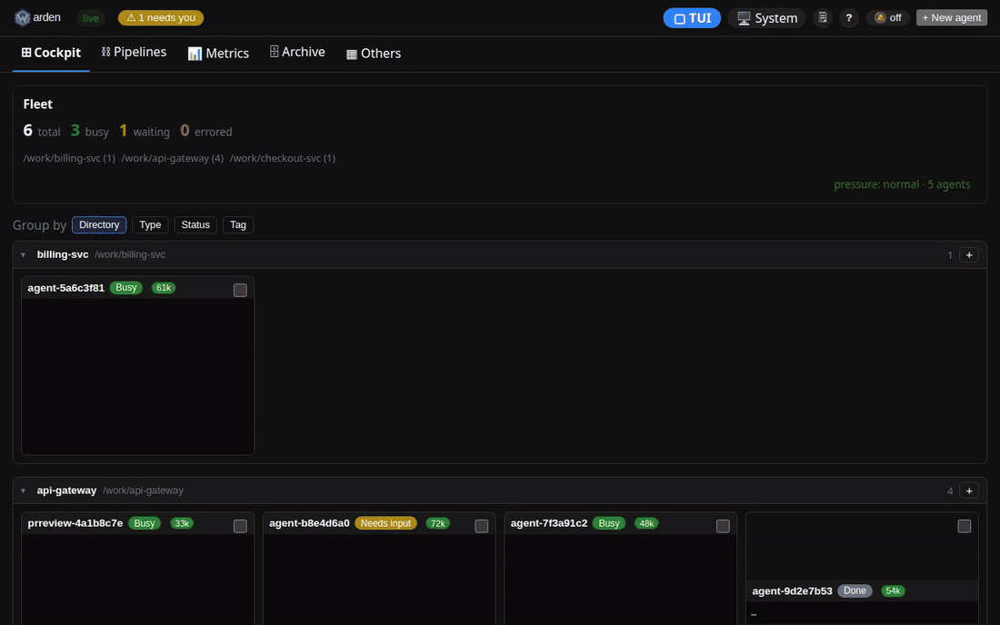
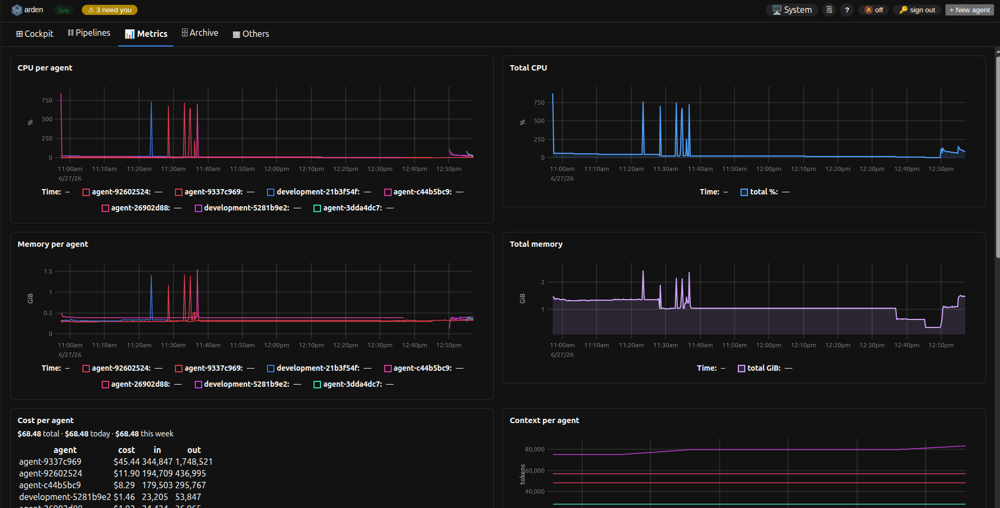
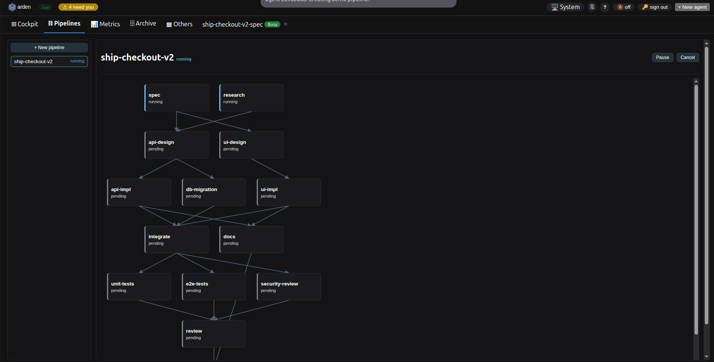

<p align="center">
  
  
</p>

[](https://github.com/srjn45/warden/actions/workflows/ci.yml)
[](#development)
[](LICENSE)
[](https://pkg.go.dev/github.com/srjn45/warden)
[](https://github.com/srjn45/warden/releases)

> 📖 **Docs & guide:** https://srjn45.github.io/warden/

**Run a fleet of coding agents without losing your mind.** warden is a single Go
binary (`warden`, aliased `wd`) that spawns, monitors, and tears down coding-agent
sessions — each in its own isolated git worktree — while tracking exactly what every agent
costs and how many tokens its lifecycle features keep out of context. It drives multiple
agent backends (Claude Code by default — see [Agent backends](#agent-backends---backend)),
backed by a local daemon and a file-based JSON store: **no database, no SaaS, no telemetry.**

<p align="center">
  <a href="https://srjn45.github.io/warden/"></a>
</p>

### Why warden

- **Orchestrate, don't babysit** — spawn many agents in parallel, watch them in a live TUI
  cockpit or web dashboard, and talk to any one of them. Write-type agents get their own
  worktree by default, so parallel agents never collide on the same tree.
- **See what it costs** — `warden spend` prices each agent's real model usage into dollars
  with a budget gate (priced for the Claude backend; bring-your-own-model backends report
  tokens), and `warden savings` is an append-only ledger of the tokens warden keeps out of
  agents' context, with a without-vs-with **A/B benchmark** you can screenshot.
- **Self-hosted and free** — one binary, a loopback REST API, and a JSON store on disk.
  Run it on your laptop or a box. **By default nothing leaves your machine** — no
  telemetry, no SaaS. Opt-in features (webhook/Slack alerts, remote access, and
  `warden savings --calibrate`) send data only where you explicitly configure them.
- **Driven by an agent itself** — `warden mcp` exposes the whole fleet as MCP tools, so an
  orchestrator agent (e.g. a Claude session) can spawn, query, and coordinate the fleet for you.

### Quickstart

```sh
go install github.com/srjn45/warden/cmd/warden@latest   # or grab a release binary (see Install)
warden setup --yes      # install missing deps (tmux, claude, …); `warden doctor` just checks
warden tutorial         # guided tour of the core loop: spawn → watch → commit → tear down
warden start "review the auth module for security issues"   # spawn your first agent
warden tui              # open the cockpit
```

> `go install` gives you the CLI / daemon / TUI / MCP server. For the embedded **web
> dashboard**, use a [release binary](#1-download-a-release-binary-quickest) or build with
> `make release` — see [Install](#install).

### Screenshots

<table>
  <tr>
    <td width="50%">
      <a href="https://srjn45.github.io/warden/guides/tui-cockpit/"></a>
      <p align="center"><strong>TUI cockpit</strong> — agents list, shell, and the selected agent's live session, side by side in tmux.</p>
    </td>
    <td width="50%">
      <a href="https://srjn45.github.io/warden/guides/web-mission-control/"></a>
      <p align="center"><strong>Web dashboard</strong> — mission control: Fleet header and grouped agents, then a live walk to the Metrics tab.</p>
    </td>
  </tr>
  <tr>
    <td width="50%">
      <a href="https://srjn45.github.io/warden/guides/web-mission-control/"></a>
      <p align="center"><strong>Metrics &amp; cost</strong> — per-agent and fleet CPU/memory, context, tokens saved, and real model spend in dollars.</p>
    </td>
    <td width="50%">
      <a href="https://srjn45.github.io/warden/multi-agent/pipelines/"></a>
      <p align="center"><strong>Pipelines</strong> — chain dependent agents into a DAG and watch each job's live status.</p>
    </td>
  </tr>
</table>

<details>
<summary><strong>Architecture — one binary, multiple faces</strong></summary>

`warden daemon` is the single writer to the on-disk session store, serving a loopback REST
API and running a background poller. `warden ls|status|start|done|attach|send|tail` are thin
HTTP clients to the daemon. `warden mcp` is a stdio MCP server that bridges MCP tool calls to
the same REST API, enabling an orchestrator agent session (e.g. Claude) to query agents and
talk to a specific running agent. A short alias `wd` (a symlink to `warden`) is installed alongside it.

```
alias agents=warden
```
</details>

> **New here?** See [docs/USAGE.md](docs/USAGE.md) for a task-oriented guide to running agents day to day, [docs/FEATURES.md](docs/FEATURES.md) for a complete catalog of what warden can do, and [FEATURES.md](FEATURES.md) for the at-a-glance **coverage matrix** (which of CLI / MCP / skill / web / TUI can drive each feature). The sections below cover build, install, and contributor setup.

---

## What's new

Capability highlights from the **v5.x** line (full notes on the [releases page](https://github.com/srjn45/warden/releases); the complete catalog lives in [docs/FEATURES.md](docs/FEATURES.md)):

- **Isolation guardrails (v5.0, breaking)** — write-type agents (`code`/`docs`/`website`/`debug-ci`/`tests`) now spawn into their own worktree by default (`--in-repo` opts out), backed by PreToolUse hooks that deny-redirect raw `git`/test commands to the first-class `warden commit`/`push`/`sync`/`check` tools. See [Lifecycle commands & boundary enforcement](#lifecycle-commands--boundary-enforcement).
- **Interactive mode (`warden repl`)** — a terminal REPL with a real line editor (history, a live `/`-command menu, Tab completion, guided argument forms, colour) that drives the fleet via deterministic `/` commands (no model) or natural language (a local-LLM conductor that turns operator intent into confirmed warden tool calls without spending cloud-model tokens); optionally hosts the cockpit master pane.
- **Pipelines, end to end** — DAG pipelines are now drivable from the **MCP tools** (create/start/show/list/cancel), ship four built-in `--template` starters, and support `run_if` conditional steps.
- **Agent sub-trees in the TUI** — agents spawned by another agent nest under their parent as a collapsible sub-tree (`▸ / ▾`, indented per depth); deleting a parent with live children leaves a muted *terminated tombstone* header so the children never orphan, reaped once the sub-tree finishes.
- **Fleet at scale** — full-text `warden search` + tags, a `warden history` archive, `warden export`/`import`, an append-only `warden audit log`, spawn `preset`s and variabled `prompt-template`s (browse both via `warden library`), and web batch operations.
- **Observability** — per-agent metrics & performance history (`warden stats`), crash/anomaly detection, the context-size guard, and webhook/Slack notifications.
- **Token-savings ledger (`warden savings`)** — a real, append-only ledger of the tokens warden's lifecycle features keep out of agents' context, with an `--benchmark` A/B headline (without-vs-with warden, % reduction, $ saved) you can screenshot.
- **Cost governance (`warden spend`)** — the REAL model spend warden measures from agents' transcripts, priced per model into dollars and rolled up per-agent/repo/day (priced for the Claude backend; bring-your-own-model backends report tokens), plus a **budget gate** that softly warns before a spawn pushes daily/weekly spend over a configured `$` cap (a `$` column in `warden ls` and a live per-agent cost card on the web Metrics tab round it out).
- **Native scheduler (`warden schedule`)** — opt-in cron/at triggers that fire an agent or a pipeline on the daemon's own timer; no external crontab.
- **Snapshots & insights** — `warden snapshot` checkpoints a worktree + transcript for rollback; `warden insights` mines agent history for patterns and parallelization wins.
- **Branch tracking (`warden branches`)** — opt-in monitor of each agent's CI status and standing vs `origin/main`, with non-blocking inbox/desktop alerts.
- **Extensibility** — a `warden plugin` system (custom task types + lifecycle hooks over JSON-stdio) and an interactive **OpenAPI/Swagger UI** at `/api/docs`.
- **Web** — real URL routing (`/cockpit`, `/tui`, `/pipelines`, `/metrics`, `/archive`, `/others`, `/agent/<id>` — deep-linkable, back/forward, shareable), a Cockpit home with a Fleet header, a highlighted top-bar **▢ TUI** launcher that opens the literal `warden tui` **full-screen** (the whole three-pane cockpit — same panes, shortcuts, real shells and live agent sessions — edge-to-edge over the viewport, Ctrl+Q to exit) so you can drive the fleet from a laptop exactly as you do locally, a dedicated **Metrics** tab (per-agent **and** fleet-total CPU / memory, per-agent context, fleet size, tokens saved — two columns on desktop, single column on mobile), dark-mode theming, global keyboard shortcuts, Cockpit agent grouping, and an Archive tab plus an Others catch-all (last).
- **Remote access** — bearer-token auth (`warden token …`) and a Docker/compose deployment.
- **First-run tutorial (`warden tutorial`)** — a guided walkthrough of the core loop, with a one-line nudge until you've taken (or skipped) the tour.

---

## Prerequisites

- **Go 1.26+** — to build the binary (only needed for `go install` or building from source)
- **tmux** — every agent session runs in a detached tmux window
- **git** — worktree creation and guarded cleanup
- **Claude Code** (`claude` on PATH) — the default agent runtime launched in each session
- **Aider** (`aider` on PATH, optional) — only needed to spawn agents with `--backend aider`; bring-your-own-model (works with local Ollama models, $0)
- **OpenCode** (`opencode` on PATH, optional) — only needed to spawn agents with `--backend opencode`; bring-your-own-model (works with local Ollama models, $0). Install: `npm install -g opencode-ai` (https://opencode.ai)
- **`gh`** (GitHub CLI) — required for `pr-review` sessions to check out the PR branch, and for `warden done --create-pr`
- **Ollama** (optional) — only needed if you enable the local-LLM features (`local_llm`) or the `warden repl` REPL; warden falls back to Claude when it's off or unreachable

> **Tip:** once you have the `warden` binary, run **`warden doctor`** to check
> these dependencies and **`warden setup`** to install whatever is missing
> (Homebrew on macOS; apt/dnf/pacman on Linux; official installers for Claude
> Code and Ollama). `warden setup --yes` does it non-interactively.

---

## Install

warden is one self-contained binary. Pick whichever fits:

### 1. Download a release binary (quickest)

Grab the archive for your OS/arch from the [latest release](https://github.com/srjn45/warden/releases/latest), extract `warden`, and put it on your `PATH`. Released binaries have the web dashboard embedded.

```sh
# example: macOS arm64 (adjust the version/arch)
curl -fsSL https://github.com/srjn45/warden/releases/latest/download/warden_1.0.0_darwin_arm64.tar.gz | tar -xz
sudo mv warden /usr/local/bin/        # or any dir on your PATH
warden --version
```

> **macOS Gatekeeper:** downloaded binaries are unsigned, so the first run may be blocked. Clear the quarantine flag once: `xattr -d com.apple.quarantine $(which warden)` (or right-click → Open). Building from source — option 3 — avoids this.

### 1b. Package managers (Homebrew / deb / rpm / AUR)

Every release also ships native packages (all with the `wd` alias included and the web dashboard embedded):

```sh
# macOS — Homebrew tap (clears the Gatekeeper quarantine for you)
brew install --cask srjn45/tap/warden

# Debian / Ubuntu
curl -fsSLO https://github.com/srjn45/warden/releases/latest/download/warden_1.0.0_linux_amd64.deb
sudo apt install ./warden_1.0.0_linux_amd64.deb

# Fedora / RHEL
sudo dnf install https://github.com/srjn45/warden/releases/latest/download/warden_1.0.0_linux_amd64.rpm

# Arch (AUR)
yay -S warden-bin
```

(Adjust the version/arch in the URLs; the `.deb`/`.rpm` pull in `tmux` and `git` as recommended packages.)

### 2. `go install` (Go toolchain)

```sh
go install github.com/srjn45/warden/cmd/warden@latest
```

This installs the `warden` binary (CLI + daemon + MCP server + TUI). **Note:** `go install` does *not* bundle the web dashboard (the UI is built from `web/` and embedded at release time, and isn't committed to the repo). The CLI, daemon API, TUI, and MCP server all work; for the embedded web GUI use a release binary (option 1) or build from source (option 3).

### 3. Build from source

```sh
git clone https://github.com/srjn45/warden.git
cd warden
make build           # CLI/daemon/TUI only → bin/warden
make release         # builds the web UI first, then embeds it → full GUI
```

### Shell Completion

warden supports shell completion for Bash, Zsh, Fish, and PowerShell. Generate the completion script for your shell and install it to the appropriate location:

**Bash:**

```sh
# System-wide installation:
warden completion bash | sudo tee /etc/bash_completion.d/warden

# User-only installation:
warden completion bash > ~/.bash_completion
```

**Zsh:**

```sh
# System-wide installation:
warden completion zsh | sudo tee /usr/local/share/zsh/site-functions/_warden

# User-only installation:
mkdir -p ~/.zsh/completion
warden completion zsh > ~/.zsh/completion/_warden
# Then add to your ~/.zshrc:
# fpath=(~/.zsh/completion $fpath)
# autoload -Uz compinit && compinit
```

**Fish:**

```sh
warden completion fish > ~/.config/fish/completions/warden.fish
```

**PowerShell:**

```powershell
warden completion powershell > warden.ps1
# Then add to your PowerShell profile
```

After installing the completion script, restart your shell or source the file for completions to take effect.

---

### Run it as a background service (macOS)

The recommended setup on macOS installs warden as an auto-starting launchd daemon (and links the Claude skill + registers the MCP server). See the next section.

---

## Install the daemon as a launchd service (auto-start)

Install with the script — it builds the release, installs the binary to
`~/.local/bin/warden`, renders and loads the launchd plist, links the Claude
skill, and registers the MCP server:

```sh
./scripts/install.sh        # or: make install
```

The daemon then starts automatically at login and restarts on crash
(`KeepAlive = true`), listening on `127.0.0.1:8765` by default.

> `~/.local/bin` must be on your `PATH` to run `warden` from the shell — the
> installer warns if it isn't.

### Stop macOS "warden would like to access…" prompts (optional, macOS)

The launchd daemon is the macOS TCC *responsible process* for the agents it
spawns and for its own directory picker, so reads of protected folders
(Downloads, Documents, Desktop, the Music/media library) surface as *"warden
would like to access…"* prompts. Granting Full Disk Access once silences them —
but macOS ties the grant to the binary's code identity, and an unsigned Go
binary gets a new identity on every rebuild, which brings the prompts back.

Run the one-time setup to give the binary a **stable** self-signed identity:

```sh
./scripts/codesign-setup.sh   # creates a self-signed code-signing cert (once)
./scripts/install.sh          # reinstall so the binary is signed
```

Then grant access once: **System Settings → Privacy & Security → Full Disk
Access → "+"** and add `~/.local/bin/warden`. Because the signing identity is
stable, the grant survives future rebuilds. (`install.sh`/`reinstall.sh` sign
automatically when the cert exists; without it they warn and leave the binary
unsigned.)

**Redeploy after a code change** (replaces `make release && ./bin/warden daemon`):

```sh
./scripts/reinstall.sh             # rebuild UI + binary, redeploy, restart
./scripts/reinstall.sh --no-build  # redeploy the existing build only
# or: make reinstall  /  make reinstall NO_BUILD=1
```

**Uninstall** (stops and removes the service, binary, skill link, and MCP
registration; **preserves** your session store at `~/.warden` and the logs):

```sh
./scripts/uninstall.sh                 # or: make uninstall
./scripts/uninstall.sh --keep-binary   # leave ~/.local/bin/warden in place
```

Logs:

- stdout: `/tmp/warden.daemon.log`
- stderr: `/tmp/warden.daemon.err`

> **Notifications:** off by default. When enabled (set `notify.enabled: true` in the config file, or the deprecated `notify: true`), the daemon posts a macOS notification when an agent enters `waiting_for_input`, `idle` (stuck), `orphaned`, or `errored`. These appear only when the daemon runs in your GUI login session (a terminal, or a launchd **user agent**); a headless/system daemon logs them instead.

---

### Run it as a background service (Linux — systemd)

The same install script detects Linux and registers a systemd **user service**
instead of a launchd plist. It builds the release, installs the binary to
`~/.local/bin/warden`, writes `~/.config/systemd/user/warden.service`, enables
it, and links the Claude skill and MCP server:

```sh
./scripts/install.sh        # or: make install
```

The daemon starts automatically at each login session and restarts on crash
(`Restart=always`), listening on `127.0.0.1:8765` by default.

> `~/.local/bin` must be on your `PATH` — the installer warns if it isn't.

> **Persistent daemon:** `install.sh` calls `loginctl enable-linger` so the
> systemd user service keeps running after you close your terminal or SSH session
> (equivalent to launchd `RunAtLoad` on macOS). This requires systemd 219+ and
> is a no-op on most modern distros.

**Redeploy after a code change:**

```sh
./scripts/reinstall.sh             # rebuild UI + binary, redeploy, restart
./scripts/reinstall.sh --no-build  # redeploy existing build only
# or: make reinstall  /  make reinstall NO_BUILD=1
```

**Uninstall** (stops and removes the service, binary, skill link, and MCP
registration; **preserves** `~/.warden`):

```sh
./scripts/uninstall.sh
./scripts/uninstall.sh --keep-binary   # leave ~/.local/bin/warden in place
```

Logs go to the systemd journal (the unit sets `StandardOutput=journal` /
`StandardError=journal`), so they survive reboots even where `/tmp` is a tmpfs
(Fedora, Arch, …):

```sh
journalctl --user -u warden -f        # follow live
journalctl --user -u warden -n 100    # last 100 lines
```

> **Notifications:** off by default. Set `notify.enabled: true` in the config file to enable (the deprecated `notify: true` also works). The
> daemon calls `notify-send` (libnotify) when it's on `PATH`; install it with
> `apt install libnotify-bin` (Debian/Ubuntu) or `dnf install libnotify`
> (Fedora). Degrades to log-only if `notify-send` is not found.

### Run the daemon in Docker

The repo ships a multi-stage [`Dockerfile`](Dockerfile) and a
[`docker-compose.yml`](docker-compose.yml). The image is a lean Alpine runtime
(static `CGO_ENABLED=0` binary plus `tmux` + `git`) with the web dashboard baked
in. State lives in a `~/.warden` volume so it survives container restarts, and
the daemon binds `0.0.0.0:8765` for remote access.

```sh
# Build the image (run from the repo root).
docker build -t warden:latest .

# A non-loopback bind REQUIRES a bearer token — the daemon refuses to start
# without one. Generate it locally (or use any secret) and run:
export WARDEN_TOKEN=$(warden token generate)
docker run -d --name warden \
  -p 8765:8765 \
  -e WARDEN_TOKEN \
  -v warden-data:/home/warden/.warden \
  warden:latest
```

Or with compose (reads `WARDEN_TOKEN` from your environment):

```sh
export WARDEN_TOKEN=$(warden token generate)
docker compose up -d        # builds the image on first run
```

The dashboard/API is then reachable at `http://<host>:8765`; the browser prompts
for the token on first load. Don't expose the port directly to the public
internet — front it with Tailscale or a Cloudflare Tunnel (see
[Remote access](#remote-access)).

> **tmux is required.** warden runs every agent inside a tmux session, so the
> image installs `tmux` (and `git`, for worktree-isolated agents) even though
> the container's primary job is to host the daemon, REST API, and dashboard.
> Spawning agents that actually call Claude additionally needs the `claude` CLI
> and its credentials inside the container — the base image deliberately omits
> these to stay lean; layer them on (and mount `~/.claude`) if you want the
> container to drive live agents rather than just manage/observe sessions.

---

## Wire in the Claude Code hooks

The hook script posts lifecycle events (`SessionStart`, `Notification`, `Stop`, `SubagentStop`, `SessionEnd`) to the daemon so it can update agent status in real time without polling. `SessionEnd` marks the session **done** (terminal) when claude exits.

Merge `hooks/settings.snippet.json` into `~/.claude/settings.json`. The snippet
uses a `__WARDEN_HOOK__` placeholder — substitute the absolute path to
`hooks/warden-hook.sh` in your clone first:

```sh
# from the repo root, render the snippet with the real hook path:
sed "s|__WARDEN_HOOK__|$(pwd)/hooks/warden-hook.sh|g" hooks/settings.snippet.json

# If ~/.claude/settings.json doesn't exist yet, write it directly:
sed "s|__WARDEN_HOOK__|$(pwd)/hooks/warden-hook.sh|g" hooks/settings.snippet.json > ~/.claude/settings.json

# If it already exists, merge the rendered "hooks" key into the root of your
# existing settings.json object.
```

The hook fails soft — it never blocks or errors the agent, even if the daemon is down or the session is unknown.

---

## Model Selection

Warden supports per-agent model selection:

- **Short aliases:** `opus`, `sonnet`, `haiku`, `fable`
- **Full model IDs:** `claude-opus-4-8`, `claude-sonnet-4-6`, etc.
- **Default:** `claude-sonnet-4-6` (or the `model_default` config setting)

```bash
# Explicit model
warden start "Complex task" --model opus

# Set the default model: edit ~/.warden/config.yaml (model_default: opus),
# then restart the daemon. `warden config` shows what's live.

# View model in agent list
warden ls  # Shows MODEL column
```

---

## Agent backends (`--backend`)

Warden drives **Claude Code** by default, but the agent layer is pluggable: pick
the backend per agent at spawn time with `--backend` (CLI) or the `backend` param
(`spawn_agent` MCP tool).

> **Supported agents — status:** warden is fully tested only with **Claude Code**.
> All non-`claude` backends (Aider, OpenCode, Codex, Crush, Goose, Cursor, Antigravity) are
> **experimental / work-in-progress** — functionality may be reduced or unverified.
> Any non-`claude` value for `--backend` is experimental.

| Agent | Status |
|---|---|
| Claude Code | ✅ Stable — fully tested, reference backend |
| Aider | 🧪 Experimental (WIP) |
| OpenCode | 🧪 Experimental (WIP) |
| Codex CLI | 🧪 Experimental (WIP) |
| Crush | 🧪 Experimental (WIP) |
| Goose | 🧪 Experimental (WIP) |
| Cursor CLI | 🧪 Experimental (WIP) |
| Antigravity CLI | 🧪 Experimental (WIP) |

| Backend | `--backend` | Tier | Notes |
|---|---|---|---|
| **Claude Code** (default) | `claude` | A | Full fidelity — digests, savings, priced spend, resume, all permission modes |
| **Aider** | `aider` | A | 🧪 Experimental. Bring-your-own-model (pass `--model`, e.g. `ollama_chat/qwen2.5-coder:3b`); structured markdown transcript ⇒ real digests; **no** resume, **no** priced spend (tokens only), runs an autonomous `--message` task that exits when done |
| **OpenCode** | `opencode` | A | 🧪 Experimental. Bring-your-own-model (pass `--model`, e.g. `ollama/qwen2.5-coder:3b`); structured JSON transcript (via `opencode export`) ⇒ real digests; **resumes** the worktree's last session (`opencode -c`); spend tokens-only (BYO model) |
| **Codex CLI** | `codex` | A | 🧪 Experimental. BYO provider (via Codex config / `-m`); structured JSONL transcript (rollout files) ⇒ real digests; **resumes** dir-scoped (`codex resume --last`), upgraded to exact-id via discover-then-pin; live state + approval detection; context injection via `AGENTS.md`; spend tokens-only. See [`docs/agent-backends/codex.md`](docs/agent-backends/codex.md) |
| **Crush** | `crush` | A | 🧪 Experimental. BYO model (config-driven TUI; headless `crush run` accepts `-m`); structured JSON transcript (via `crush session show --json`) ⇒ real digests; **resumes** dir-scoped (`--continue`); **TUI takes no initial prompt** (type it after attach); context injection via `CRUSH.md`; spend tokens-only. See [`docs/agent-backends/crush.md`](docs/agent-backends/crush.md) |
| **Goose** | `goose` | A | 🧪 Experimental. BYO provider (`GOOSE_PROVIDER`/`GOOSE_MODEL` env); structured JSON transcript (via `goose session export`) ⇒ real digests; **resumes** name-deterministic (`goose session -r --name <id>`); no model flag on session launch; context injection via `.goosehints`; spend tokens-only. See [`docs/agent-backends/goose.md`](docs/agent-backends/goose.md) |
| **Cursor CLI** | `cursor` | C | 🧪 Experimental. Hosted plan (`cursor-agent`, billed to your Cursor subscription); rich native permission modes (`plan`/`ask`/`auto-review`/`force`); **resumes** dir-scoped (`--continue`); live state + approval/trust detection; context injection via `AGENTS.md`. **No structured transcript yet** (interactive store is unreadable SQLite) ⇒ no digests; spend tokens-only. See [`docs/agent-backends/cursor.md`](docs/agent-backends/cursor.md) |
| **Antigravity CLI** | `antigravity` | A | 🧪 Experimental. Google-hosted free tier (`agy`, multi-vendor model menu); structured trajectory JSONL ⇒ real digests; **resumes** dir-scoped (`agy -c`); live state + approval detection; context injection via `AGENTS.md`; spend tokens-only. See [`docs/agent-backends/antigravity.md`](docs/agent-backends/antigravity.md) |

```bash
# Drive Aider against a local Ollama model (free, offline)
export OLLAMA_API_BASE=http://127.0.0.1:11434
warden start "implement the add function" --backend aider --model ollama_chat/qwen2.5-coder:3b --dir .

# Drive OpenCode against a local Ollama model (free, offline)
warden start "implement the add function" --backend opencode --model ollama/qwen2.5-coder:3b --dir .

# Drive Codex against a local Ollama model (configure provider in ~/.codex/config.toml first)
warden start "implement the add function" --backend codex --dir .

# Drive Crush against a local Ollama model (configure provider in ~/.config/crush/crush.json first)
warden start "implement the add function" --backend crush --dir .

# Drive Goose against a local Ollama model
GOOSE_PROVIDER=ollama GOOSE_MODEL=qwen2.5-coder:3b \
warden start "implement the add function" --backend goose --dir .
```

Backends differ in capabilities; warden **degrades gracefully** rather than
crashing when one lacks a capability (e.g. spend shows tokens-not-dollars for a
bring-your-own-model backend; rotate/handoff re-spawn fresh when resume is
unavailable). It also surfaces some backends' **native superpowers** as
first-class verbs — `warden review` (Codex's diff reviewer), `warden models`
(Antigravity/Cursor's live model menu), and `warden fork` (branch a Codex
session into a new managed agent — see [`warden fork`](#warden-fork)); see
[Agent-native superpowers](#agent-native-superpowers--warden-review--warden-models).
See the design (`docs/superpowers/specs/2026-06-27-pluggable-agent-backends-design.md`, §5)
and roadmap item #52.

---

## Configuration

Warden reads all settings from a single YAML file (default `~/.warden/config.yaml`). Run `warden config init` to generate a fully-commented file, edit the values, then restart the daemon; `warden config` prints what's currently live. The `--config <path>` flag points any command at an alternate file, and `--addr <host:port>` overrides the daemon address for a single command.

| Setting | Default | Description |
|---|---|---|
| `addr` | `127.0.0.1:8765` | Daemon listen address. Non-loopback **requires** `WARDEN_TOKEN` (bearer-token auth — see [Remote access](#remote-access)); the daemon refuses a non-loopback bind without a token |
| `data_dir` | `~/.warden` | Directory for warden state: session JSON (`sessions/`, `closed/`), per-agent prompt files (`prompts/`), inbox, pipelines, and metrics |
| `claude_projects_dir` | `~/.claude/projects` | Root of Claude Code transcript directories; the poller reads agent transcripts here to generate subjects and the context gauge |
| `model_default` | `claude-sonnet-4-6` | Default model for new agents (a model id or alias: `sonnet`/`opus`/`haiku`/`fable`) |
| `default_permission_mode` | `auto` | Default permission mode for new agents (`auto`/`default`/`acceptEdits`/`bypassPermissions`/`dontAsk`/`plan`) |
| `notify.enabled` | `false` | Desktop notifications when an agent needs attention |
| `approvals` | `true` | The approvals inbox: the daemon parses recognized Claude Code tool-permission prompts and surfaces them for answering. The web AttentionQueue shows one-click option buttons, the CLI exposes `warden approvals`/`warden approve`, and the TUI shows a pinned **⏳ Approvals** row — answer it in place (`i`, or `enter` on the row, then `1`-`9`; `tab` cycles between waiting agents) or from the web / `warden approve`. Unrecognized prompts always fall back to attach |
| `tokens.guard` | `true` | The context-size guard: the poller reads each live agent's context-window fill from its transcript, classifies it `ok`/`warning`/`critical`, and shows a state-colored token figure in `warden ls`, the TUI row, and the web tile. Master switch for the whole guard (gauge, alert, auto-compact) |
| `tokens.warn_alert` | `true` | Fire a desktop notification (when `notify.enabled` is on) once per upward crossing into the warning or critical band |
| `tokens.auto_compact` | `true` | When an agent is `critical` **and** idle/waiting, auto-send `/compact` to reclaim its context (cooldown-guarded) |
| `tokens.force_compact` | `false` | When an agent goes `critical` **while still working**, interrupt it (Escape), `/compact` once it idles, then send the resume prompt. **Destructive** — discards the in-flight turn — so off by default. Per-agent override via `warden force-compact <id> on\|off\|inherit` |
| `tokens.compact_resume_prompt` | _(built-in)_ | Message sent to a force-compacted agent once compaction lands so it resumes its work |
| `tokens.warn` | `200000` | Warning threshold in context tokens (inclusive lower bound). If `tokens.critical` is not greater than this, both reset to the defaults |
| `tokens.critical` | `400000` | Critical threshold in context tokens (inclusive lower bound) — the auto-`/compact` trigger band |
| `auto_approve` | `false` | Auto-answer recognized permission prompts. Bare on/off, or an allow/deny **rule policy** (by tool / glob / regex / paths, with per-agent overrides) — see `warden auto-approve` |
| `notify.webhook_enabled` / `notify.webhook_url` | `false` / _(empty)_ | POST a JSON payload to `webhook_url` on attention + context-size alerts (a Slack incoming-webhook URL works out of the box); runs alongside `notify.enabled` |
| `collab.enabled` / `collab.interval` / `collab.hint` | `true` / … / `true` | File-conflict detection across worktrees, scan interval, and the spawn-time coordination hint |
| `rails.isolation_guard` / `rails.git_redirect` / `rails.check_redirect` / `rails.git_conventions` | `true` | Boundary-enforcement hooks (see [Lifecycle commands & boundary enforcement](#lifecycle-commands--boundary-enforcement)) |
| `log.level` / `log.format` | `info` / `text` | Daemon log verbosity (`debug`/`info`/`warn`/`error`) and format (`text`/`json`); `warden daemon --log-level`/`--log-format` override |
| `local_llm.enabled` (+ `.url`/`.model`/`.timeout`) | `false` | Route fuzzy-cheap work (classify, summarize, commit messages) to a local Ollama model; falls back to Claude on any error. Powers the natural-language half of `warden repl` (its `/` commands work without it) |
| `local_llm.repl` | `false` | Start the cockpit master pane in `warden repl` mode instead of a plain shell |

`warden config` lists every setting, including `worktree.spawn_gate` / `worktree.spawn_gate_max_agents`, `tokens.budget_gate` / `tokens.budget_daily_usd` / `tokens.budget_weekly_usd`, `metrics`, `allow_nonloopback`, `pipeline.keep_done` / `pipeline.hint`, `worktree.keep_done` / `worktree.auto_prune`, the `auto_restart.*` and `rate_limit.*` knobs, and the REPL tier knobs (`local_llm.tier` / `local_llm.escalate` / `local_llm.classifier`).

> Related settings are grouped into namespaced blocks (`pipeline.*`, `auto_restart.*`, `collab.*`, `memory.*`, `branch_track.*`, `rate_limit.*`, `http.*`, `log.*`, `plugins.*`, alongside the existing `rails.*` / `tokens.*` / `notify.*` / `worktree.*` / `local_llm.*`). The old flat keys (`collab_enabled`, `log_level`, `memory_inject`, …) still load as **deprecated aliases** — they work but emit a one-time deprecation warning; `warden config` rewrites them into the nested form.

> **Config namespacing:** Settings are grouped into five YAML blocks — `rails`, `tokens`, `notify`, `worktree`, `local_llm`. Old flat keys (e.g. `token_guard`, `local_llm_url`, `notify`) are still accepted as deprecated aliases and migrate to the namespaced form automatically when `warden config init` is re-run.

> **Legacy env vars:** the old `WARDEN_*` environment variables (e.g. `WARDEN_ADDR`, `WARDEN_NOTIFY`, `WARDEN_TOKEN_*`) are no longer read — the daemon warns once at startup if any are still set. The per-agent IPC vars warden injects into each agent (`WARDEN_SESSION_ID`, `WARDEN_PIPELINE_ID`, `WARDEN_JOB_ID`) are not configuration and are unaffected.

---

## Prompt-spawn (no repo, auto-typed)

The simplest way to create an agent is to give it a plain prompt and let the system figure out the rest:

```sh
warden start "review the auth module for security issues"
# spawned agent-a1b2 (classifying…) — attach with `warden attach agent-a1b2`
```

In the web GUI, **+ New agent** opens a single prompt textarea — no type or repo fields.

**How it works:**

- **Runs in the caller's directory.** Prompt-spawned agents run `claude --dangerously-skip-permissions '<prompt>'` (or `--permission-mode acceptEdits` with `--supervised`) in the directory you invoked `start` from (or the `--dir` you pass) — no per-agent directory is created. Point it elsewhere with `--dir`, and include any extra repo context in the prompt itself.
- **Type is auto-assigned.** Shortly after creation the daemon classifies the prompt with `claude -p` and updates the type label. It appears as "classifying…" until then. Requires `claude` on the daemon's `PATH`; falls back to `other` if unavailable.
- **Subject is auto-generated.** Each agent has a one-line subject summarizing what it is currently working on. It is seeded from the first words of the prompt at spawn, then refreshed periodically by the poller: the poller reads the agent's Claude Code transcript (looked up under the `claude_projects_dir` config setting) or, if no transcript is found, captures the tmux pane, then asks `claude -p` for an ≤8-word phrase. Refreshes are throttled and only run when the pane content has changed.
- **Managed worktrees still available.** `warden start TICKET --type development --repo …` is unchanged — see the section below.

To launch an agent in a directory other than your current one, pass `--dir`:

```sh
warden start "summarize recent changes" --dir /path/to/repo
```

---

## Task types and the `--type` flag

When you need a managed git worktree (e.g. a development branch tied to a Jira ticket), pass `--type`. The type controls whether a git worktree is created and determines how the session is set up.

| Type | Worktree | Notes |
|---|---|---|
| `development` | yes (new branch) | Creates `.worktrees/<ticket>` on a new branch named after the ticket |
| `pr-review` | yes (PR branch) | Detached worktree; runs `gh pr checkout <PR>` inside it. Requires `--pr` or `--branch`. Exempt from the write-type isolation default |
| `analysis` | opt-in (`--worktree`) | Runs in the repo by default; pass `--worktree` to get a scratch branch |
| `spike` | opt-in (`--worktree`) | Same as analysis |
| `code` | yes (new branch) | Isolated in `.worktrees/<id>`; pass `--in-repo` to share the repo |
| `docs` | yes (new branch) | Isolated in `.worktrees/<id>`; pass `--in-repo` to share the repo |
| `website` | yes (new branch) | Isolated in `.worktrees/<id>`; pass `--in-repo` to share the repo |
| `debug-ci` | yes (new branch) | Isolated in `.worktrees/<id>`; pass `--in-repo` to share the repo |
| `tests` | yes (new branch) | Isolated in `.worktrees/<id>`; pass `--in-repo` to share the repo |
| `other` | no | Catch-all; also used for unrecognized type strings |

Every **write-type** agent (`code`/`docs`/`website`/`debug-ci`/`tests`) gets its own isolated worktree by default so parallel agents don't collide on the shared tree; pass `--in-repo` to opt back into the repo root. `pr-review` is exempt (it already checks out the PR branch). This isolation is what makes the boundary-enforcement hooks (see [Lifecycle commands & boundary enforcement](#lifecycle-commands--boundary-enforcement)) meaningful.

By default every agent runs `claude --dangerously-skip-permissions` — permission prompts are suppressed and the agent runs fully autonomously; the `Notification` hook still records them as events in the session doc.

Pass `--supervised` to opt into a lighter permission mode (`--permission-mode acceptEdits`): file edits and common filesystem commands auto-approve, but other tools (bash writes, network calls, etc.) surface the numbered permission prompt — which the approvals inbox captures and lets you answer from the web AttentionQueue (one-click buttons), the TUI (`⏳ Approvals` row → `i`/`1`-`9`), or the CLI (`warden approve`) when `approvals` is on. A restored agent keeps its supervised setting.

If a worktree for the ticket already exists on disk, the spawn adopts it (reattaches claude to the existing branch) instead of erroring.

---

## Terminal UI

```sh
warden tui   # open the cockpit
warden       # bare invocation — same thing
```

`warden tui` (or bare `warden`) opens a **tmux-composited cockpit** — a dedicated tmux session with three panes: an agents list (top-left), a terminal shell for running CLI commands (bottom-left), and a full-height live detail pane (right) that opens the selected agent's interactive `claude` session. Browse the list freely with `↑`/`↓` without disturbing the detail pane; press `Enter` to open an agent in it.

Agents spawned by another agent (via the `spawn_agent` MCP tool) **nest under their parent** as a collapsible sub-tree (`▸ / ▾`, indented per depth — the same affordance pipelines use), so you can see which agents an orchestrator fanned out. Deleting a parent that still has live children keeps it as a muted **terminated tombstone** header (`terminated · N running`) — no terminal/attach pane — so its children never vanish; the daemon reaps the tombstone once the whole sub-tree finishes.

The cockpit **requires tmux ≥ 3.1** (it composites real tmux panes). If tmux isn't installed, or `warden tui` is launched from inside an existing tmux session, the cockpit can't build its panes and exits with an error — run it from a plain terminal.

The list pane polls the daemon about once a second. The daemon must be running (`warden.daemon`) before opening the TUI.

**Keys (cockpit)**

| Key | Action |
|---|---|
| `↑` / `↓` or `j` / `k` | Move selection (detail pane is unaffected) |
| `←` / `→` or `h` / `l` | Collapse / expand the pipeline or agent sub-tree under the cursor |
| `Enter` | Open the selected agent (or running pipeline job) in the right detail pane — a finished agent or tombstone shows its stored detail instead of attaching |
| `n` | New agent — opens a prompt textarea; `ctrl+s` to submit, `esc` to cancel |
| `o` | Open a directory as a group (becomes the spawn target for `n`) |
| `s` | Send a message to the selected agent — `enter` to send, `esc` to cancel |
| `a` | Attach — full-screen the agent's (or running job's) tmux session; press **`Ctrl-b Enter`** to return to the dashboard |
| `d` | Completion digest for the selected agent — scrollable overlay; `d`/`esc` to close |
| `i` | Answer pending approvals (also `enter` on the **⏳ Approvals** row) — `1`-`9` to answer, `tab` for next |
| `c` | Shared-context + message-traffic inspector |
| `r` | Retry a failed / needs-attention pipeline job |
| `x` | Context-sensitive: terminate the selected agent / cancel a pipeline / close an opened dir (confirm with `y`) |
| `D` | Delete a stopped pipeline's record (confirm with `y`) |
| `?` | Toggle help overlay |
| `Alt+t` | Toggle the bottom-left master pane between Claude and a shell (both stay alive) |
| `q` | Quit and tear down the cockpit |

Move focus between panes with **Alt+←/→/↑/↓** (no tmux prefix); toggle the bottom-left master pane between Claude and a shell with **Alt+t**. See [docs/USAGE.md §7](docs/USAGE.md) for the full cockpit guide and caveats around nested tmux.

---

## Command reference

### `warden tui`

Open the live terminal cockpit. Also launched by bare `warden` with no subcommand.

```sh
warden tui
warden       # equivalent
```

See the [Terminal UI](#terminal-ui) section above for the full key reference.

### `warden start [TICKET|"<prompt>"] [--type <TYPE>]`

Spawn a new agent session. Two modes:

**Prompt mode** (no `--type`) — pass a quoted prompt; the type is assigned automatically:

```sh
warden start "review the auth module for security issues"
warden start "investigate why the nightly build is flaky"
```

**Managed worktree mode** (`--type` required) — creates a git worktree for the ticket:

```sh
# Development agent for a Jira ticket:
warden start PROJ-350 --type development

# PR review — checks out the PR branch in a fresh worktree:
warden start --type pr-review --pr 1234

# Debug CI — no worktree, runs in current directory:
warden start --type debug-ci

# Spike with an optional scratch worktree:
warden start --type spike --worktree

# Point at a specific repo and branch:
warden start PROJ-350 --type development --repo /path/to/repo --branch my-branch

# Permission mode examples:
# Use acceptEdits mode for careful prompting on risky operations:
warden start "refactor the auth module" --permission-mode acceptEdits

# Set a global default for all new agents: put default_permission_mode: acceptEdits
# in ~/.warden/config.yaml, then restart the daemon.
warden start "debug the API rate limit"  # uses acceptEdits mode

# Override the global default for a specific agent:
warden start "quick spike" --permission-mode auto  # bypass global setting

# Change permission mode for a running agent:
warden set-permission-mode agent-abc123 dontAsk
```

Flags:
- `--type` — task type; omit to use prompt mode (auto-typed)
- `--repo` — repo path (default: current directory; managed worktree mode only)
- `--branch` — new branch name (development) or checkout target (pr-review)
- `--pr` — PR number or URL (pr-review only)
- `--dir <path>` — directory to run a prompt-spawned agent in (default: current directory)
- `--worktree` — opt-in worktree for analysis/spike
- `--in-repo` — write-type opt-out: run in the shared repo instead of an isolated worktree (ignored for pr-review)
- `--model <model>` — per-agent model (id or alias `opus`/`sonnet`/`haiku`/`fable`); defaults to the `model_default` config setting
- `--tags <a,b>` — attach tags (lowercased, deduped); searchable and filterable with `warden ls --tag`
- `--preset <name>` — seed spawn defaults from a saved preset (`warden preset save`); explicit flags still override
- `--prompt-template <name> --set VAR=value` — fill a saved prompt template (`warden prompt-template save`) into the spawn prompt; repeat `--set` per variable. A positional prompt still wins; free-form only (no `--type`)
- `--auto-restart` — opt this agent into daemon auto-restart on error (tuned by `auto_restart_*` config)
- `--permission-mode <mode>` — control Claude's permission level (valid modes: `acceptEdits`, `auto`, `bypassPermissions`, `default`, `dontAsk`, `plan`); defaults to the `default_permission_mode` config setting (default: `auto`)
- `--supervised` — legacy alias for `--permission-mode acceptEdits`; risky tools prompt and the approvals inbox surfaces them (see the `approvals` setting)

### `warden ls`

List all active agent sessions with their type, status, working directory, and subject.

```sh
warden ls
# ID                TYPE         STATUS    AGE   DIR                SUBJECT
# PROJ-350    development  working   2m    PROJ-350     refactoring auth middleware
# prreview-a1b2     pr-review    idle      5m    prreview-a1b2      reviewing PR 1234
# agent-c3d4        …            working   1m    agent-c3d4         investigate flaky nightly build
```

`DIR` shows the base name of the agent's working directory. `SUBJECT` is the auto-generated one-line summary of what the agent is currently doing (empty until the first poller refresh).

Use `--json` for machine-readable output (a JSON array of full session objects; an empty fleet prints `[]`). Useful for scripts and for Claude driving the CLI:

```sh
warden ls --json
```

Other flags:
- `--watch` / `-w` — live-update the table on every agent state change over the daemon's SSE stream (Ctrl+C to exit); combine with `--json` to stream one JSON snapshot per change.
- `--tag <tag>` — filter to agents carrying *every* given tag (AND semantics; repeatable or comma-separated). Tags are set at spawn with `warden start --tags backend,urgent` and are part of the search haystack.

### `warden status <TICKET>`

Show full detail for one session: working directory, subject, worktree, branch, PR, all events.

```sh
warden status PROJ-350
```

Add `--json` to emit the full session as a single JSON object (including the `events` array):

```sh
warden status PROJ-350 --json
```

### `warden adopt [--session-id <uuid>] [--dir <path>]`

Register an existing Claude session into warden.

- **Plain shell** — finds the newest Claude conversation for the directory and resumes it under a new tmux session (`claude --resume`).
- **Inside tmux** — registers the current tmux session live without relaunching claude.

```sh
warden adopt                          # newest session for cwd, resume under tmux
warden adopt --session-id <uuid>      # pick a specific Claude conversation
warden adopt --dir /path/to/project   # target a different directory
```

### `warden attach <TICKET>`

Attach your terminal to the agent's tmux session interactively.

```sh
warden attach PROJ-350
```

### `warden stop <TICKET>`

The **single umbrella teardown verb.** By default `warden stop <TICKET>` does a **full teardown**: terminate the tmux + claude session, clear (archive) the record, **and** remove the git worktree + branch (asking for confirmation first, unless `--yes`). Subtractive flags keep parts around; `--pr` opens a GitHub PR first while the agent is still intact. Safe order is always PR → terminate → clear record → remove worktree, so a failed push leaves the agent running.

```sh
warden stop PROJ-350                 # full teardown (asks before removing the worktree)
warden stop PROJ-350 --yes           # ...without the confirmation prompt
warden stop PROJ-350 --keep-worktree # terminate + clear record, keep the worktree (== `done`)
warden stop PROJ-350 --keep-record   # terminate + remove worktree, keep the record
warden stop PROJ-350 --hard          # purge the record instead of archiving
warden stop PROJ-350 --pr --base main # open a GitHub PR first, then tear down
```

The four older verbs are kept as thin **aliases** — each is just `stop` with a fixed flag combo:

| old verb | equivalent |
|---|---|
| `wd terminate <T>` | `wd stop <T> --keep-record --keep-worktree` |
| `wd delete <T> [--hard]` | `wd stop <T> --keep-worktree` (record only) |
| `wd remove-worktree <T>` | `wd stop <T> --keep-record` (worktree only) |
| `wd done <T> [--hard\|--create-pr]` | `wd stop <T> --keep-worktree [--hard\|--pr]` |
| `wd stop <T>` | terminate + clear record + remove worktree |

### `warden done <TICKET>`

Terminate the agent (kill its tmux + claude session) **and** clear its stored record in one step. It does **not** remove the git worktree — that is a separate, explicitly-confirmed step (`remove-worktree`). Equivalent to `terminate` followed by `delete`, i.e. `stop --keep-worktree`.

```sh
warden done PROJ-350          # terminate + clear record (worktree kept)
warden done PROJ-350 --hard   # purge the record instead of archiving it
warden done PROJ-350 --create-pr --base main   # push the branch + open a GitHub PR first
```

`--create-pr` pushes the agent's branch and opens a GitHub PR (via `gh`) — titled from the agent, bodied from its digest, targeting `--base` (default `main`) — *before* terminating, so a failure leaves the agent running to retry; an existing PR for the branch is reported, not re-created.

### `warden terminate <TICKET>`

Stop an agent: kill its tmux + claude session, but **keep** the record and worktree. This is the safe "stop this agent" default — it is reversible with `warden restore`. Alias for `stop --keep-record --keep-worktree`.

```sh
warden terminate PROJ-350
```

### `warden restore <TICKET>`

Recreate and resume a lost/orphaned agent's tmux + claude session (`claude --resume`). Use only when the agent's tmux session is gone (status `orphaned`).

```sh
warden restore PROJ-350
```

### `warden delete <TICKET>`

Clear an agent's stored record (archives by default; `--hard` purges). Does not touch tmux or the worktree. Alias for `stop --keep-worktree` (record only).

```sh
warden delete PROJ-350
warden delete PROJ-350 --hard
```

### `warden remove-worktree <TICKET>`

Remove an agent's git worktree and branch. **Destructive.** It refuses if the agent is still running (terminate it first) or if the worktree has uncommitted changes or unpushed commits — use `--force` to override the guard. Alias for `stop --keep-record` (worktree only); always asks unless `--yes`.

```sh
warden remove-worktree PROJ-350
warden remove-worktree PROJ-350 --force
```

### `warden send <TICKET> <message...>`

Type a message into the agent's claude session and press Enter.

```sh
warden send PROJ-350 "run the unit tests and fix any failures"
```

### `warden tail <TICKET>`

Print the recent terminal output of the agent's claude session.

```sh
warden tail PROJ-350
warden tail PROJ-350 --lines 80
```

### `warden digest <TICKET>`

Summarize what an agent accomplished — files touched, branch, number of turns, and a short narrative (best-effort, via `claude -p`). Also available as a web **Digest** panel and, in the cockpit, the `d` key (opens a scrollable digest for the selected agent).

```sh
warden digest PROJ-350
warden digest PROJ-350 --json
```

### `warden approvals` / `warden approve <TICKET> <option>`

The **approvals inbox** (on by default; the `approvals` setting). When a `--supervised` agent hits a tool-permission prompt, the daemon recognizes it and surfaces the numbered options so you can answer without attaching.

```sh
warden approvals                 # list pending permission prompts (with their options)
warden approve PROJ-350 1  # answer prompt for that agent with option 1 (e.g. "Yes")
```

Unrecognized prompts always fall back to attach. Also surfaced in the web AttentionQueue (one-click buttons) and the TUI **⏳ Approvals** row.

### `warden doctor`

Preflight checks — required binaries (`tmux`, `git`, `claude`), optional ones (`gh`, `ollama`, warn-only), daemon reachability, and the data directory. It also prints a one-line hardware-aware `local_llm_model` recommendation for the REPL.

```sh
warden doctor
```

### `warden setup`

Verifies the install with the **same checks as `doctor`**, then installs whatever is missing — idempotent, so it only touches deps that aren't already on PATH. It prints the exact install command for each missing dependency and prompts before running it; `--yes` installs everything without prompting (for automation). Required deps (`tmux`, `git`, `claude`) come first, then optional ones (`gh`, `ollama`). Package managers are auto-detected — Homebrew on macOS (never auto-bootstrapped) and `apt`/`dnf`/`pacman` on Linux — and Claude Code and Ollama use their official installers. After installing, it re-runs the checks and prints a doctor-style report. `setup` is **CLI-only** (it installs host packages) and is not exposed over MCP.

```sh
warden setup            # confirm-each install of anything missing
warden setup --yes      # non-interactive: install all missing deps
```

### `warden llm suggest` (memory-ranked model picker)

Recommends local models for the REPL (`warden repl`), sized to this machine. It auto-detects **two** figures from the *same* memory pool — **total** memory (the bound) and **average free** memory (sampled to smooth spikes) — using NVIDIA VRAM (`nvidia-smi`), Apple unified memory, or Linux `MemAvailable`. It scores a curated, **tool-calling-forward** catalog (Qwen3, gpt-oss, Mistral Small, Qwen2.5) by **conductor suitability** — not raw size or coding skill, since the REPL routes tool calls and never writes code. Scores are calibrated against the [Berkeley Function-Calling Leaderboard](https://gorilla.cs.berkeley.edu/leaderboard.html) (BFCL v4), weighted toward the multi-turn subcategory that matches the REPL's tool-call loop. Each model is marked `fits now` / `free memory first` / `too large`. The ★ pick is the best-scoring model that runs *comfortably now* with headroom for your real workload (Docker, DBs, IDE, Claude sessions, the daemon). It only ever recommends — you set `local_llm_model` yourself.

```sh
warden llm suggest                    # auto-detect and rank
warden llm suggest --samples 8        # average more free-memory samples
warden llm suggest --total-gb 48 --free-gb 30   # what-if for another machine
warden llm suggest --json
```

### `warden tutorial` (first-run walkthrough)

A guided tour of the core loop (spawn → watch → commit → tear down). Until you've taken or skipped it, warden prints a single non-blocking stderr hint nudging you toward it (suppressed for piped/non-interactive use).

```sh
warden tutorial                       # run the walkthrough, then mark it complete
warden tutorial --skip                # mark complete without running it
warden tutorial --reset               # clear the marker so the tour (and hint) run again
```

Disable the hint entirely with `tutorial: false` in the config.

### `warden handoff --retire` (self-rotation; alias `warden rotate`)

Run **inside an agent session** to retire a long-lived, context-heavy agent and hand off to a fresh successor in the same workdir/worktree. Phase 1 is driven by the `/warden` skill (the agent writes a handoff file + resume prompt and shows you); on your go-ahead it spawns the successor and reaps itself.

```sh
warden handoff --retire --confirm \
  --resume-file "${TMPDIR:-/tmp}/warden-rotate-handoff-$WARDEN_SESSION_ID.md" \
  --resume-prompt "Continue the migration from where the notes leave off"
# `warden rotate --confirm …` is an exact alias.
```

The handoff file lives at a unique, per-agent temp path so concurrent rotations never clobber each other; the successor deletes it once read (and `/tmp` self-clears). Spawn-before-reap is fail-safe: if the successor fails to spawn, the current agent keeps running. Rotation reuses the worktree by cwd and never removes it. `--retire` is mutually exclusive with `--to`.

### Pipelines — `warden pipeline`

Define a **DAG of agent jobs** in YAML and let the daemon run them: jobs with no dependencies start first, and each job's `emit` publishes its output and unblocks its dependents. The daemon owns the cheap "await + fire" so the lead Claude stays off the critical path.

```sh
warden pipeline validate -f review.yaml # check the spec (DAG/refs/cycles); exit 0/1, no daemon
warden pipeline create -f review.yaml   # validate + register (does not start)
warden pipeline list-templates          # list the built-in starter templates + their placeholders
warden pipeline create --template analyze-implement-review --set REPO=. # render from a template
warden pipeline start <id>              # spawn jobs with no dependencies
warden pipeline show <id>               # jobs, status, branches, and emitted output
warden pipeline list
warden pipeline edit-job <id> <job> ... # edit a not-yet-started job's fields
warden pipeline retry <id> <job>        # re-run a failed/needs-attention job
warden pipeline pause <id>              # stop spawning new jobs (in-flight keep running)
warden pipeline resume <id>             # resume a paused pipeline
warden pipeline cancel <id>             # terminate running jobs
warden pipeline delete <id>             # remove the record (cancel first if live)
```

Four `go:embed`-bundled templates ship in the binary — `analyze-implement-review`, `parallel-tasks`, `test-fix-verify`, `research-synthesis`. Render one with `warden pipeline create --template <name>`, substituting placeholders via `{{NAME}}`/`{{REPO}}` (auto-filled) and `--set KEY=VALUE`.

A minimal `analyze → implement → review` spec (job prompts must **not** mention `emit` — the daemon auto-appends it and auto-injects upstream outputs):

```yaml
name: auth-refactor
jobs:
  - id: analyze
    prompt: "Analyze the auth module and list the concrete refactors needed."
  - id: implement
    depends_on: [analyze]
    worktree: fresh
    prompt: "Implement the refactors identified upstream."
  - id: review
    depends_on: [implement]
    prompt: "Review the implementation branch for correctness and regressions."
```

Jobs can be made conditional with `run_if: success` (default) `| failure | always` — e.g. a `run_if: failure` rollback/notify step that only runs when an upstream job fails. Pipelines have full TUI and web visibility (a ▸ Pipelines section / a Pipelines tab). See [docs/USAGE.md](docs/USAGE.md) for the full authoring guide.

### `warden schedule` (native cron/at)

Fire an agent spawn **or** a pipeline on the daemon's own timer — no external crontab. **Opt-in:** set `scheduler_enabled: true` in the config and keep the daemon running (schedules only fire while it is up).

```sh
# Recurring agent spawn (5-field cron; @daily etc. supported):
warden schedule create daily-review --cron "0 9 * * *" \
  --type pr-review --repo . --prompt "Review yesterday's merged PRs"

# Single-shot spawn (RFC3339 or 2006-01-02T15:04, local time):
warden schedule create launch --at 2026-06-27T09:00 --prompt "Kick off the release checklist"

# Fire a pipeline on a schedule (each run gets a timestamped name):
warden schedule create nightly --cron "0 2 * * *" --pipeline ci.yaml

warden schedule list                  # kind, mode, spec, enabled, next run, last error
warden schedule delete daily-review
```

Missed runs are **not** backfilled — on daemon startup each next-fire is recomputed from the wall clock. The reconcile loop fails soft (a bad fire is recorded in `last_error`, never crashes the loop). `list_schedules` exposes the same read-only view over MCP.

### Shared context & messaging — `warden ctx` / `warden msg`

The substrate pipelines are built on, usable directly so agents can collaborate:

```sh
# Shared context: a namespaced key/value blackboard all agents can read/write
warden ctx set build.status "green" --as agent-4f2a
warden ctx get build.status
warden ctx list --prefix build.

# Directed messages: per-agent inbox; sending wakes a parked (idle/waiting) agent
warden msg send agent-9c1d "the API contract changed — re-check your client"
warden msg inbox --as agent-9c1d
warden msg wait --as agent-9c1d --timeout 120   # block in the daemon until a message arrives
```

### File-conflict detection — `warden collab`

The daemon watches each active agent's worktree (fsnotify, with a `git diff` poll as a safety net) and warns — via the inbox, deduplicated — when two agents edit the same file. Spawned agents also get a system-prompt hint to check before editing shared files, so they coordinate rather than overwrite.

```sh
warden collab conflicts                 # current cross-agent file conflicts
warden collab who-is-editing <file>     # which agents (if any) are touching a file
```

Tunable via the `collab.enabled` / `collab.interval` / `collab.hint` config settings; also exposed as the `get_collaboration_status` / `who_is_editing_file` MCP tools and a **File conflicts** card on the dashboard.

### Git & check lifecycle — `warden commit` / `push` / `sync` / `check`

First-class, deterministic commands that move git and test/lint/build work off the agent and return compact results instead of raw tool-spam. PreToolUse hooks (config-gated, fail-open) steer agents toward these and deny-redirect the raw escapes — see [Lifecycle commands & boundary enforcement](#lifecycle-commands--boundary-enforcement).

```sh
warden commit            # stage + commit the agent's worktree (message auto-filled if omitted)
warden commit -m "fix: …"
warden push              # push the worktree's branch
warden push --force-with-lease  # safe force after a rebase/amend
warden sync              # rebase-sync against the upstream (refuses on a dirty tree)
warden check [name]      # run the project's .warden/check.yml checks; reports only failures
```

Rails: no commit/push on `main`/`master`, no dirty-tree sync, pre-commit-hook failures surfaced as a result. Force pushes are always `--force-with-lease` (never a bare `--force`), so a rebased branch can't clobber a teammate's push. All four are also MCP tools.

### Agent-native superpowers — `warden review` / `warden models`

Some backends ship native capabilities Claude Code doesn't, and warden surfaces them as first-class verbs (added *on top* — never a restriction). Like `warden check`, these **exec in the agent's worktree with no daemon round-trip**, so they are **CLI-only by design** (no MCP twin).

```sh
warden review                  # the backend reviews its OWN uncommitted diff and streams findings
warden review --base main      # review the branch's changes against a base instead
warden review --prompt "focus on error handling"
warden review --json           # neutral machine-readable findings: {summary, verdict, findings[]}
warden models                  # the backend's LIVE model menu (one id per line; --json for an array)
```

- **`warden review`** — the agent-native counterpart to `warden check` (configured test/lint) and a `pr-review` agent (a whole reviewer session): it runs the backend's own one-shot reviewer against the worktree. **Codex** implements it (`codex review`); backends without a native reviewer (e.g. Claude) exit non-zero pointing you at `warden check` / `pr-review`. `--json` runs the structured form (`codex exec review`) and normalizes the backend's native output into one neutral findings shape; review quality rides the backend's configured model.
- **`warden models`** — the live runtime model menu (vs warden's static `opus`/`sonnet`/`haiku`/`fable` aliases). **Antigravity** (`agy models`) and **Cursor** (`cursor-agent --list-models`) implement it; the ids feed `--model` verbatim. Listing is a metadata read, so it spends no quota. Backends with a static model set (Claude) degrade non-zero ("pass `--model` with a known id").

Both take `--backend <id>` to target a specific backend (default: the current agent's). See [Agent backends](#agent-backends---backend).

### `warden memory` — project memory projected into every spawn

warden owns one committed, backend-neutral **project memory** — `.warden/memory.md` (beside `.warden/check.yml`), keyed implicitly by the repo root and holding durable cross-agent facts ("where X lives", "run Y via `warden check`", project invariants). The point: **the next agent — any backend — doesn't re-pay the rediscovery tax** the last one already paid.

```sh
warden memory                  # show the resolved path + the rendered view injected into agents
warden memory --raw            # print the file verbatim
warden memory --edit           # open it in $EDITOR (auto-creates it first)
warden memory --path           # just the resolved path (scriptable; no auto-create)
```

At **every spawn** warden projects the budgeted, navigational render into the agent's system prompt through the same seam the collab/pipeline/git hints ride: **Claude** via `--append-system-prompt` (file-backed, so it never bloats the launch line), **codex / cursor / opencode / antigravity** via their `AGENTS.md` warden block, **crush** via `CRUSH.md`, **goose** via `.goosehints`; **aider** degrade-skips. **7 of 8 backends project with zero new adapter code.** It is config-gated by `memory.inject` (default on) — off, or an empty/absent file, makes the launch **byte-identical** to no injection. warden **reads but never rewrites** your CLAUDE.md/AGENTS.md/CONVENTIONS.md; `.warden/memory.md` is warden's own. `warden memory` is CLI-local like `warden check`/`warden review` (no daemon round-trip, no MCP twin).

**Auto-curation (`memory.curate`, default OFF).** warden can also *propose* memory for you: on the existing completion-digest hook, a debounced extraction pass reads finished agents' digests + the current memory and writes **durable, reusable facts** back as `- [unverified · <date> · <provenance>] <fact>`. It is deliberately never authoritative — proposals land in the **working tree only** (warden **never commits and never pushes** them, so the committed diff is the human review gate), promote to `trusted` only when corroborated by a second agent or a human, **supersede** older contradicting facts (struck with a tombstone), **age out** past a TTL, and get **flagged stale** when a named path vanishes. It prefers the `$0` local model and never sits on a paid critical path. This is the core defence against memory *poisoning*: one agent's wrong belief can never silently mislead the fleet.

**Local grounding (`memory.ground`, default ON).** In `warden repl` you can also *ask* this memory a question — `/memory <q>` (`/mem`/`/ask`), or the model-callable `project_memory` tool — and warden answers "where does X live?" / "how do I run Y?" **locally** from `.warden/memory.md`. This is the token-*removing* lever of the feature: unlike projection (which *adds* input tokens per turn), grounding *removes* a cloud round-trip by serving the answer from the local model. It is read-only (never creates or writes memory), cites each entry's trust (`unverified`/`trusted`/`human`) + provenance so a stale hint reads as a hint, stays on the **local tier only** (structurally `$0` — it can never escalate to a paid model), and with no local model configured degrades to returning the matching entries verbatim. An absent/empty file answers "not in project memory".

### `warden search <query…>` / `warden history`

```sh
warden search auth backend          # AND every term across active sessions; --closed folds in the archive
warden history --since 7d --type development --limit 20   # browse the archived (closed) store
```

`search` matches case-insensitively over id/name/ticket/type/subject/prompt/branch/tags/last-pane; `--json` on either prints raw records. The web dashboard carries a live search box and a 🗄 Archive tab mirrors `history`.

### `warden export` / `warden import`

Serialize session **metadata** (not worktrees/branches/tmux) to JSON for backup or moving between machines.

```sh
warden export > fleet.json           # active records; --all also dumps the archive
warden import < fleet.json           # idempotent by id; --merge overwrites colliding records
```

### `warden audit log`

An append-only trail of the daemon's meaningful actions (`spawn`, `terminate`, `delete`, `approve`, `pipeline_start`/`pipeline_cancel`) written to `~/.warden/audit.jsonl` (`0600`). Read directly from the file, so it works even while the daemon is down.

```sh
warden audit log                                  # newest last (default tail 50)
warden audit log --action spawn --since 24h --json
warden audit log --target PROJ-350 --tail 0       # 0 = all
```

### `warden preset save|list`

Save reusable spawn defaults under a name and replay them with `warden start --preset <name>`.

```sh
warden preset save fast --model haiku --permission-mode acceptEdits --auto-restart
warden preset list
warden start "quick fix" --preset fast            # explicit flags still override the preset
```

`--type`/`--model`/`--permission-mode`/`--auto-restart`/`--worktree`/`--in-repo` are persisted to `~/.warden/presets.yaml`; per-invocation inputs (ticket, branch, PR, dir) are not.

### `warden prompt-template save|list`

Where a preset stores reusable *flags*, a prompt template stores a reusable *prompt body* with `{{VAR}}` placeholders. Save one, then fill it in at spawn time (alias `pt`).

```sh
warden prompt-template save bugfix --prompt "Fix the bug in {{FILE}} described by {{TICKET}}"
warden prompt-template list                        # each template + its variables
warden start --prompt-template bugfix --set FILE=server.go --set TICKET=WARD-42
```

Variables are auto-derived from the body and persisted to `~/.warden/prompt-templates.yaml`. Every declared variable must be supplied (a typo'd `--set` is rejected), and an explicit positional prompt still wins. `--prompt-template` is free-form only (no `--type`).

### `warden library list|save-preset|save-prompt`

One umbrella over all three kinds of reusable launch config — saved spawn **presets**, saved **prompt templates**, and the built-in pipeline **templates**.

```sh
warden library list                               # presets + prompt templates + pipeline templates, labeled sections (alias: wd lib list)
warden library save-preset fast --model haiku     # delegates to `warden preset save`
warden library save-prompt bugfix --prompt "Fix {{FILE}}"   # delegates to `warden prompt-template save`
```

Purely additive: it reuses the existing preset store, the prompt-template store, and the embedded template catalog, so `warden preset`, `warden prompt-template`, and `warden pipeline list-templates` keep working unchanged. Pipeline templates are embedded/read-only (no `save-template`; author one with `warden pipeline create -f <spec.yaml>`). Also exposed over MCP as `library_list` (returns `{presets, prompt_templates, templates}`).

### `warden stats`

CLI view of the resource metrics (per-agent process-tree RSS/CPU, system memory/pressure, daemon self-stats).

```sh
warden stats                          # live snapshot
warden stats --history                # per-agent performance history + anomaly warnings
warden stats --history --agent PROJ-350
```

### `warden cost`

One umbrella over warden's two financial views: **spend** (the real dollars agents billed to the model provider) and **savings** (the tokens — and the dollars they represent — warden kept out of context). `warden cost` with no subcommand prints a combined at-a-glance summary of both.

```sh
warden cost                           # combined: SPEND section + SAVINGS section
warden cost spend                     # same as `warden spend` (all flags wired through)
warden cost savings --benchmark       # same as `warden savings --benchmark`
```

Purely additive: it reuses the existing spend rollup and savings ledger and their render logic, so the top-level `warden spend` and `warden savings` keep working unchanged (they remain available as aliases). Resource footprint — memory/CPU/pressure — is a different axis; see `warden stats`.

### `warden savings`

Read back the **token-savings ledger** — the tokens warden's lifecycle features kept out of agents' context windows. A real, append-only record, not an estimate. Gated by the `savings` config setting (default on). Also reachable as `warden cost savings`.

```sh
warden savings                        # per-feature table (saved/raw tokens, events)
warden savings --benchmark            # headline A/B: without-vs-with warden, % cut, $ saved, trend sparkline
warden savings --since 7d             # scope to a window (24h/7d/2w) or a date
warden savings --json                 # structured summary
warden savings --audit                # raw-vs-kept provenance samples (needs savings_samples)
warden savings --calibrate            # measure this workload's bytes/token vs Claude count_tokens (needs ANTHROPIC_API_KEY)
```

Two axes are reported separately and never blended: the **context** axis (how much leaner context stayed, in % and $) and the **offload** axis (cloud-model work moved off entirely onto the local LLM, in $). Each figure states its basis — `CALIBRATED` or the 4-bytes/token `HEURISTIC`. See [docs/FEATURES.md §29](docs/FEATURES.md).

### `warden spend`

The cost side of the ledger: the **REAL billed model spend** warden measured from agents' transcripts, priced per model into dollars and rolled up per agent / repo / day. Dollar pricing currently covers the **Claude backend**; bring-your-own-model backends report tokens only. Gated by the same `savings` config setting. Also reachable as `warden cost spend`.

```sh
warden spend                          # total / today / this week, then per-agent/repo/day $ tables
warden spend --by agent               # just one rollup: agent, repo, or day
warden spend --json                   # structured rollup
```

A **budget gate** (off by default) turns this into a guardrail: set `budget_daily_usd` / `budget_weekly_usd` and flip `budget_gate: true`, and a spawn that would push measured spend over the cap warns first (re-run with `--force` to proceed) — mirroring the memory-pressure spawn gate. `warden ls` also gains a **COST** column, and the web Metrics tab a live per-agent cost card. See [docs/FEATURES.md §30](docs/FEATURES.md).

### `warden branches`

Opt-in, read-only view of each active agent's branch health: its **GitHub CI status** (latest `gh run list` in the worktree) and its **standing vs `origin/main`** (commits behind/ahead, merged?).

```sh
warden branches                       # table of per-agent CI + base-branch standing
warden branches --json
```

The daemon monitor behind it (enable with `branch_track.enabled`) delivers **non-blocking** alerts — an inbox note to the agent (and a desktop ping to you) on a new CI failure, an inbox nudge on a merged or far-behind branch. Every `gh`/git call fails open. Also exposed via `GET /api/v1/collab/branches` and the `get_branch_status` MCP tool.

### `warden insights`

Mine archived agent history for **patterns** — recurring task shapes, slow/failure-prone work, and parallelization opportunities — as a deterministic report (optionally narrated by the local LLM). Gated by `insights` (default on).

```sh
warden insights
warden insights --json
```

### `warden snapshot`

Checkpoint an agent's **worktree changes + session transcript** and roll back later. Gated by `snapshots` (default on).

```sh
warden snapshot create [name] -m "before risky refactor"   # capture a checkpoint
warden snapshot list [name] [--all]                        # list checkpoints
warden snapshot restore <id> [--force]                     # re-apply onto its worktree
```

Restore reapplies the captured stash onto the recorded worktree; it refuses a dirty/conflicting tree rather than clobbering, and a failed apply leaves the snapshot intact. Also available as the `snapshot_create`/`snapshot_list`/`snapshot_restore` MCP tools.

### `warden auto-approve`

Two layers control auto-approval:

**Per-agent toggle** — opt one agent into evaluation even when the global policy is off:

```sh
warden auto-approve agent-abc123 on
warden auto-approve agent-abc123 off
```

**Rule policy** — a real allow/deny engine. A recognized prompt is auto-answered only when it matches an **allow** rule, matches **no deny** rule, and isn't on warden's built-in destructive deny-list (which always wins). Rules match by tool name, a case-insensitive glob/substring (`--pattern`), a **Go regexp** (`--regex`) over the prompt, and/or path globs (`--paths`). A **per-agent override** (`--agent`, keyed by name or id) gets its own rule set that replaces the default. Changes take effect immediately and persist to config.

```sh
warden auto-approve rules                         # show the live policy
warden auto-approve enable                         # turn the policy on
warden auto-approve allow --tool Read              # auto-approve all Read prompts
warden auto-approve allow --regex '^Bash\(git (status|diff|log)\)'
warden auto-approve deny  --tool Bash --pattern rm
warden auto-approve allow --agent reviewer --tool Grep
warden auto-approve clear --agent reviewer         # drop reviewer's overrides
```

With **no rules** configured, an enabled policy keeps the simple legacy behavior: it auto-answers every recognized, non-destructive prompt (selecting the least-privilege affirmative). Multi-select / text-entry / unrecognized prompts always fall back to manual. Also available as the `set_auto_approve` (toggle) and `set_auto_approve_policy` (rules) MCP tools.

### `warden set-permission-mode <id> <mode>`

Change a running agent's permission mode (`acceptEdits`/`auto`/`bypassPermissions`/`default`/`dontAsk`/`plan`); preserved on restore.

```sh
warden set-permission-mode agent-abc123 dontAsk
```

### `warden worktree`

The umbrella for warden's worktree operations — **list** and **prune**:

```sh
warden worktree                       # list warden-owned worktrees (same as `worktree list`)
warden worktree list                  # list worktrees under .worktrees, joined to records (alias: ls)
warden worktree prune                 # reclaim orphaned worktrees (prompts; --force overrides guards)
warden worktree prune --include-archived  # widen scope to archived records
```

`warden prune` remains as a top-level alias for `warden worktree prune` (same flags, prompts, and output). Retention is policy-driven via the `worktree.keep_done` / `worktree.auto_prune` config settings; dirty/unpushed worktrees are always kept. Reclaiming whole orphaned worktrees is distinct from `warden remove-worktree`, which tears down one agent's worktree.

### `warden handoff`

The single verb for passing work to another agent, with three modes. Default mode spawns a fresh delegate in its own isolated worktree; `--to <id>` delivers the handoff into an existing agent's inbox (waking it) — both **keep the source running** and inline the handoff content into the recipient's prompt/message. `--retire` (requires `--confirm`) is the **self-succession** mode: it spawns a successor in the calling agent's **same** worktree and reaps the caller — exactly what the `warden rotate` alias runs (see above). `--retire` and `--to` are mutually exclusive. Phase 1 (writing the handoff) is `/warden`-skill-driven.

### `warden fork`

Shorthand for `warden start --fork-from <agent>` — fork an existing agent's recorded session into a **new** managed agent. A fork branches the source's conversation/reasoning (Codex's session rollout) into a divergent session and continues it as its own agent: a fresh sibling worktree off the source's branch HEAD, seeded with the source's uncommitted **tracked** changes (dirty-tree carry; untracked/`.gitignore`'d build artifacts are not carried), with its own tmux session warden manages and tears down. **The source agent keeps running, untouched** — fork branches *sideways*, unlike `snapshot` (rewinds one timeline) or `rotate`/`handoff` (carry the task, drop the conversation).

```sh
warden fork agent-7                  # fork agent-7, continue its conversation
warden fork agent-7 "now try X"      # fork and seed a divergent first prompt
```

Only backends with a native session fork are forkable — **Codex** today (`codex fork`); forking one without (e.g. Claude) reports a clean "cannot fork". The source's backend session id must already be pinned (let it run a turn first). The fork inherits the source's repo + backend; `--type` defaults to `development`. Unlike `warden review` / `warden models`, fork is a managed spawn that crosses the daemon, so it has **MCP + CLI parity** — the `fork_agent` MCP tool is the orchestrator twin (a thin wrapper over `spawn_agent` with `fork_from` set, no new endpoint).

### `warden token generate|show|rotate`

Manage the bearer token that gates non-loopback (remote) access — see [Remote access](#remote-access).

```sh
warden token generate                 # mint a 256-bit token (persisted to ~/.warden/token.env, 0600)
warden token show                     # print the current token (paste into a remote client)
warden token rotate                   # regenerate in place + restart the daemon
warden token show --readonly          # print the read-only token (WARDEN_READONLY_TOKEN)
```

The `WARDEN_TOKEN` env var overrides the file so the secret can stay off disk.

**Read-only token.** Set an optional second token, `WARDEN_READONLY_TOKEN`, to hand
out view-only access (e.g. a shared dashboard or a teammate). A read-only token may
read everything — all GETs plus the live event stream — but is denied every
state-changing action and the interactive attach. Mint one with `warden token
generate` and export it as `WARDEN_READONLY_TOKEN` (it only works alongside a
primary `WARDEN_TOKEN`; the daemon refuses to start with a read-only token but no
primary one).

### `warden repl` — interactive mode

warden's **interactive mode**: a proper terminal REPL to drive the fleet, with a real line editor (arrow keys, persisted history, reverse-search, a **live `/`-command menu** that filters as you type, **Tab completion**, colourised prompt) that closes cleanly with Ctrl-D. It drives the fleet two ways:

- **Deterministic `/` commands (no model)** — `/agents`, `/spawn <prompt>`, `/tell <id> <text>`, `/memory <question>`, `/pipelines`, … Typing `/` pops a live, filtering menu of matching verbs (each with its summary); `/help` lists them all. These keep working even when the local model is slow or wrong. When a command needs more input, a **guided argument form** collects it — numbered pick-lists for known fields (model, permission, type), free text for the rest — opening automatically for a missing required arg or on a `+`-suffixed verb (`/spawn+`); a local model, if present, pre-fills each field with a suggestion you can accept, override, or clear.
- **Natural language (local LLM)** — any other line is planned into **confirmed** warden tool calls without spending cloud-model tokens. It conducts; it never implements — all code work is delegated by spawning an agent.
- **Local project grounding (`$0`)** — ask a project question ("where does the spawn gate live?", "how do I run the tests?") via `/memory <q>` (`/mem`/`/ask`) or the `project_memory` tool and warden answers it **locally** from `.warden/memory.md`, citing each entry's trust + provenance. It *removes* a cloud round-trip (rather than adding tokens like injection); read-only, degrades to the matching entries verbatim with no local model, default on via `memory.ground`.

It **starts without a local model** (the `/` commands and `!`-shell always work); only the natural-language half needs `local_llm: true`. Every mutating action passes a mandatory confirm gate. Run standalone, or as the cockpit master pane via the `repl` config / `--repl` flag (Alt+t toggles it with a raw shell). See [docs/FEATURES.md §17](docs/FEATURES.md).

```sh
warden repl                           # aliases: warden interactive, warden i
```

### `warden plugin`

Inspect the **plugin** registry — external executables that extend warden with custom agent task types and lifecycle hooks (over a versioned JSON-over-stdio protocol). **Default off** (`plugins: true` to enable, since plugins run external code).

```sh
warden plugin list                    # registered plugins: paths, custom task types, subscribed hook events, config errors
```

Hooks (`pre/post-spawn`, `pre/post-commit`, `pre/post-check`) are **advisory and fail-open** — a missing, slow, or crashing plugin is logged and skipped, never blocking an agent. Configure via `plugins.enabled` + a `plugins.registry` list in `~/.warden/config.yaml`; a worked example lives under [`examples/plugins/`](examples/plugins/). See [docs/FEATURES.md §26](docs/FEATURES.md).

### `warden.daemon`

Run the daemon (HTTP API + background poller). Normally managed by launchd; run manually for debugging.

```sh
warden.daemon
warden.daemon --addr 127.0.0.1:9000
```

### `warden mcp`

Run the MCP stdio server so an orchestrator agent session (e.g. Claude) can manage agents via tool calls.

```sh
warden mcp
warden mcp --addr 127.0.0.1:8765
```

Tools exposed: `list_agents`, `get_agent`, `spawn_agent`, `adopt_agent`, `send_to_agent`, `get_agent_output`, `stop_agent`, `terminate_agent`, `restore_agent`, `delete_agent`, `remove_worktree`, `ctx_set`, `ctx_get`, `ctx_list`, `ctx_cas`, `ctx_append`, `send_message`, `read_inbox`, `wait_for_message`, `list_approvals`, `approve`, `commit`, `push`, `sync`, `check`, `get_collaboration_status`, `who_is_editing_file`, `get_branch_status`, `create_pipeline`, `start_pipeline`, `show_pipeline`, `list_pipelines`, `cancel_pipeline`, `list_schedules`, `snapshot_create`, `snapshot_list`, `snapshot_restore`, `insights`, `savings`, `spend`.

### `warden completion <shell>`

Generate shell completion scripts for Bash, Zsh, Fish, or PowerShell.

```sh
warden completion bash   # generate bash completion script
warden completion zsh    # generate zsh completion script
warden completion fish   # generate fish completion script
warden completion powershell   # generate PowerShell completion script
```

The completion script should be redirected to the appropriate location for your shell. See the [Shell Completion](#shell-completion) section for installation instructions.

---

## Orchestrator (MCP)

Register `warden mcp` as an MCP server in your orchestrator agent's MCP config. For a Claude Code orchestrator that's `~/.claude/claude_desktop_config.json` or the project-level `.claude/mcp.json`; other MCP-capable agents use their own config path:

```json
{
  "mcpServers": {
    "warden": {
      "command": "warden",
      "args": ["mcp"]
    }
  }
}
```

`warden mcp` connects to the daemon at the `addr` config setting (default `127.0.0.1:8765`); to point it elsewhere use `"args": ["mcp", "--addr", "host:port"]`.

Once registered, the orchestrator session can call these tools directly:

| Tool | Description |
|---|---|
| `list_agents` | List all active agents with their status, working directory, and subject |
| `get_agent` | Get full detail (status, workdir, subject, events, worktree) for one agent |
| `spawn_agent` | Spawn a new agent — pass a `prompt` for a quick auto-typed agent, or `type`+`repo` for a managed worktree; set `supervised: true` for `--permission-mode acceptEdits` instead of full bypass |
| `adopt_agent` | Register an existing Claude session: resume newest-for-dir under tmux, or live-register a running tmux session |
| `send_to_agent` | Type a message into a specific agent's claude session |
| `get_agent_output` | Return the recent terminal output of a specific agent |
| `stop_agent` | **Umbrella teardown.** Default = full teardown (terminate + clear record + remove worktree). `keep_record` / `keep_worktree` subtract steps (`keep_worktree` alone == the old `done`); `hard` purges the record; `pr`/`base` open a GitHub PR first while the agent is intact; `force`/`delete_adopted_branch` for the worktree guards. **Destructive** when it removes the worktree — only after explicit user confirmation |
| `terminate_agent` | Stop an agent (kill tmux + the agent process); keeps the record and worktree. Reversible via `restore_agent` — the default "stop this agent" action |
| `restore_agent` | Recreate and resume a lost/orphaned agent's session (`claude --resume`) |
| `delete_agent` | Clear an agent's stored record (archives by default; `hard` purges). Does not touch tmux or the worktree |
| `remove_worktree` | Remove an agent's git worktree + branch — **destructive**; refuses while the agent runs or has uncommitted/unpushed work unless `force` |
| `ctx_set` / `ctx_get` / `ctx_list` / `ctx_cas` / `ctx_append` | Read/write the shared-context key/value blackboard agents collaborate through (with compare-and-swap and append) |
| `send_message` / `read_inbox` / `wait_for_message` | Send a directed message to an agent (wakes it if parked) / read this agent's inbox / block until a message arrives |
| `list_approvals` / `approve` | List recognized pending tool-permission prompts / answer one by option number |
| `commit` / `push` / `sync` | Git lifecycle on the agent's pinned worktree (staged commit with auto-message, push — `force` uses `--force-with-lease`, rebase-sync) returning compact structs instead of raw git output |
| `check` | Run the project's `.warden/check.yml` checks, returning pass/fail with output for only the failing ones |
| `get_collaboration_status` / `who_is_editing_file` | File-conflict view across the fleet / who (if anyone) is editing a given file |
| `create_pipeline` / `start_pipeline` / `show_pipeline` / `list_pipelines` / `cancel_pipeline` | Drive a DAG pipeline — create from a YAML spec, start entry jobs, inspect, list, cancel |

> Pipeline MCP tools are thin wrappers over the same daemon routes the CLI uses,
> so an orchestrator session can run a multi-stage workflow (analyze→implement→review)
> without shelling out. `pause`/`resume`/`delete`/`edit-job`/`retry` remain CLI-only
> (`warden pipeline …`).

Example orchestrator prompts:

- "What is PROJ-350 doing?" — calls `get_agent` to fetch current status and events
- "Tell PROJ-343 to run the tests" — calls `send_to_agent` with `"run the tests"`
- "List all my agents" — calls `list_agents`
- "Spin up an agent to research SSE reconnection" — calls `spawn_agent` with a `prompt` (auto-typed)
- "Spawn a debug-ci agent in /path/to/repo" — calls `spawn_agent` with `type`+`repo`
- "Stop PROJ-350" — calls `terminate_agent` (reversible); "clear its record too" — then `delete_agent`

### Drive it from an orchestrator agent (the `warden` skill)

Beyond raw tool access, install the packaged **Claude Code skill** so a Claude
orchestrator session knows *how and when* to manage your fleet (triage, create-from-prompt,
relay "tell X to do Y", terminate-with-confirmation, daemon-down handling). Other
MCP-capable orchestrators drive the same tools directly without the skill:

```sh
make install-skill   # symlinks skills/warden into ~/.claude/skills/warden
```

With the MCP server registered (above) and the skill installed, just talk to a
Claude session: *"list my agents"*, *"spin up an agent to research X"*,
*"what is agent-4f2a doing?"*, *"tell agent-4f2a to run the tests"*, *"kill the
idle ones"* — it drives the MCP tools (falling back to the `warden` CLI if the
MCP server isn't registered). The daemon must be running.

---

## Lifecycle commands & boundary enforcement

warden moves deterministic responsibilities off agents — git and checks — onto the first-class `warden commit`/`push`/`sync`/`check` commands (CLI + MCP), and **enforces** the worktree boundary with PreToolUse hooks delivered through a per-agent `claude --settings` file (Claude Code backend). Each hook fails open (a hook error never blocks the agent) and is individually config-gated (default on):

| Layer | Setting | What it does |
|---|---|---|
| **Prompt steer** | `git_conventions` | A system-prompt hint steering agents toward `wd commit`/`push`/`sync`/`check` over raw git/test Bash — the gentle first layer |
| **Isolation guard** | `isolation_guard` | Denies an isolated agent's Edit/Write that escapes its worktree into the shared repo |
| **Git-guard** | `git_redirect` | Deny-redirects raw `git commit`/`push`/`pull`/`rebase` to the warden tools (reads stay allowed) |
| **Check-guard** | `check_redirect` | Deny-redirects a raw test/lint/build command registered in `.warden/check.yml` to `wd check` (focused `-run` invocations pass through) |

The default write-type isolation (each `code`/`docs`/`website`/`debug-ci`/`tests` agent gets its own worktree unless `--in-repo`) is what makes the isolation guard meaningful and fixes parallel-agent collisions. See [docs/FEATURES.md §22](docs/FEATURES.md) for the full model.

---

## Typical workflow

```sh
# 1. Start the daemon (once — then managed by launchd)
./scripts/install.sh   # install + start as a background launchd service (recommended)
make run-daemon        # foreground, for debugging only (blocks the terminal; ctrl-C to stop)

# 2. Spawn an agent for a ticket
warden start PROJ-350 --type development

# 3. Watch what it's doing
warden ls
warden status PROJ-350

# 4. Drop into its terminal if needed
warden attach PROJ-350

# 5. Clean up when done
warden done PROJ-350
```

---

## Development

```sh
make build            # go build -o bin/warden ./cmd/warden
make test             # go test ./...  (includes fuzz seed corpora)
make lint             # go vet ./...
make run-daemon       # build + start daemon in the foreground (debugging only)
make test-integration # build-tagged end-to-end suite (real daemon subprocess + CLI)
make bench            # run the Benchmark* suite (store I/O, pipeline, approvals)
make fuzz             # deeper fuzz sweep of the YAML/pane/session parsers
make cover            # whole-repo statement coverage (prints the total%)
```

The README coverage badge is a static snapshot of `make cover`'s total — refresh
it when coverage moves materially.

All unit tests run without Docker or any external services:

```bash
go test ./...
```

The integration suite (`make test-integration`, build tag `integration`) boots a
real `warden daemon` against an isolated `HOME`; its spawn-lifecycle test
self-skips unless `tmux` and `claude` are installed, so it stays CI-safe.

### Git hooks

The repo ships version-controlled hooks in `.githooks/`. Wire them once with:

```sh
make install-hooks          # git config core.hooksPath .githooks
# or: ./scripts/install-hooks.sh
```

`scripts/install.sh` (the service installer) also does this automatically. Once
wired:

- **pre-commit** runs `make fmt-check lint` (gofmt + `go vet`) — fast, so a
  formatting/vet slip is caught before the commit lands.
- **pre-push** runs `make verify-fast` (gofmt/vet/web/release build) — the CI
  subset that doesn't need an isolated machine.

Bypass either in a pinch with `git commit --no-verify` / `git push --no-verify`.
Because `core.hooksPath` is a relative path, the hooks work across git worktrees
too.

---

## Web GUI

The daemon embeds a React dashboard (Astro + React) and serves it at `http://localhost:8765` alongside the REST API — no separate server required.

### Build & run

```sh
make release     # 1. builds the Astro UI (web/), 2. embeds it via go:embed, 3. builds bin/warden
warden.daemon  # start the daemon as usual
```

Then open `http://localhost:8765` in a browser.

> **Note:** the UI is baked into the binary at build time. After changing anything under `web/`, re-run `make release` (or `make ui` to rebuild only the frontend) and restart the daemon for the changes to take effect.

### What it does

The dashboard is a **routed mission-control shell**. Tabs are **real URLs** (History-API routing — back/forward, refresh, and shareable deep links all work), so each surface has its own address:

| Route | Tab | What's there |
|---|---|---|
| `/cockpit` | ⊞ **Cockpit** | **The home view** (`/` redirects here). A slim **Fleet** header (totals · busy · waiting · errored, pressure, dirs) above the full agent grid. |
| `/others` | ▦ **Others** | The former *Overview*, now a **catch-all**: *Needs you* (attention queue), *File conflicts*, and *Recent activity*. |
| `/pipelines` | ⛓ **Pipelines** | Pipeline list + live DAG / job drawer. |
| `/metrics` | 📊 **Metrics** | Per-agent and fleet-wide charts — see below. |
| `/archive` | 🗄 **Archive** | Ended sessions with since/type filters. |
| `/agent/<id>` | `<id>` | A pinned agent's live terminal (one closeable tab per pinned agent). |

- **Cockpit is the home** — `/` redirects to `/cockpit`. It carries the **Fleet** summary header (moved out of the old Overview) above the canonical agent grid; the redundant *Quick spawn* widget and the duplicate *All agents* mini-grid were removed.
- **Metrics tab (`/metrics`)** — a scrollable column of uPlot chart cards: **CPU per agent**, **Memory per agent** (GiB), **Cost per agent** (live measured model spend in $, with a total/today/this-week headline and a per-agent cost table), **Context per agent** (a client-accumulated time series of each agent's live context fill, legend dot colored by `ok`/`warning`/`critical`; in-session only — resets on full reload), **Number of agents** (fleet size over time), and **Tokens saved** (daily bars from the savings ledger + a headline saved-tokens/$ figure). When the savings ledger is disabled the savings/cost cards show a "set `savings: true`" hint instead of an empty chart. A **Live footprint** card carries the former Resources panel.
- **Context & Messages** — no longer a tab; opened from a small **🗒 button in the header** as a dismissible overlay (**Esc** to close).
- **Agent tabs** — pin any agent to its own tab to get a **live, interactive terminal** (`AttachTerminal`) — a real `tmux attach` bridged to the browser over a WebSocket, so you can type into the agent and watch it respond in real time.
- **Create agent** — **+ New agent** opens a prompt box (with a directory picker and a **Supervised** checkbox). Type the task and press **Create** (or Cmd/Ctrl+Enter); the type label is assigned automatically. Tick **Supervised** to launch with `--permission-mode acceptEdits` instead of full bypass. For a managed worktree, use the CLI: `warden start TICKET --type development --repo …`.
- **Terminate** — surfaces the git guard (409 → **Force** + optional **hard-delete**) when there's uncommitted/unpushed work.
- **Agent grouping** — the Cockpit grid buckets agents into collapsible panes by **Directory / Type / Status / Tag** (choice saved to LocalStorage).
- **Batch operations** — per-tile checkboxes (Shift-click range select) raise a bulk action bar offering **Message…**, **Terminate**, and **Delete** across the selection.
- **Search & Archive** — a live search box filters the fleet client-side; the 🗄 **Archive** tab browses ended sessions with since/type filters.
- **Theme toggle** — header control cycles **System → Light → Dark** (defaults to System; persisted, applied before first paint).
- **Keyboard shortcuts** — a global layer: `?` help overlay, `n` new agent, `/` focus filter, `r` refresh, `1`–`9` jump to a tab, `j`/`k` next/previous tab, `Esc` close/blur (also closes the Context overlay).
- **Browser notifications** — opt in to get a desktop notification when an agent enters `waiting_for_input` (gated so they only fire while the tab is hidden).

### Remote access

The dashboard is mobile-responsive and can be reached from your phone or another machine. Generate a token (`export WARDEN_TOKEN=$(warden token generate)`), bind a non-loopback address (`warden daemon --addr 0.0.0.0:8765`), and expose it over Tailscale (recommended) or a Cloudflare Tunnel. The daemon refuses to bind non-loopback without a token; the browser prompts for it on first load. See [docs/USAGE.md → Remote access](docs/USAGE.md#remote-access-phone-tablet-another-machine) for the full walkthrough.

### Dev workflow

Run two terminals in parallel — no rebuild loop needed while iterating on the UI:

```sh
# Terminal 1 — daemon (REST API + SSE on :8765)
warden.daemon

# Terminal 2 — Astro dev server (:4321, proxies /api/* (REST + /api/v1/.../attach WS + /api/v1/events SSE) and /healthz to :8765)
make ui-dev
```

Open `http://localhost:4321`. Edits under `web/src/` trigger HMR instantly; the browser stays on the same origin as the real daemon API so SSE and all REST calls work without CORS configuration.

### Tests

```sh
make web-test    # Vitest — frontend unit tests (status mapping, API client)
go test ./...    # Go suite — covers daemon hub, SSE endpoint, static embed, and all existing routes
```

The frontend Vitest suite lives in `web/src/lib/` alongside the source files (`status.test.ts`, `api.test.ts`). The Go daemon tests cover the broadcaster (`hub_test.go`), the SSE handler (`sse_test.go`), and the static file serving with SPA fallback (`static_test.go`).

---

## Contributing

Issues and pull requests are welcome. See [CONTRIBUTING.md](CONTRIBUTING.md) for
licensing, the **DCO sign-off** (`git commit -s`), and dependency/notices rules.
Before opening a PR:

```sh
gofmt -l $(git ls-files '*.go')   # must be empty (CI enforces gofmt)
make lint                          # go vet ./...
make test                          # go test ./...
make web-test                      # frontend unit tests
```

CI (build, test, lint) runs on every push and PR to `main` — see [`.github/workflows/ci.yml`](.github/workflows/ci.yml).

---

## License

Licensed under the **Apache License, Version 2.0**. See [LICENSE](LICENSE) and [NOTICE](NOTICE).
Third-party dependency licenses are listed in [THIRD-PARTY-NOTICES.md](THIRD-PARTY-NOTICES.md).

### Trademarks & affiliation

warden is an independent open-source project. It is **not** affiliated with,
endorsed by, or sponsored by Anthropic, OpenAI, Google, Cursor, Block, or any
other agent-backend vendor. "Claude" and "Claude Code" are trademarks of
Anthropic, PBC; "Codex" of OpenAI; and all other product and company names are
trademarks of their respective owners, used here for identification only.

### Your credentials, your responsibility

warden is a local orchestrator: it drives agent-backend CLIs and services using
**credentials you supply**. You are responsible for complying with the terms,
usage policies, and rate limits of every backend and account you connect. warden
grants no rights to any third-party service and makes no representation that a
given automation or concurrency pattern is permitted under your plan.

```
Copyright 2026 Srajan Pathak

Licensed under the Apache License, Version 2.0 (the "License");
you may not use this file except in compliance with the License.
You may obtain a copy of the License at

    http://www.apache.org/licenses/LICENSE-2.0
```
