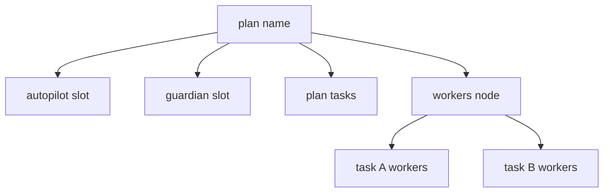

# Autopilot Plan-Scoped Hierarchy — Implementation Plan

**Date:** 2026-09-01  
**Status:** Approved design; implementation plan  
**Scope:** Documentation of the implementation plan only — no production code changes are approved by this document.

## 1. Outcome and non-goals

Replace autopilot's disposable manager sessions and tag-derived flat tree with a **plan-name-scoped hierarchy** that mirrors pipelines: stable slot ids, in-place manager rotation, explicit session back-refs instead of a live `parent_id` chain, and a **per-plan integration branch** so concurrent runs in one repo cannot land into each other's trees.

### Goals

- Render each registered plan as a stable tree root (display name), with fixed slots for the manager, guardian, plan checklist, and workers grouped by ledger state.
- Make guardian heal-ladder rotation (`nudge → restart → rotate backend → backoff`, plus `plannedRotate` on high context) an **in-place hot-swap** into the same manager slot, reusing `Lifecycle.HotSwap` and the existing handoff machinery.
- Stop using `parent_id` as the autopilot ownership/display contract; use explicit back-ref fields on `store.Session` (analogous to `PipelineID`/`JobID`).
- Derive each run's integration branch from its plan name (default `autopilot/<plan-name>`), resolve it once, persist it on `RunRecord`, and surface it on every operator surface.
- Keep `run_id` (`ap-<hash>`) as the internal collision-free key; use plan name only as the display root and for derived naming.

### Non-goals

- Changing autopilot decision-making, gating semantics, landing merge strategies, heal-ladder policy, or backend-recovery ownership (see `docs/specs/2026-09-01-reactive-backend-limit-recovery.md` §9).
- Editing `internal/cli/**` in this workstream — coordinate with the in-flight CLI Command & Help Redesign (`docs/specs/2026-09-01-cli-command-help-redesign.md`, plan `plans/cli-command-help-redesign.yaml`).
- Removing legacy `run:<run_id>` tags or the ownership guard's tag-based authorization during rollout (additive migration only).

---

## 2. Verified current state

Phase 1 characterization tests must record this baseline before changing behavior.

### 2.1 Run identity and grouping

| Mechanism | Location | Behavior |
|---|---|---|
| `run_id` | `internal/autopilot/controller.go:292-300` | `ap-` + first 12 hex chars of `sha256(canonicalPath(repo) + "\x00" + canonicalPath(planPath))` |
| Plan name | `internal/autopilot/lifecycle.go:21-24`, `118-121` | `defaultRunName(planFile)`; per-repo uniqueness enforced only in `Register` (`lifecycle.go:122-126`) |
| Run tag | `internal/autopilot/run.go:14-18` | Brain/workers carry `autopilot` + `run:<run_id>` |
| Guardian id | `internal/daemon/autopilot_runtime.go:98-99` | `guardian-` + `strings.TrimPrefix(runID, "ap-")` |
| Manager id | `internal/lifecycle/lifecycle.go:808-812` | Free-form spawn → `agent-<8hex>` via `resolveID` / `shortID` |

The manager ("brain") is spawned by `Controller.spawnBrain` → `Runtime.SpawnBrain` (`internal/autopilot/run.go:165-209`, `internal/daemon/autopilot_runtime.go:52-78`) with no `ParentID` and no deterministic id.

### 2.2 Manager rotation and restart churn

**Guardian rotation** (`internal/autopilot/run.go:147-158`):

```go
func (c *Controller) rotateBrain(...) error {
    if r.brain != nil && r.brain.AgentID != "" {
        if err := c.runtime.TerminateBrain(ctx, r.brain.AgentID); err != nil { ... }
        r.brain = nil
    }
    return c.spawnBrain(ctx, r, backend)
}
```

Each rotation mints a **new** `agent-<hex>` id. Workers keep `parent_id` pointing at the dead manager (`internal/mcp/server.go:297`, `internal/lifecycle/lifecycle.go:1493-1497`).

**Daemon restart churn** (`internal/autopilot/lifecycle.go:44-48`, `internal/autopilot/controller.go:260-289`): `restoreStoredRuns` deliberately does not restore `BrainID` ("Agent ids are process/session observations, not proof of a live manager"). `SetRuntime` then calls `spawnBrain` for every live run, spawning a rival manager even when the old tmux session may still be alive.

**Authorization break:** `CanBrainComplete` compares the caller to in-memory `r.brain.AgentID` (`controller.go:772-783`), so a surviving pre-restart manager is rejected after boot reconciliation.

### 2.3 Tombstoned managers

When a parent has live children, `DeleteSession` tombstones instead of deleting (`internal/daemon/strict_lifecycle.go:288-311`): tmux terminated, status set to `done`/`orphaned`, record kept. Reaping walks up `ParentID` when no live children remain (`internal/daemon/tombstone_reap.go:40-91`, periodic sweep at `tombstone_reap.go:115-129`).

Production consequence: a rotated manager with live MCP workers (`agent-8bed0ec5`-class) stays `orphaned` indefinitely, accumulating dead manager records over long runs.

### 2.4 Ownership is already tag-based, not parent-based

`guardOwnership` (`internal/daemon/ownership_guard.go:48-64`) authorizes brain actions when the caller has `Role == "autopilot"` and the target carries matching `autopilot` + `run:<run_id>` tags. `inheritOwnershipTags` (`ownership_guard.go:88-102`, called from `strict_lifecycle.go:69`) appends tags at spawn. Manager-created pipelines get tags but **no** `ParentID`.

### 2.5 Pipeline contrast (the model to copy)

| Aspect | Pipeline | Autopilot today |
|---|---|---|
| Stable root id | Pipeline name == `Pipeline.ID` (`internal/pipeline/spec.go:9-17`) | `run_id` hash, not plan name |
| Job session id | `<pipelineID>-<jobID>` via `SpawnJob` (`internal/lifecycle/lifecycle.go:2457-2461`) | `agent-<hex>` manager |
| Linkage | `Session.PipelineID`, `Session.JobID` | `ParentID` chain + tags |
| TUI | Pipeline jobs removed from flat list (`internal/tui/list.go:165-176`); header + job rows (`list.go:512-529`) | Run agents matched by tag (`list.go:734-743`, `control_pane.go:223-235`) |

### 2.6 Integration branch is global (present-tense defect)

| Source | Location | Value |
|---|---|---|
| Config default | `internal/config/config.go:473-478`, `1571-1573` | `"autopilot/integration"` via `AutopilotIntegrationBranch()` |
| Controller field | `internal/cli/daemon.go:600-607` | Single `IntegrationBranch` on `ControllerConfig` |
| Preflight | `internal/autopilot/preflight.go:87-106` | `branch := c.integrationBranch` |
| Run record | `internal/autopilot/lifecycle.go:56-60` | `IntegrationBranch: c.integrationBranch` (mirrors global) |
| Land | `internal/autopilot/controller.go:871-887` → `land_routes.go:68-78` | `LandParams.IntegrationBranch` → `LandRequest.IntegrationBranch` |
| Land guard | `internal/autopilot/land.go:154-155` | `pr.BaseRef != req.IntegrationBranch` → `ErrWrongBase` |

**Concurrent runs already share one branch.** The comment in `preflight.go:36-38` claiming "no second active run per repo" lives in `Enable` is **stale**. V2 removed that invariant (`docs/specs/2026-08-30-autopilot-v2.md` Phase 1). `Enable` spawns a brain per matching plan (`controller.go:399-450`); `StartRun` has no repo-wide exclusivity check (`lifecycle.go:177-216`). Two active plans in one repo today both land into `autopilot/integration`, stacking unrelated PRs and gating a branch containing another plan's work.

### 2.7 Surfaces today

- **TUI:** `projectGroupedItems` nests run → plan tasks → run-tagged sessions at `depth: 1` (`internal/tui/list.go:700-714`); run header shows name/state/task counts (`list.go:1041-1047`).
- **Web:** `AutopilotPanel.tsx:112` filters agents by `run:${run_id}` tag; Cockpit grid does not hide autopilot/pipeline agents.
- **CLI:** `warden autopilot list`/`status` omit integration branch (`internal/cli/autopilot.go:41-51`, `216-221`).
- **OpenAPI:** `Session` lacks autopilot back-ref fields; `parent_id` documented at `internal/daemon/apidocs/openapi.yaml:2910`. Regenerate via `make generate` (`internal/daemon/oapi/doc.go:7`).

### 2.8 Ledger state keys (docs vs code)

Documented per-task keys `autopilot.tasks.<id>.state` appear in `skills/warden/SKILL.md` and operator docs, but the implementation stores one JSON array at `autopilot.<run_id>.tasks` (`internal/autopilot/ledger.go:84-93`). `LedgerTask.State` is an unconstrained string; plan-file statuses are a separate four-value enum (`internal/autopilot/plan.go:70-75`).

---

## 3. Decisions

### D1 — Plan-name-scoped tree with stable slot ids

Adopt the operator's hierarchy:

```text
<plan-name>                      # display root (run_id internally)
├── autopilot                    # manager slot: <slot-scope>-autopilot
├── guardian                     # guardian slot: <slot-scope>-guardian
├── plan                         # checklist from plan YAML + ledger
└── workers                      # grouped by ledger state
    └── <task-id>                # worker sessions / manager pipelines
```

**Justification:** Same pattern as `SpawnJob`'s `<pipelineID>-<jobID>` (`internal/lifecycle/lifecycle.go:2457`). Slot ids survive rotation; downstream never re-points.

**Rejected:** Keep `parent_id` and restart the replacement manager in the dead one's place — see §3.2.

### D2 — Reject repairing the live `parent_id` chain

| Reason | Evidence |
|---|---|
| Ownership is not parent-based | `ownership_guard.go:48-64`; pipelines have tags without `ParentID` |
| N children rewritten on every rotation | No bulk re-parent API; `parent_id` is one-way (`openapi.yaml:1404`) |
| Rotation is not the only churn | `restoreStoredRuns` + `SetRuntime` spawn rivals on every daemon boot |
| Pipelines prove back-refs work | `PipelineID`/`JobID` + deterministic ids; TUI needs no tag parsing for jobs |

**Fallback (not recommended):** If implementation discovers HotSwap cannot serve manager rotation (e.g. brain has no worktree), adopt in-place id reuse via `SpawnRequest.Ticket` + adopt path — still back-refs, still no parent chain repair.

### D3 — Manager rotation = in-place hot-swap into the slot

Replace `rotateBrain`'s terminate-then-spawn with a `Runtime.RotateBrainSlot` (name TBD) that calls `Lifecycle.HotSwap` on the slot session (`internal/lifecycle/switch.go:95-98`, `100-167`):

| Heal stage | Current (`guardian.go`) | New |
|---|---|---|
| `stageHealthy` | Nudge | Unchanged |
| `stageNudged` | `rotateBrain(same backend)` | `HotSwap` with pinned `SwapRequest.Backend` |
| `stageRotated` / `rotateStep` | `rotateBrain(next backend)` | `HotSwap` with selected backend |
| `plannedRotate` | `rotateBrain` on context pressure | Same HotSwap seam |
| Cold start / missing slot | `spawnBrain` | `Spawn` with `Ticket = slot id`; adopt on `ErrExists` |

Boundary: `BackendRecoveryCoordinator` remains the sole automatic backend switcher for quota recovery (`docs/specs/2026-09-01-reactive-backend-limit-recovery.md` §9). Guardian rotation and recovery must not double-switch the same session.

Handoff path: `<workdir>/.warden/handoff-<slot-id>.md` (`internal/handoff/serialize.go:15-26`).

### D4 — Explicit session back-refs; deprecate autopilot `parent_id`

Add to `store.Session` (`internal/store/types.go`):

| Go field | JSON name | Values |
|---|---|---|
| `AutopilotRunID` | `autopilot_run_id` | Owning `ap-` run id |
| `AutopilotSlot` | `autopilot_slot` | `autopilot` \| `guardian` \| `worker` |
| `AutopilotTaskID` | `autopilot_task_id` | Plan task id (workers only) |

Tags remain the authorization channel during rollout. Fields are the display/reconciliation contract. MCP worker spawns must **not** set `ParentID` to the manager when `AutopilotSlot` is set (guardian is never anyone's parent).

Extend OpenAPI `Session` schema and `AutopilotRun`/`AutopilotStatus` with slot ids, integration branch, and worker grouping metadata. Run `make generate`; CI enforces via `make generate-check`.

Correct the `Session.id` OpenAPI description ("always carries the `agent-` prefix") — already false for `guardian-*` and `<pipeline>-<job>` ids.

### D5 — Identity: `run_id` stays internal; plan name is display-only

- **`run_id`:** unchanged hash (`controller.go:292-300`).
- **Display root:** `RunRecord.Name` / `AutopilotRunStatus.Name`.
- **Slot scope:** derived token satisfying `store.SafeID` (`internal/store/file.go:277-285`) and `store.ValidateName` length/pattern (`file.go:291-303`), **not** raw plan name when unsafe.

**Cross-repo name collision:** `Register` enforces per-repo name uniqueness (`lifecycle.go:122-126`). Cross-repo ambiguity already errors in CLI (`internal/cli/autopilot.go:82-99`). Slot scope gains a deterministic disambiguating suffix from `run_id` when the same scope is claimed by a different run (e.g. `default~a1b2c3`).

**Reserved suffixes:** Plans named `foo-autopilot` must not collide with plan `foo`'s manager slot `foo-autopilot`. Enforce at register via reserved suffix set (`-autopilot`, `-guardian`) and claim registry.

**Name shadowing:** `GetByNameOrID` resolves names before ids (`file.go:542-563`). Slot sessions must not use `Session.Name` values that shadow another session's id.

**Plan rename:** Explicit registry operation (modeled on `relocateStoredRun`, `internal/autopilot/migrate.go`); do not silently change `run_id` (path-derived). Slot scope may update; integration branch retarget is explicit (§4).

### D6 — Per-plan integration branch

**Default:** `autopilot/<sanitized-plan-name>`.

**Precedence:** plan-file override > derived default > legacy global config.

**Storage:** Resolve once at register/preflight; persist on `RunRecord.IntegrationBranch` (`internal/autopilot/store.go:30`). Consumers read the stored value only:

1. `preflight.go` branch block (today line 87)
2. `recordLocked` (`lifecycle.go:59`)
3. `LandParams` (`controller.go:880`) — single land chokepoint

**Alternatives considered:**

| Shape | Rejected because |
|---|---|
| `autopilot/<run_id>` | Opaque on PRs and in GitHub UI |
| `autopilot/<name>-<hash>` | Ugly; rename unstable |

**Config back-compat (`autopilot.merge.target_branch`):**

- Plain global value: **grandfather** runs that already resolved to it (e.g. live `autopilot/integration` on this machine) — no re-derive, no open PR rebasing on upgrade.
- New runs after upgrade: derived per-plan default unless overridden.
- Template: `{{plan}}` expanded per run (e.g. `integration/{{plan}}`).
- Warn when >1 active run in a repo would resolve to the same branch (migration safety net). Defer deprecating bare global.

**Plan-file override:** Adding `integration_branch` to `Plan` requires struct change (`plan.go` strict decode). Older binaries reject unknown keys. **Recommendation:** prefer registry-side override API; if plan YAML override ships, document forward-compat cost.

**Branch naming safety:**

- Sanitize plan names through `git check-ref-format` rules: reject/replace trailing `.lock`, leading/trailing `.`, `..`, trailing `/`, all-dot names.
- Plan names cannot contain `/` today (`validPlanName`, `init.go:88-99`) — state invariant explicitly; block nested names if schema ever changes (avoid `autopilot/foo` vs `autopilot/foo/bar` ref conflict).
- Deterministic collision disambiguation shares WP2's `run_id` suffix mechanism with slot scopes.
- **Rename:** Do not silently abandon old branch or open PRs. Carry forward or require explicit `--retarget`; otherwise `ErrWrongBase` (`land.go:154-155`).

**Concurrent runs per repo:** Already supported (V2). Per-plan branches remove the last shared resource. No reintroduction of "one active run per repo."

**CI gate (`gate: auto`):** `resolveGateMode` (`land.go:225-237`) picks `ci` only when workflows cover the **resolved** branch. Workflows listing `autopilot/integration` exactly do not cover `autopilot/<plan>`. Silent downgrade to `local` weakens the gate without error (observed on this machine). Mitigations:

- `printCIHint` recommends `autopilot/**` (`init.go:343-357`, `359-366`).
- Preflight warns when `auto` → `local` because derived branch is uncovered.
- Docs sweep carries workflow migration note.

**Worker PR base:** Deliver resolved branch via (1) manager digest prompt (`ComposeDigest`, `internal/autopilot/digest.go`), (2) `AutopilotRunStatus.integration_branch` (new field on wire types, `internal/client/client.go:1249-1263`), (3) ledger/run context keys. Workers must not guess; misconfiguration surfaces as explicit `ErrWrongBase` detail (`land.go:155`).

---

## 4. Target tree (all surfaces)

All of CLI (`warden ls`, `warden autopilot status`/`list`), MCP tools, REST/OpenAPI, TUI (`internal/tui/list.go`, `control_pane.go`), and web (`web/src/components/AutopilotPanel.tsx`) must render the same hierarchy.



TUI implementation notes:

- Extend `projectGroupedItems` (`list.go:595-727`): after plan tasks, emit synthetic `workers` header; nest worker sessions by `AutopilotTaskID`; order segments by ledger state (`pending` → `assigned` → `in_progress` → `pr_open` → `gated` → `landed`).
- Prefer `AutopilotRunID` over `sessionRunID` tag parsing (`list.go:734-743`).
- Remove run-owned agents from flat forest via back-ref filter (replace `control_pane.go:223-235` tag filter).
- Run header shows integration branch alongside state/task summary (`list.go:1047`).

Guardian: real session (`autopilot_runtime.go:98-121`), tagged `system:true` + `autopilot-run:<run_id>`, **not** anyone's `parent_id`. Scheduled loop remains daemon-owned (`guardian.go:37-53`); session is display-only inspectability.

---

## 5. Migration and back-compat

### 5.1 Daemon boot (`Controller.SetRuntime`, `ReconcileGuardians`)

| Legacy artifact | Reconciliation |
|---|---|
| `agent-<hex>` managers | If live tmux for stored `BrainID`, adopt into `<scope>-autopilot` slot; else spawn slot |
| `guardian-<hash>` ids | `ReconcileGuardians` (`autopilot_runtime.go:144-178`); migrate to `<scope>-guardian` |
| Workers with `parent_id` → dead manager | Clear or ignore `parent_id`; set back-ref fields from tags + task id |
| `RunRecord.IntegrationBranch == autopilot/integration` | Grandfather — never re-derive for existing records |
| Dual-read window | Tree renderers accept tags **or** back-ref fields until migration complete |

### 5.2 In-flight runs

Runs active during upgrade must not orphan workers or open PRs. WP12 runs reconciliation once at `SetRuntime` and is idempotent.

### 5.3 OpenAPI / generated clients

Edit `internal/daemon/apidocs/openapi.yaml` first; `make generate`; never hand-edit `internal/daemon/oapi/api.gen.go`.

---

## 6. Phased work packages

Each package is independently landable with explicit dependencies. Suitable for a warden pipeline or autopilot plan.

### WP1 — Characterization tests (baseline inventory)

**Goal:** Freeze current behavior in tests before any semantic change.

**Tasks:** Rotation id churn; restart spawn-without-adopt; tombstone-on-delete-with-live-children; `CanBrainComplete` after simulated restart; shared integration branch for two runs in one repo; TUI run rendering golden (`list_test.go:306-324` pattern).

**Acceptance:** Tests pass on main; document exact seams for WP4–WP6, WP9.

**Depends on:** none.

---

### WP2 — Identity and claim registry

**Goal:** Derived slot scope, reserved suffixes, cross-repo disambiguation, plan rename registry op, close uniqueness holes in `Register` and legacy `Enable`.

**Tasks:** `SlotScope(run)` function shared by manager/guardian ids; claim registry in run store or controller; rename API; fix stale `preflight.go:36-38` comment.

**Acceptance:** Two repos with `plans/default.yaml` get distinct slot scopes; `foo-autopilot` plan cannot steal `foo`'s slot; rename preserves `run_id`.

**Depends on:** WP1.

---

### WP3 — Session back-ref fields + OpenAPI

**Goal:** Add `autopilot_run_id`, `autopilot_slot`, `autopilot_task_id` to `Session`; extend autopilot run schemas; regenerate oapi.

**Acceptance:** Fields round-trip REST/SSE; dual-read renderers accept empty back-refs (legacy sessions).

**Depends on:** WP2.

---

### WP4 — Deterministic slot spawn

**Goal:** Manager and guardian use `SpawnRequest.Ticket = <scope>-autopilot|guardian`; adopt live session on `store.ErrExists` (`file.go:524-529`).

**Files:** `internal/daemon/autopilot_runtime.go`, `internal/autopilot/run.go`, `internal/autopilot/lifecycle.go` (`recordLocked` slot id fields on run record).

**Acceptance:** First start creates slot ids; second start adopts; `BrainID` on record matches slot id.

**Depends on:** WP2, WP3.

---

### WP5 — In-place hot-swap rotation

**Goal:** Replace `rotateBrain` terminate-spawn with HotSwap-based slot rotation for all guardian ladder paths.

**Acceptance:** After rotation, manager id unchanged; workers need no `parent_id` update; handoff file written at stable path; backend recovery coordinator not invoked by guardian rotation.

**Depends on:** WP4.

**Testing:** Table-driven tests per heal stage; integration test: rotate with live workers → tree unchanged, workers landable.

---

### WP6 — Stop parenting autopilot workers

**Goal:** MCP spawn omits `ParentID` for autopilot-owned workers; set back-ref fields instead.

**Acceptance:** Delete rotated manager no longer tombstones; dead manager records reap when workers finish.

**Depends on:** WP3.

---

### WP7 — Ledger state enum

**Goal:** Define canonical task states in Go; align docs/skill with `ledger.go` storage; optional ctx keys for TUI segmentation.

**Acceptance:** States `pending`, `assigned`, `in_progress`, `pr_open`, `gated`, `landed` validated on write; tests for illegal transitions deferred to autopilot semantics owners.

**Depends on:** none (parallel with WP4–WP6).

---

### WP8 — TUI + web tree

**Goal:** `workers` node, back-ref filtering, ledger-state ordering, integration branch on run header; web parity in `AutopilotPanel.tsx`.

**Acceptance:** TUI matches §4 diagram; web run card shows branch + grouped workers; Cockpit hides back-ref autopilot agents from flat grid.

**Depends on:** WP3, WP7.

---

### WP9 — Per-plan integration branch: resolution and storage

**Goal:** Branch sanitizer; resolve at register/preflight; persist on `RunRecord.IntegrationBranch`; switch three consumers to per-run value; config precedence + `{{plan}}` template; same-branch collision warning.

**Acceptance:** Two plans in one repo → different branches stored; land uses stored value; grandfather preserves `autopilot/integration` on existing records.

**Depends on:** WP2 (shared disambiguation suffix).

**Testing:** See §7 integration-branch matrix.

---

### WP10 — Per-plan branch: init, gate, worker base, surfaces

**Goal:** Init/preflight use resolved branch; CI hint + downgrade warning; branch in digest/status/ledger; wire types + TUI/web display.

**Acceptance:** Worker spawn prompt includes branch; `autopilot status` JSON includes `integration_branch` (REST first; CLI after CLI redesign lands).

**Depends on:** WP9.

**Sequencing:** CLI-visible output waits for `pipeline-autopilot` task in CLI redesign plan.

---

### WP11 — Plan rename (branch + scope)

**Goal:** Rename operation updates display scope; integration branch retarget is explicit; old branch/PRs not silently abandoned.

**Depends on:** WP2, WP9.

---

### WP12 — Migration and reconciliation

**Goal:** Boot adopts live legacy managers; migrates guardian ids; sets back-refs on workers; grandfathers branches; dual-read tree.

**Depends on:** WP4, WP5, WP9.

---

### WP13 — Documentation and Definition of Done

Per `CLAUDE.md` checklist:

| Surface | Files |
|---|---|
| README | `README.md` autopilot section |
| Docs | `docs/FEATURES.md` §34, `docs/USAGE.md` §18 |
| Website | `site/src/content/docs/concepts/autopilot.md`, `guides/autopilot.md` |
| Skill | `skills/warden/SKILL.md`, `.agents/skills/warden/SKILL.md` (keep identical) |
| CLI reference | `make gendocs` only if cobra help changes (after CLI redesign) |

Must document: plan-scoped tree, slot ids, rotation hot-swap, `autopilot.merge.target_branch` migration, `autopilot/**` workflow triggers, per-plan integration branches.

**Depends on:** feature PRs; prose can land incrementally but WP13 completes the checklist before tag/release.

---

## 7. Testing strategy

### 7.1 Hierarchy and rotation

| Area | Scenario | Assertion |
|---|---|---|
| Rotation | Guardian `rotateBrain` after nudge/restart/rotate/planned | Manager slot id unchanged; `HotSwap` called; handoff path stable |
| Workers | Live workers during rotation | No `parent_id` rewrite; back-refs intact; land still works |
| Restart | Daemon `SetRuntime` with live manager tmux | Adopts slot; does not spawn rival `agent-<hex>` |
| Tombstone | Delete manager with live workers (legacy) | No tombstone after WP6; manager reap when subtree terminal |
| Tree | TUI + REST session list | Same parent/child shape; pipeline-owned still hidden from flat list |
| Auth | `CanBrainComplete` after restart | Succeeds when caller is slot manager session |

### 7.2 Integration branch

| Area | Scenario | Assertion |
|---|---|---|
| Isolation | Two plans, one repo | Different `IntegrationBranch` on records |
| Land guard | Plan A worker, PR base plan B branch | `ErrWrongBase`; no merge side effect |
| Sanitizer | `.lock`, `..`, trailing `.` plan names | Valid git ref or register-time error |
| Precedence | Override / derived / global / `{{plan}}` | Correct resolved value stored once |
| Grandfather | Existing `autopilot/integration` record | Unchanged across restart |
| Gate | Workflow `autopilot/integration` only | Does not cover `autopilot/foo`; `autopilot/**` does |
| Gate warning | `auto` → `local` due to uncovered branch | Explicit operator warning emitted |
| Worker base | Spawn without branch in prompt | Fails preflight or surfaces `ErrWrongBase` with detail |

### 7.3 Generated surfaces

- `make generate-check` clean after OpenAPI edits.
- Client/TUI tests for new JSON fields (nullable round-trip).

---

## 8. Sequencing and dependencies

```text
WP1 (characterization)
  └─▶ WP2 (identity registry)
        ├─▶ WP3 (back-ref fields) ──▶ WP6 (no parent_id)
        │         └─▶ WP8 (TUI/web) ◀── WP7 (ledger enum)
        ├─▶ WP4 (slot spawn) ──▶ WP5 (hot-swap rotation) ──▶ WP12 (migration)
        └─▶ WP9 (branch resolve) ──▶ WP10 (branch surfaces) ──▶ WP11 (rename)
                                              └─▶ WP12
WP13 (docs) — after feature packages; CLI prose after CLI redesign
```

**CLI redesign coordination:** Do not edit `internal/cli/**` until `pipeline-autopilot` task lands (`plans/cli-command-help-redesign.yaml`). REST/MCP/status JSON may ship first; CLI formatting follows.

**Backend recovery coordination:** Guardian rotation must not duplicate `BackendRecoveryCoordinator` (`docs/specs/2026-09-01-reactive-backend-limit-recovery.md` §9).

---

## 9. Risks and rollback

| Risk | Mitigation | Rollback |
|---|---|---|
| Session id change breaks tmux/handoff/audit | Slot ids introduced before rotation switch; adopt path | Revert WP5; keep WP4 slot ids with legacy rotation |
| Half-migrated tree during rollout | Dual-read tags + back-refs; idempotent reconciliation | Feature flag per run; grandfather legacy tags |
| Open PR orphan on branch re-derive | Never re-derive stored `IntegrationBranch` | WP12 grandfather |
| Silent gate downgrade to `local` | WP10 explicit warning | Operators add `autopilot/**` to workflows |
| Plan schema forward-compat | Prefer registry override over plan YAML key | Document; delay plan-file override |
| `GetByNameOrID` shadowing | Scope validation; no shadowing names on slot sessions | — |

Per-WP rollback: each package is independently revertible if acceptance tests are package-scoped.

---

## 10. Follow-up items (observed during research; not fixed by this plan)

1. **`TerminateGuardian` empty tmux:** `autopilot_runtime.go:132` calls `Terminate` with unset `TmuxSession` (`114-116`); harmless due to `lifecycle.go:2079-2084`.
2. **Ledger key divergence:** Skill/docs `autopilot.tasks.<id>.state` vs `ledger.go` array storage.
3. **OpenAPI `Session.id` description:** Claims universal `agent-` prefix; false for pipeline/guardian ids.
4. **`Register` uniqueness:** In-memory only; `Enable` has no name check.
5. **`CanBrainComplete` vs boot reconciliation:** In-memory brain id discarded on restore (`lifecycle.go:44-48`).
6. **Stale preflight comment:** "no second active run per repo" (`preflight.go:36-38`) — invariant removed in V2.
7. **Shared integration branch defect:** Concurrent repo runs land into each other's tree today — fixed by WP9/WP10.

---

## 11. Out of scope

- Autopilot heal-ladder timing/threshold changes.
- Backend quota recovery behavior (`docs/specs/2026-09-01-reactive-backend-limit-recovery.md`).
- CLI command tree reorganization (`docs/specs/2026-09-01-cli-command-help-redesign.md`).
- Removing `run:<run_id>` tags or tag-based ownership guard (future cleanup after migration window).
- Tag/release — requires maintainer confirmation per `CLAUDE.md` before pushing `v*` tags.

---

## 12. Comprehensive acceptance criteria

1. Each autopilot run renders as a plan-name root with stable `<scope>-autopilot` and `<scope>-guardian` slot ids on TUI, web, REST, MCP, and CLI (CLI after redesign).
2. Guardian rotation hot-swaps into the manager slot; manager id does not change; workers require no `parent_id` repoint.
3. Autopilot workers and manager-created pipelines use `autopilot_run_id`/`autopilot_slot`/`autopilot_task_id`; `parent_id` is not the ownership contract.
4. Dead manager records do not accumulate as orphaned tombstones with live worker subtrees.
5. Two concurrent runs in one repo use distinct integration branches; land rejects cross-plan PR bases with `ErrWrongBase`.
6. Existing runs on `autopilot/integration` continue landing there after upgrade.
7. `gate: auto` downgrade to `local` due to uncovered workflow emits an explicit warning; docs recommend `autopilot/**`.
8. Workers receive the resolved integration branch via digest, status API, and ledger — not guesswork.
9. OpenAPI and generated clients include new session and run fields; `make generate-check` passes.
10. Definition of Done docs/skill/website updates complete per WP13 before feature tag/release.
