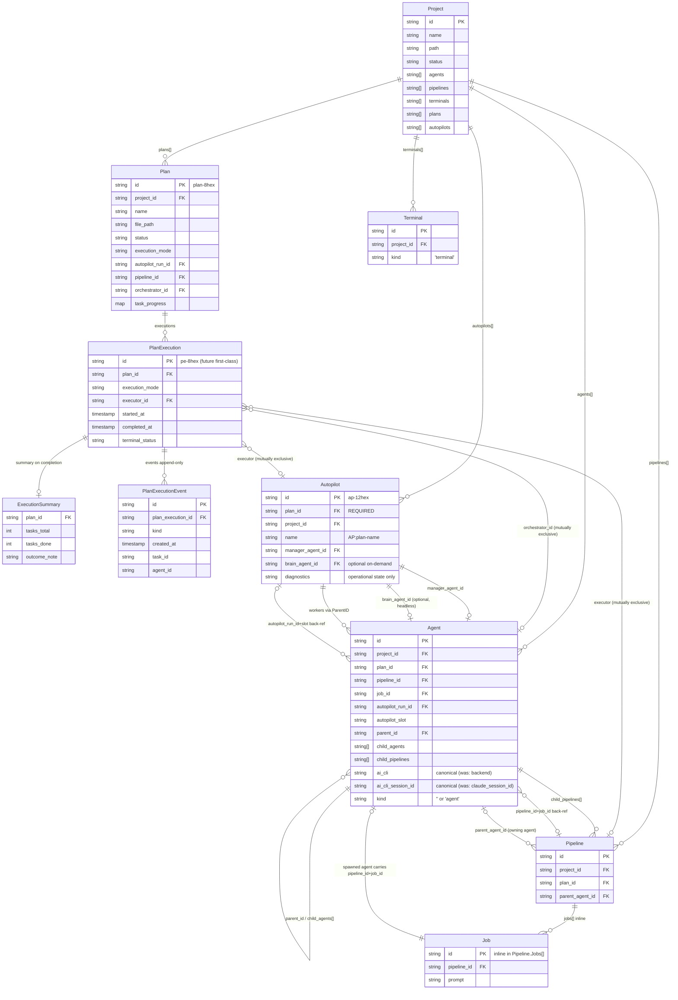

# Plan-Execution Entity Redesign — Implementation Contract

**Date:** 2026-09-29  
**Status:** Spec freeze / implementation contract — no production code changes in this document  
**Integration branch:** `autopilot/plan-execution-entity-redesign`  
**Scope:** Lock the canonical entity vocabulary, ownership rules, relationship model, and
`ai_cli` terminology migration so that every downstream task
(`plan-execution-types`, `terminal-record-model`, `agent-canonical-model`,
`autopilot-entity-model`, `ai-cli-terminology-migration`, etc.) can implement
against a single agreed contract without making new naming or ownership decisions.

---

## 0. Why this spec exists

Three gaps make it hard to implement the plan-execution-entity redesign cleanly:

1. **The Plan/execution boundary is implicit.** The `Plan` DB record carries both
   the durable definition _and_ transient execution links
   (`autopilot_run_id`, `pipeline_id`, `orchestrator_id`) directly on the same
   row. There is no named concept for "one execution attempt of a plan."

2. **Executor entities have no canonical disposition.** The codebase uses
   `Agent`, `Pipeline`, and `Autopilot` in overlapping roles. Which ones are
   durable? Which are disposable? The spec was never written down.

3. **The field that selects the AI CLI is called `backend` everywhere.** That
   name is implementation-internal and leaks into the public API, config, and
   CLI flags. The canonical rename to `ai_cli` requires a migration window with
   backward-compatible aliases.

This spec resolves all three and is normative for every downstream task.

---

## 1. Canonical entity glossary

### Project

The repo-level parent. One per checkout root (local absolute path) or remote
URL. Persisted in `internal/projectstore` as `projectstore.Project`.

A Project is **open** or **closed** (IDE-like hibernation). A closed project's
agents are hibernatable; the Project record is never deleted on close.

The Project stores the **authoritative membership lists**:

| List field | Members |
|---|---|
| `Project.Agents[]` | AI agent sessions (planless or plan-bound) |
| `Project.Pipelines[]` | Pipeline entities (planless or plan-bound) |
| `Project.Terminals[]` | Terminal (shell pane) sessions — leaf members |
| `Project.Plans[]` | Plan records |
| `Project.Autopilots[]` | Autopilot run records |

Membership lists are stored on the Project record and kept consistent with each
member's back-ref `ProjectID` field. Both directions are maintained together in
the same operation; neither is re-derived by scanning.

A worktree is **not** a Project. An Agent running in a git worktree carries
the parent repo's Project ID in `Session.ProjectID` and its own worktree path
in `Session.Worktree`. Worktrees are never registered as separate Projects.

---

### Plan

A **durable** work definition. Authored as a YAML file under
`plans/{pending,in_progress,completed,archived}/` in the project repository.
Persisted in `internal/planstore` as `planstore.Plan`.

**Durable means:** a Plan record and its YAML file survive all executor
teardowns. Completing, failing, or deleting an executor (Agent, Pipeline,
Autopilot) does not delete the Plan. Explicit plan archiving (`archive_plan`)
is the operator's choice.

YAML-backed definition fields (carried by the file, not the DB record):

| Field | Type | Semantics |
|---|---|---|
| `name` | string | Human-readable plan name; also drives the file slug |
| `goal` | string | What the plan is trying to achieve |
| `tasks[]` | `{id, prompt, after?}` | Ordered work units; `after` declares dependencies |
| `constraints[]` | string list | Hard rules every executor must follow |
| `done_when[]` | string list | **Free-text only** (see ownership rule 5) |

DB-only execution state (carried on the `planstore.Plan` record):

| Field | Semantics |
|---|---|
| `status` | `pending` / `in_progress` / `completed` / `archived` |
| `execution_mode` | `autopilot` / `pipeline` / `orchestrator_worker` / `manual` |
| `autopilot_run_id` | Back-ref when mode is `autopilot` |
| `pipeline_id` | Back-ref when mode is `pipeline` |
| `orchestrator_id` | Back-ref when mode is `orchestrator_worker` |
| `task_progress` | Map task ID → `pending/in_progress/done/skipped` |
| `plan_branches[]` | Git branches associated with this plan's execution |

---

### PlanExecution

A **single execution attempt** of a Plan. Created when `run_plan` is called;
transitions the Plan to `in_progress`.

**Current state:** The PlanExecution concept is currently _flattened onto the
`planstore.Plan` record_ — the fields `autopilot_run_id`, `pipeline_id`,
`orchestrator_id`, `execution_mode`, `started_at`, and `completed_at` together
constitute the current PlanExecution representation. This spec names and defines
the concept so downstream tasks can lift it into a first-class record without
bikeshedding the vocabulary.

**Canonical fields** (whether stored on `Plan` or promoted to a first-class
`PlanExecution` record in a later task):

| Field | Type | Required | Semantics |
|---|---|---|---|
| `id` | `pe-<8hex>` | yes | Stable execution ID |
| `plan_id` | `plan-<8hex>` | yes | The Plan this execution belongs to |
| `execution_mode` | enum | yes | `autopilot` / `pipeline` / `orchestrator_worker` / `manual` |
| `executor_id` | string | depends | `autopilot_run_id` OR `pipeline_id` OR `orchestrator_id` (mutually exclusive; absent for `manual`) |
| `started_at` | timestamp | yes | When `run_plan` succeeded |
| `completed_at` | timestamp | no | When the execution reached a terminal state |
| `terminal_status` | enum | no | `running` / `completed` / `failed` / `cancelled` |
| `task_progress` | map | yes | Task ID → `pending/in_progress/done/skipped` |
| `plan_branches[]` | string list | no | Git branches opened by this execution |

A Plan may accumulate multiple PlanExecutions over its lifetime (e.g., a failed
run followed by a successful one). The Plan's own `status` reflects the latest
PlanExecution's outcome.

---

### ExecutionSummary

A compact, read-only report produced when a PlanExecution completes or is
archived. Not a DB record in its current form — generated on demand from a
completed `planstore.Plan`.

Canonical fields:

| Field | Semantics |
|---|---|
| `plan_id` | The source Plan |
| `plan_name` | Human-readable name (from YAML) |
| `goal` | Plan goal (from YAML) |
| `execution_mode` | How the plan was run |
| `executor_id` | Linked executor (autopilot run / pipeline / orchestrator) |
| `started_at` / `completed_at` | Execution window |
| `tasks_total` | Total task count (from YAML) |
| `tasks_done` | Count in `done` / `skipped` state |
| `outcome_note` | Free-text (set by the executor or the operator) |

---

### PlanExecutionEvent

A timestamped, append-only event emitted during a PlanExecution. Events are
never edited or deleted.

Canonical event kinds:

| Kind | Emitted when |
|---|---|
| `task_started` | A task transitions to `in_progress` |
| `task_completed` | A task transitions to `done` |
| `task_failed` | A task transitions to `failed` |
| `task_skipped` | A task transitions to `skipped` |
| `worker_spawned` | An Agent is spawned for a plan task |
| `worker_landed` | A worker's PR is merged into the integration branch |
| `executor_created` | The executor (pipeline / autopilot run) is registered |
| `executor_completed` | The executor reaches its terminal state |

Events may carry a `task_id`, `agent_id`, `pipeline_id`, `autopilot_run_id`, or
`pr_url` as payload depending on kind.

---

### Agent

An AI coding session. Persisted in `internal/store` as `store.Session` with
`Kind == ""` (agent, back-compat zero value) or `Kind == "agent"`.

**Disposable executor.** An Agent may be terminated and deleted without
affecting the Plan it was spawned under. Its existence depends on a running tmux
process; its record may be garbage-collected after teardown.

Key back-ref fields:

| Field | Semantics |
|---|---|
| `plan_id` | The plan this agent is executing a task for (optional) |
| `pipeline_id` + `job_id` | The pipeline job this agent is executing (mutually exclusive with plan_id/autopilot fields as primary context) |
| `autopilot_run_id` + `autopilot_slot` + `autopilot_task_id` | Autopilot ownership (worker back-ref) |
| `parent_id` | The agent that spawned this one (empty = operator/CLI spawn) |
| `child_agents[]` | Forward edge: user-facing sub-agents this agent spawned |
| `child_pipelines[]` | Forward edge: pipelines this agent created or escalated |
| `project_id` | The owning Project |

Pipeline job agents are **not** `child_agents[]` of the pipeline's parent agent.
They are reached through the Pipeline (`child_pipelines[] → Pipeline.jobs`).

A plan task's agent IS a `child_agents[]` member of the orchestrator agent that
spawned it (in `orchestrator_worker` mode).

---

### Terminal

A plain shell pane. Persisted in `internal/store` as `store.Session` with
`Kind == "terminal"`.

**Terminal is categorically distinct from Agent.** See ownership rule 3.

Key constraints:
- No `plan_id`, `pipeline_id`, `job_id`, `autopilot_run_id`, or
  `autopilot_slot` fields are set on a Terminal record.
- No `child_agents[]` or `child_pipelines[]` — Terminals are leaf members.
- Excluded from all AI-centric surfaces: spend, savings, metrics, insights,
  state detection, approvals, and classification.
- Still tracked for recovery, attach, persistence, and file-conflict awareness.

A Terminal appears only in `Project.Terminals[]` on the project side. It does
**not** appear in `Project.Agents[]`.

---

### Pipeline

A multi-job DAG of dependent Agent runs. Persisted in `internal/pipeline` as
`pipeline.Pipeline`. **Disposable executor.**

Key fields:

| Field | Semantics |
|---|---|
| `plan_id` | Back-ref to the Plan this pipeline is executing (optional for planless pipelines) |
| `project_id` | Back-ref to the owning Project |
| `parent_agent_id` | Back-ref to the Agent that created or escalated this pipeline (empty = operator/CLI) |
| `jobs[]` | Inline Job list — not a first-class DB record |

A Pipeline is **not** itself an Agent. It is a separate entity (spec decision
D1 of `2026-09-25-project-entity-hierarchy.md`).

---

### Job

A single unit of work inside a Pipeline. **Not a first-class DB record** —
stored inline in `Pipeline.Jobs[]` as `pipeline.Job`.

An Agent spawned to execute a Job carries `Session.PipelineID` and
`Session.JobID` as back-refs. Those back-refs are how the pipeline knows which
Agent is running its job; they are not `child_agents[]` of any parent Agent.

---

### Autopilot

A live, disposable plan-execution executor. Persisted as `autopilotstore.Autopilot`
in `internal/autopilotstore`. **Disposable executor** — it has no independent
task lifecycle or durable completion history. Those facts live on the Plan
(`PlanExecution` / `PlanExecutionEvent` / `ExecutionSummary`).

An Autopilot run consists of:
- A **manager** Agent (`ManagerAgentID`, role `autopilot`, `PlanID` set; in-place
  hot-swap on rotation). Created by `Controller.StartFromPlan` when
  `run_plan {execution_mode: "autopilot"}` runs — not by plan-file registration.
- An optional on-demand **brain** Agent (`BrainAgentID`, role `brain`, headless
  with `system:true` so it is not a normal tree node)
- Zero or more **worker** Agents (role `worker`, each assigned to one plan task;
  parented via `ParentID` to the manager). `AutopilotRunID` / `AutopilotSlot` /
  `AutopilotTaskID` are no longer required on Agent — `PlanID` + `ParentID` +
  Role + ownership tags are the authority.
- Operational diagnostics (state, integration branch, gate) — not a task ledger.
  Task definitions and progress come from the Plan (`TaskProgress` /
  `ActiveExecution` / `PlanExecutionEvent`).

Display name is always `AP:<plan-name>`. `PlanID` is **required**; planless
creation is rejected.

Key `Autopilot` fields:

| Field | Semantics |
|---|---|
| `id` | Stable `ap-<12hex>` identifier (same id family as legacy `run_id`) |
| `plan_id` | Back-ref to the Plan (**REQUIRED**) |
| `project_id` | Back-ref to the owning Project |
| `name` | `AP:<plan-name>` display name |
| `manager_agent_id` | Manager Agent slot ID |
| `brain_agent_id` | Optional on-demand brain Agent ID |
| `diagnostics` | Operational state only (active/starting/healing/…, branch, gate) |

**Legacy migration:** registered `autopilot.RunRecord` rows are folded into Plan
execution events/history when a Plan can be resolved; otherwise they are
archived under `autopilot/legacy-runs-db` and never silently deleted. Only
operationally live states (`starting`/`active`/`healing`/`degraded`/`paused`)
produce a live `Autopilot` row.

---

## 2. Non-negotiable ownership rules

### Rule 1 — Plan is durable

A Plan record and its YAML file survive all executor teardowns. Completing,
failing, cancelling, or deleting an Agent, Pipeline, or Autopilot run does not
delete the Plan. The Plan transitions to `completed` when all tasks are
`done`/`skipped` and all branches are merged — the executor teardown is a
side-effect of that, not the cause.

Archiving a Plan (`archive_plan` / `wd plan archive`) is the operator's
explicit action; the daemon never archives a Plan on executor completion.

### Rule 2 — Agent, Pipeline, and Autopilot are disposable executors

Each of these exists to execute work and may be terminated, replaced, or
garbage-collected without affecting the Plan's durability.

- An **Agent** may be orphaned, rotated, or garbage-collected after it completes
  its task. Its `plan_id` back-ref stays readable in the DB record until the
  record is pruned.
- A **Pipeline** may be cancelled and recreated for a re-run of the same Plan.
  The Pipeline's `plan_id` links it back; the Plan is not re-created.
- An **Autopilot** is torn down when plan finalization completes. A new
  run of the same Plan creates a fresh `Autopilot` with a new `id`; the Plan
  record and its execution history continue to exist.

### Rule 3 — Terminal is never an Agent

A `store.Session` with `Kind == "terminal"` is categorically different from one
with `Kind == ""` or `Kind == "agent"`. This is a closed set — the `Kind` field
is not extensible without a new spec decision.

Consequences that are non-negotiable:

- No API endpoint, MCP tool, or CLI command accepts a terminal ID where an
  Agent ID is expected.
- No plan-execution machinery (`run_plan`, `startPlanExecution`, worker spawn)
  ever creates or references a Terminal.
- `Project.Terminals[]` and `Project.Agents[]` are disjoint; a session ID
  appears in exactly one of the two.
- The TUI and API never display a Terminal in an agent list or agent tree view.

### Rule 4 — Project stores child IDs

`Project.Agents[]`, `Project.Pipelines[]`, `Project.Terminals[]`,
`Project.Plans[]`, and `Project.Autopilots[]` are **authoritative** membership
lists stored on the Project record — not re-derived by scanning session
back-refs.

The two sides (Project → child list, child → `ProjectID`) are maintained
consistently in the same operation. A child ID that no longer resolves to a live
record is tolerated (dangling ref) and is not eagerly pruned.

### Rule 5 — free-text `done_when` is NOT automated proof

The `done_when` field in a plan YAML is a list of **human-readable** completion
criteria intended for the operator or the agent executing the plan to verify
manually or by LLM judgment.

The daemon does **not** parse, evaluate, or programmatically gate transitions on
`done_when` text. The only daemon-enforced completion gates for
`in_progress → completed` are:

1. All task IDs in the YAML have a `done` or `skipped` entry in `TaskProgress`.
2. No plan branch still has an open GitHub PR.

An implementation that gates on `done_when` text automatically (e.g., by
running a shell command derived from the text) is out of scope and explicitly
excluded.

### Rule 6 — `ai_cli` is canonical (see §4 for the full migration table)

The field/flag/config key that identifies **which AI command-line tool drives an
agent** is named `ai_cli` in the canonical model. Legacy names are accepted for
one release as deprecated aliases; when both canonical and alias are provided,
the canonical value wins.

### Rule 7 — PlanID is optional for Agent and Pipeline; REQUIRED for Autopilot

Agents and Pipelines support two creation modes:

- **Plan-bound**: `plan_id` is set. The executor is linked to the Plan;
  `Project.Plans[]` membership is recorded alongside `Project.Agents[]` /
  `Project.Pipelines[]` membership.
- **Planless**: `plan_id` is absent. The executor is Project-scoped only.

**Autopilot runs are always plan-bound.** `run_plan {execution_mode:
"autopilot"}` is the only supported creation path for new Autopilot runs.
Calling `set_autopilot {enabled: true}` without a registered plan file fails
preflight. Grandfathered runs that predate the Plan CRUD API may carry an empty
`plan_id` and are not retroactively broken, but no new Autopilot run may be
created without a Plan.

---

## 3. Entity relationship diagram



---

## 4. `ai_cli` terminology migration

### Motivation

The current field name `backend` is an implementation-internal term (it names
the abstract backend adapter) and has leaked into the public API, config file,
and CLI flags. Using `claude_session_id` for the session-resume handle is
Claude-specific and breaks the backend-agnostic model.

The canonical rename:

| Concept | Old name (deprecated) | Canonical name |
|---|---|---|
| Which AI CLI drives the agent | `backend` | `ai_cli` |
| Session resume ID (backend-specific UUID/token) | `claude_session_id` | `ai_cli_session_id` |

### Migration compatibility table

| Surface | Deprecated form | Canonical form | Alias-window behavior |
|---|---|---|---|
| `store.Session` JSON field | `backend` | `ai_cli` | Both emitted during alias window; reads accept either |
| `store.Session` JSON field | `claude_session_id` | `ai_cli_session_id` | Both emitted during alias window; reads accept either |
| OpenAPI `SpawnSessionRequest` body | `backend` | `ai_cli` | Both accepted; `ai_cli` wins if both present |
| OpenAPI `SpawnSessionRequest` body | `claude_session_id` | `ai_cli_session_id` | Both accepted; `ai_cli_session_id` wins if both present |
| CLI flag (all spawn/start commands) | `--backend` | `--ai-cli` | Both flags accepted; `--ai-cli` wins if both present |
| Config file (`~/.warden/config.yaml`) | `backend_default` | `ai_cli_default` | Both accepted; `ai_cli_default` wins if both set |
| MCP tool `spawn_agent` argument | `backend` | `ai_cli` | Both accepted; `ai_cli` wins if both present |
| MCP tool response JSON | `backend` | `ai_cli` | Both keys emitted during alias window |

### Alias-window duration

One release after the canonical names are introduced. Concretely:

1. Release N: canonical names introduced. Deprecated names still accepted on
   input and still emitted in responses (dual-key responses).
2. Release N+1: deprecated names silently ignored on input; omitted from
   responses; CLI flag `--backend` removed from help text (still parsed for
   one more release as a silent alias per the CLI help redesign).
3. Release N+2: deprecated names rejected with a clear error message.

### Canonical-wins rule

When a caller provides _both_ the deprecated and canonical form in the same
request (e.g., both `backend: "claude"` and `ai_cli: "aider"` in a JSON body),
the **canonical value is used** and the deprecated value is discarded. The
response always carries the canonical name.

This avoids ambiguity in proxy/client code that forwards both during migration
without realizing it.

---

## 5. Planless vs plan-bound creation

### Plan-bound creation

Any operation that includes a `plan_id`:

**Agent (plan-bound):**
```
spawn_agent {
  prompt: "...",
  plan_id: "plan-abc123",
  repo: "/path/to/repo"
}
```
- Sets `Session.PlanID = plan_id`
- Records the agent in `Project.Agents[]` and ensures the plan appears in
  `Project.Plans[]`

**Pipeline (plan-bound):**
Created by `run_plan {execution_mode: "pipeline"}` via `startPlanExecution`.
- Sets `Pipeline.PlanID = plan_id`
- Each task in the plan YAML becomes a `Pipeline.Job`

**Autopilot (plan-bound — the only supported form):**
Created by `run_plan {execution_mode: "autopilot"}` via `startPlanExecution`.
- `Autopilot.PlanID = plan_id` (REQUIRED; fails if absent)
- The plan file path is stored in `Autopilot.Diagnostics.PlanFile`
- The integration branch defaults to `autopilot/<plan-name>`

### Planless creation

Creation without a `plan_id`:

**Agent (planless):**
```
spawn_agent { prompt: "...", repo: "/path/to/repo" }
```
- `Session.PlanID` is empty
- Agent is Project-scoped only (`Session.ProjectID` is set)
- Appears in `Project.Agents[]`

**Pipeline (planless):**
```
create_pipeline { name: "...", jobs: [...] }
```
- `Pipeline.PlanID` is empty
- Pipeline is Project-scoped only
- Appears in `Project.Pipelines[]`

**Autopilot (planless) — NOT SUPPORTED for new runs.**
An Autopilot run cannot be created without a linked Plan. Calling
`warden autopilot enable` without a plan file (or with a plan file that has no
corresponding `planstore.Plan` record) fails preflight with:
```
autopilot preflight: no plan registered for this repo — run `warden autopilot init` first
```
Grandfathered runs that predate the Plan CRUD API (those with empty `plan_id` on
their Autopilot record) continue to operate under the legacy `autopilot/integration`
branch and are not retroactively broken.

---

## 6. Relationship to prior specs

| Prior spec | Relationship |
|---|---|
| `2026-09-25-project-entity-hierarchy.md` | This spec extends §1 (entity set) with Plan, PlanExecution, ExecutionSummary, PlanExecutionEvent, and Autopilot. Decisions D1–D10 from that spec remain locked. |
| `2026-09-01-autopilot-plan-scoped-hierarchy.md` | This spec reaffirms the plan-scoped integration branch model. The `brain_id` stable slot requirement from §3 of that spec is adopted here. |
| `2026-08-28-project-centric-ui.md` | This spec refines the Project membership model (§1, Rule 4). Phase P1–P3 of that spec are not revisited. |
| `2026-08-06-backend-registry.md` | The backend registry feature uses `backend_id` as the registry key. The `ai_cli` rename (§4) maps `Session.Backend` → `Session.AiCli` at the session level; the registry's own `BackendID` field is independent and not renamed by this spec. |
| `2026-09-01-reactive-backend-limit-recovery.md` | Backend recovery uses `Session.BackendRecovery`. The field name is not affected by the `ai_cli` rename — it describes the recovery state, not the backend selector. |

---

## 7. What downstream tasks must NOT decide

The following decisions are **locked by this spec** and must not be relitigated
in any downstream task:

- The canonical name for the AI CLI selector is `ai_cli` (not `backend`, not
  `cli`, not `ai_backend`, not `agent_backend`).
- The canonical name for the backend session-resume ID is `ai_cli_session_id`
  (not `session_id`, not `backend_session_id`, not `resume_id`).
- Terminal is never an Agent — no new `Kind` value makes a Terminal an Agent.
- PlanID is optional for Agent/Pipeline; REQUIRED for Autopilot (new runs).
- `done_when` is free-text human guidance; the daemon never parses it as a
  machine-executable gate.
- Plan is durable; executors are disposable.
- Project membership lists are authoritative (stored on Project, not re-derived).
- The alias window is **one release** — not "until we get around to it."

Decisions not covered by this spec are open for the implementing task to make
within the constraint of not contradicting a locked decision above.

---

## 8. Verification checklist for reviewers

A reviewer of any downstream task should verify:

- [ ] No new field or flag uses `backend` to mean "the AI CLI" — canonical name
  `ai_cli` is used, and any backward-compat alias is explicitly documented as
  deprecated.
- [ ] Terminal sessions are not accepted in any plan-execution code path.
- [ ] Autopilot creation is rejected without a linked plan ID.
- [ ] Plan-bound and planless Agent/Pipeline creation paths are both tested.
- [ ] `done_when` is shown to the operator / agent as a checklist but does not
  gate any daemon state machine transition.
- [ ] Project membership lists are updated (not just the child's back-ref) when
  any entity is created, transferred, or deleted.
- [ ] The Mermaid diagram in §3 matches the actual field shapes after the
  implementing change.
