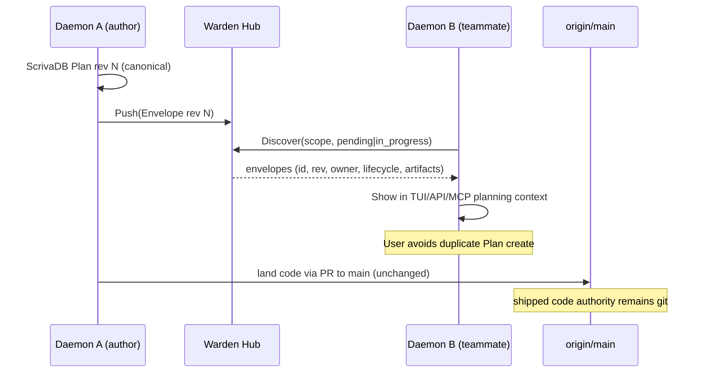

# Plan Hub Sync Boundary — Protocol & Team Discovery

**Date:** 2026-09-30  
**Status:** Protocol / design — Phase 10 of `scrivadb-canonical-plans-repo-sync`  
**Package:** `internal/plansync`  
**Design freeze:** [`2026-09-30-scrivadb-canonical-plans.md`](./2026-09-30-scrivadb-canonical-plans.md) **D6**  
**Hub product (relay/accounts):** [`2026-08-23-warden-hub.md`](./2026-08-23-warden-hub.md) — orthogonal; this doc only covers **Plan revision sync**

---

## 1. Purpose

Define a small, offline-safe **PlanSyncProvider** boundary and a **versioned sync
envelope** so a future Warden Hub can transport canonical ScrivaDB Plan
revisions across machines and teams — **without** shipping network transport,
accounts, authorization enforcement, background replication, or Hub UI in this
phase.

A default warden install keeps using **`plansync.Local()`** (no-op). Zero
network calls. Hub remains a bolt-on.

---

## 2. Two providers, two jobs (do not conflate)

| Concern | Package | Writes | Authority |
|---|---|---|---|
| **Repo export** | `internal/planexport` (`Syncer`, `sync_to_repo`) | Git branch + PR with inert YAML replica | Review artifact only; never execution SoT |
| **Hub sync** | `internal/plansync` (`PlanSyncProvider`) | Future: Hub-stored revision envelopes | Team discovery of *plans*; not shipped code |

Frozen invariant (D6): **Hub does not replace `origin/main` as authority for
shipped code.** Merged git history remains how code lands. Hub sync answers
“what Plans is my team already running?” — not “what is production.”

`planexport.Syncer` must **not** implement `PlanSyncProvider` (enforced by
contract test). Callers that want a PR use repo export; callers that want
cross-daemon Plan awareness use Hub sync (later).

---

## 3. Sync envelope (v1)

`plansync.Envelope` wraps one canonical Plan **revision** (not a full task-prompt
dump). Required discovery / merge fields:

| Field | Role |
|---|---|
| `schema_version` | Envelope version (`1`) |
| `scope.organization_id` / `scope.team_id` / `scope.project_id` | Tenancy for listing |
| `project_id` / `plan_id` | Stable ScrivaDB identity |
| `revision` / `content_hash` | Canonical revision model |
| `visibility` / `owner_id` | Intended audience + owner (claims only until Hub authZ) |
| `lifecycle` | `pending` / `in_progress` / `completed` / `archived` snapshot |
| `artifacts[]` | Linked branches / PRs for overlap hints |
| `origin` | Who produced the change (`local_daemon` / `local_user` / `local_agent` / `hub`) |
| `conflict_token` | Opaque OCC token (`"{revision}:{content_hash}"` in v1) |
| `synced_at` / `remote_id` | Filled only after a successful Hub round-trip (mirrors `planstore.Plan` seams) |

`EnvelopeFromPlan` builds this from `planstore.Plan` + local options. It never
reads repository YAML.

**Out of envelope (deliberate):** credentials, disposable worktree paths,
volatile diagnostics, full agent transcripts. Task prompts may be added in a
later Hub schema version if product needs full remote edit — v1 prioritizes
**discovery**.

---

## 4. PlanSyncProvider surface

```text
Name() / Enabled()
Push(ctx, Envelope) error
Pull(ctx, PullQuery) ([]Envelope, error)
Discover(ctx, Scope, statuses) ([]Envelope, error)
```

| Implementation | `Name` | `Enabled` | Behavior now |
|---|---|---|---|
| `Local()` / `Default()` | `local` | `false` | Validate on Push; Pull/Discover empty; **no network** |
| `FakeProvider` | `fake` | `true` | In-memory contract double; conflict on token mismatch |
| future `Hub` | `hub` | `true` when configured | Reserved; not shipped |

Authorization claims on the envelope are **data**, not enforcement. Hub authN/Z
remains deferred (freeze §13 open question #5).

---

## 5. Eventual team discovery (protocol)

### 5.1 User-visible goal

Before creating duplicative work, a user (or planning agent) in org/team scope
should see **pending** and **in_progress** Plans in the projects they can access —
including Plans authored on another teammate’s daemon — with enough metadata to
decide “join / wait / create something else.”

### 5.2 Flow (future Hub; not implemented here)



Local discovery today (Phase 8 projections) already lists ScrivaDB Plans on
**this** daemon. Hub Discover extends that list with **scoped remote** envelopes
when a Hub provider is configured; Local returns nothing remote.

### 5.3 Conflict handling (future)

- `conflict_token` lets Hub reject stale Push (structured `ConflictError`).
- Canonical resolution stays on each daemon’s ScrivaDB; Hub is a sync fabric,
  not a second Plan SoT that silently overwrites local audit history.
- Repo export conflicts (path collision on a sync branch) remain
  `planexport`’s problem — unrelated to Hub tokens.

### 5.4 What stays out of Hub sync

- Merging application code
- Replacing `git fetch` / CI as ship gates
- Auto-creating Plans on every teammate’s disk without consent (product policy
  for a later phase)
- Background replication loops in the default install

---

## 6. Default installation invariant

```text
plansync.Default() == plansync.Local()
Local.Enabled() == false
Local Push/Pull/Discover → no dial, no HTTP, no background workers
```

Contract tests:

1. Fake + Local share the provider contract.
2. `DefaultInstallationMakesNoNetworkCalls` — noop sources import no `net` /
   `net/http`, and method exercise under a tripwire `RoundTripper` records zero
   dials.
3. `RepoExportIsSeparateFromHubSync` — `planexport.Syncer` is not a
   `PlanSyncProvider`.

---

## 7. Explicit non-goals (this phase)

- Hub HTTP/WSS transport, device login, org billing
- Account management / membership admin UI
- Authorization enforcement beyond carrying visibility/owner fields
- Background sync schedulers or daemon wiring that phones home
- Changing `plan sync_to_repo` behavior
- Filling `Plan.SyncedAt` / `RemoteID` from production code paths

---

## 8. Follow-ups

1. Optional daemon config `plan_sync.provider: local|hub` (default `local`).
2. Hub service endpoints for Push/Pull/Discover with real authZ.
3. TUI/MCP badge: “N teammate plans in scope” from Discover.
4. Envelope v2 if full definition bodies must sync for remote edit.
