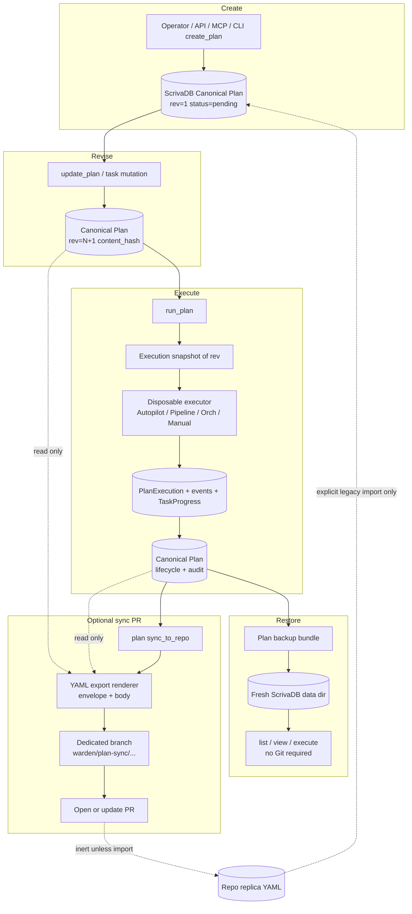

# ScrivaDB Canonical Plans — Design Freeze

**Date:** 2026-09-30  
**Status:** Spec freeze / design contract — **documentation only**; no production
runtime behavior is changed by this document  
**Integration branch:** `autopilot/scrivadb-canonical-plans-repo-sync`  
**Autopilot run:** `ap-2c5dde19f75f`  
**Plan:** `scrivadb-canonical-plans-repo-sync` (task `canonical-contract`)  
**Scope:** Freeze authority, lifecycle, export/import, terminology, failure
handling, and the cutover stop-list so every later phase of
`scrivadb-canonical-plans-repo-sync` implements against one contract.

---

## 0. Why this spec exists

Today warden treats repository YAML under `plans/` as the authoritative Plan
definition and treats **directory placement** as lifecycle status. ScrivaDB
(`internal/planstore`) holds execution links, task progress, events, and
summaries only. That split is encoded in package comments and in prior specs:

| Evidence (current authority) | Location |
|---|---|
| "Plans are YAML files… deriving plan status from the subdirectory" | `internal/planstore/store.go` package docstring |
| "The canonical definition … lives in the YAML; this record owns execution state only" | `planstore.Plan` docstring in `store.go` |
| Status inferred from `plans/{pending,in_progress,completed,archived}/`; flat `plans/*.yaml` → pending | `planstore.ScanProject` in `scan.go` |
| Daemon startup re-authorizes Status/FilePath from dirs | `Server.runStartupPlanScan` in `internal/daemon/server.go` |
| API/MCP/CLI hydrate goal/tasks/constraints/done_when from disk | `hydratePlanDef` in `internal/daemon/strict_plans.go` |
| Autopilot / pipeline / orch / assess load tasks via `LoadPlan(FilePath)` | `internal/autopilot/plan.go`; `plan_autopilot_adapter.go`; `plan_pipeline_adapter.go`; `plan_agent_adapters.go`; `plan_assess.go` |
| TUI task list reads YAML via `FilePath` | `planTasksFromPlan` in `internal/tui/plan_view.go` → `planstore.ReadPlanTasks` |
| Product docs: directory = status | `docs/specs/2026-09-28-plans-first-class.md`; `docs/FEATURES.md` §37; site `concepts/plans.md` |

This freeze **inverts** that authority: ScrivaDB is sole canonical Plan store;
repository files become optional, inert exports; Hub remains a future sync
provider, not a Git substitute.

---

## 1. Locked decisions (normative)

These six decisions are **frozen**. Downstream tasks must not relitigate them.

### D1. ScrivaDB Plan is canonical

The sole authority for a Plan is the ScrivaDB record in the daemon's
`plans` collection (`internal/planstore`, data dir `plans-db`).

Canonical content includes at least:

- Stable `plan_id` (`plan-<8hex>`)
- Project membership (`project_id`)
- Definition: `name`, `goal`, `constraints[]`, `done_when[]`, task DAG
  (`id`, `prompt`, `after[]`)
- Lifecycle field `status` (`pending` / `in_progress` / `completed` / `archived`)
  plus lifecycle timestamps (`created_at`, `updated_at`, `started_at`,
  `completed_at`, and later `archived_at` when introduced)
- Monotonic `revision` and deterministic `content_hash` over canonical
  definition fields
- Execution / audit: links, `TaskProgress`, `ActiveExecution`,
  `ExecutionHistory`, events, notes, `ExecutionSummary`, branch/task outcomes

A Plan can be created, listed, viewed, revised, executed, completed, archived,
and recovered with **no** `plans/` directory present in the repository.

### D2. Repository files are exports only

Any file under `plans/**/*.yaml` (or future formats) is a **replica export** of
a canonical revision. Exports exist for human review, PR discussion, and
optional team visibility of plan text in git — not for daemon discovery or
execution.

Normal Plan service paths must not write, move, or delete repository files.
Filesystem mutation is confined to:

1. Explicit **legacy import** (operator-invoked), and
2. Explicit **`plan sync_to_repo`** export (dedicated Warden branch + PR).

### D3. Lifecycle is a Plan field — never inferred from an export path

`Plan.Status` is a ScrivaDB field mutated only by Plan service transitions
(`run` / `complete` / `archive` / explicit reset). Directory names in an export
path (`plans/pending/…`, `plans/completed/…`) are **descriptive conventions for
export layout only**. They must never feed:

- list/filter status,
- run eligibility,
- completion/archive gates,
- startup reseeding, or
- TUI tree grouping.

### D4. Execution reads canonical tasks

Every execution consumer loads goal, task prompts, and `after` dependencies
**only** from the ScrivaDB Plan (or from an immutable execution snapshot of that
Plan revision — see §7). Forbidden at execution time:

- `autopilot.LoadPlan` / `DecodePlan` of a repo path
- `planstore.ReadPlanTasks` against `FilePath`
- `hydratePlanDef`-style disk reads for run/assess/pipeline build
- plan-file watchers that re-authorize the DAG from mtime

Surfaces in scope for cutover (today's YAML readers):

| Surface | Today's YAML reader |
|---|---|
| Autopilot start / recover | `plan_autopilot_adapter.go` → `StartFromPlan` → `LoadPlan` |
| Pipeline build | `buildPlanPipeline` in `plan_pipeline_adapter.go` |
| Orchestrator / manual prompts | `plan_agent_adapters.go` (`orchestratorPlanPrompt` / `manualPlanPrompt`) |
| Assess | `assessPlanProgress` in `plan_assess.go` |
| Completion task enumeration | `planTasksFromPlan` / `ReadPlanTasks` in `planstore` |
| Finalize task totals | `persistExecutionSummary` in `finalize.go` |
| TUI detail | `internal/tui/plan_view.go` |
| API/MCP/CLI show | `hydratePlanDef` in `strict_plans.go` |

### D5. Replica edits are inert unless an explicit import is invoked

Editing, renaming, moving, or deleting an exported YAML file must have **no
effect** on listing, detail, execution, or lifecycle of the canonical Plan.

The only path that may create or update a canonical Plan from a repository file
is an **operator-invoked** legacy/import command (Phase 5:
`legacy-plan-import`). Implicit startup scan and "scan then execute" are
retired as authority mechanisms.

### D6. Hub is a future sync provider, not a Git replacement

- **Repo export** (`plan sync_to_repo`) publishes a replica via Git/PR for review.
- **Hub sync** (future) is a separate `PlanSyncProvider` transporting canonical
  revisions across machines/teams (`SyncedAt` / `RemoteID` remain reserved
  seams on `planstore.Plan` today; see `TestPlansPatchHubSyncFieldsIgnored`).
- Hub does **not** replace `origin/main` as authority for shipped code.
- This plan adds a local/no-op provider boundary and sync envelope only — no
  network calls, accounts, tenancy, or remote replication
  (`docs/specs/2026-08-23-warden-hub.md` remains the Hub product spec;
  plan sync to Hub stays OOS here).

---

## 2. Exact terminology

| Term | Meaning |
|---|---|
| **Canonical Plan** | The ScrivaDB `planstore.Plan` record (plus related plan-events / plan-notes). Sole authority. |
| **Definition** | `name`, `goal`, `constraints`, `done_when`, task DAG. Lives on the canonical Plan after cutover. |
| **Lifecycle** | The `status` field and associated timestamps. Never derived from a path. |
| **Revision** | Monotonic integer on the Plan; increments on every successful canonical definition or lifecycle mutation that changes content covered by `content_hash` policy (Phase 2 locks the exact increment rules). |
| **Content hash** | Deterministic hash of canonical definition fields for a given revision; used for export idempotency and import duplicate detection. |
| **Replica / export** | Optional YAML (v1) file rendered from a canonical revision; inert for execution. |
| **Export envelope** | Metadata wrapper fields on the replica (§8). |
| **Legacy import** | Explicit one-shot (or report-mode) ingestion of pre-cutover `plans/**/*.yaml` into ScrivaDB. |
| **`sync_to_repo`** | Explicit command that renders a revision onto a dedicated Warden branch and opens/updates a PR. |
| **PlanSyncProvider** | Interface for future Hub (and local/no-op) synchronization; separate from repo export. |
| **Execution snapshot** | Immutable copy of definition+revision captured when a PlanExecution starts (§7). |
| **FilePath (legacy)** | Historical relative path field; after cutover may remain as last-export path metadata only — never an execution input. |

**Deprecated phrases** (must not appear as normative guidance after
compatibility retirement):

- "status is directory-placement"
- "YAML is the source of truth for goal/tasks"
- "scan reseeds lifecycle from git"
- "flat `plans/*.yaml` are pending"

---

## 3. Entity / flow diagram



**Invariant:** arrows into ScrivaDB from replica exist only on the explicit
import edge. Listing, TUI, CLI, MCP, pipeline, and autopilot never traverse
replica → canonical.

---

## 4. Failure matrix

| Scenario | Expected outcome | Must not happen |
|---|---|---|
| No `plans/` directory | Full CRUD + execution from ScrivaDB | Soft-fail into "scan to discover" |
| Replica edited / deleted / moved | Canonical Plan unchanged | Status flip, duplicate Plan, or empty task list |
| Stale replica vs newer DB revision | List/detail show DB; export status may show stale | Execution uses stale YAML tasks |
| `sync_to_repo` same rev/hash already exported | Return prior sync result; no new GitHub activity | Duplicate PR spam |
| `sync_to_repo` with dirty unrelated worktree | Fail closed or isolate to dedicated branch only (Phase 7 rails) | Stage/commit operator WIP |
| Path collision with non-Warden file on export branch | Structured conflict; canonical intact | Overwrite foreign content |
| GitHub auth missing | Sync fails; canonical intact | Partial DB mutation pretending success |
| Concurrent definition edits | Structured revision conflict (optimistic concurrency) | Silent overwrite |
| Structural edit while `in_progress` | Rejected for the live revision **or** applied as new revision that does not mutate the in-flight snapshot (§7) | Mid-flight DAG rewrite of the running execution |
| Legacy import, content/hash match | Idempotent no-op | Duplicate Plan IDs |
| Legacy import, same identity different hash | Structured conflict + report | Silent clobber of audit/execution history |
| Daemon restart | Load Plans from ScrivaDB only | `runStartupPlanScan` re-authorizes Status from dirs |
| Restore backup bundle to fresh data dir | Plan operable without Git | Require `plans/` or `git pull` to recover definition |
| Hub provider unset / no-op | Local-only; zero network | Accidental Hub transport |
| `FilePath` empty after cutover | Detail/execution still work from DB fields | Error "missing plan file" |

---

## 5. Legacy migration table

| Legacy concept (YAML-authority era) | Canonical era |
|---|---|
| `plans/pending\|in_progress\|completed\|archived/<slug>.yaml` as definition SoT | ScrivaDB Plan definition fields |
| Directory name = `Plan.Status` | `Plan.Status` field only; path is export convention |
| Flat `plans/*.yaml` → implicit pending | One-time import maps to `pending` (or report); no ongoing flat inference |
| `wd plan scan` / `scan_plans` / `runStartupPlanScan` as reseeding authority | Deprecated migration aids → then removed; never auto at startup |
| `wd plan scan --migrate-flat` | Folded into explicit legacy import report/migrate |
| `wd plan import <file>` copying into `plans/pending/` + scan | Explicit import into ScrivaDB (optional later re-export) |
| `PlanService.Create` writing YAML then DB | DB-only create; optional later `sync_to_repo` |
| `PlanService.Transition` / `Finalize` `movePlanFile` | Status field update only; no `os.Rename` of replicas |
| `hydratePlanDef` disk read | Fields already on Plan / API projection from DB |
| `autopilot.LoadPlan(FilePath)` for run | Load Plan (+ execution snapshot) from planstore |
| Autopilot `writeTaskStatusAtomic` / `markPlanCompleteInPlace` into YAML | ScrivaDB `TaskProgress` / events / summary only |
| Recovery: "git pull → scan restores status" | Recovery: ScrivaDB backup/restore bundle; Git optional for code only |
| Hub `SyncedAt` / `RemoteID` reserved | Unchanged reservation; filled only by future Hub provider |
| Stable ID `plan-`+hex(sha256(projectID+name)) | **Preserved** across import so execution links survive |
| Docs: `2026-09-28-plans-first-class.md` D1–D3 | **Superseded** by this freeze for authority/lifecycle |
| Docs: `2026-09-29-plan-execution-entity-redesign.md` YAML-authority sentences | Entity/executor rules **kept**; YAML-authority **superseded** (§9) |

Import requirements (Phase 5 normative preview):

1. Operator-invoked only; never on daemon start or normal list/run.
2. Idempotent when identity + content hash match.
3. Preserve task `after` deps, lifecycle, and existing execution/audit when
   reconciling an already-canonical Plan.
4. Leave source files untouched by default; report imported / skipped /
   conflicted.
5. Cover all four legacy statuses in fixtures.

---

## 6. Behavior that must **stop** reading `plans/*.yaml`

After Phases 3–4 and compatibility retirement, these call sites must **not**
read repository plan YAML for authority (discovery, lifecycle, definition, or
execution). Keep them only behind an explicitly named
**migration/export/import** boundary where noted.

### 6.1 Discovery / lifecycle reseeding (delete or quarantine)

| Behavior | Package / symbol |
|---|---|
| Startup directory walk upserting Status/FilePath | `internal/daemon/server.go` — `runStartupPlanScan` |
| On-demand scan as SoT | `planstore.ScanProject` (`scan.go`); `Server.ScanProjectPlans` (`strict_plans.go`) |
| Flat-file → pending inference | Flat walk in `ScanProject` |
| `--migrate-flat` as product surface | `migrateFlatPlans` in `strict_plans.go`; CLI/MCP flags |

### 6.2 Definition hydration for normal surfaces

| Behavior | Package / symbol |
|---|---|
| API/MCP/CLI detail hydration from disk | `hydratePlanDef` in `strict_plans.go` |
| TUI task list from `FilePath` | `planTasksFromPlan` in `internal/tui/plan_view.go` |
| PlanService load/rewrite YAML document | `loadPlanDocument` / `writePlanYAMLAtomic` / `PlanService.Create|Update` filesystem steps in `service.go` |

### 6.3 Execution-time file reads

| Behavior | Package / symbol |
|---|---|
| Autopilot boot from plan file | `plan_autopilot_adapter.go`; `autopilot.StartFromPlan`; `LoadPlan` |
| Plan-file mtime reload | `internal/autopilot/run.go` watcher paths |
| Pipeline jobs from YAML tasks | `buildPlanPipeline` in `plan_pipeline_adapter.go` |
| Orch/manual prompt embeds file body | `plan_agent_adapters.go` |
| Assess loads YAML tasks | `plan_assess.go` |
| Completion/finalize enumerates tasks from file | `planTasksFromPlan` / `ReadPlanTasks` / `persistExecutionSummary` |
| Autopilot writes progress into YAML | `writeTaskStatusAtomic`, `markPlanCompleteInPlace` in `autopilot/plan.go` |

### 6.4 Lifecycle filesystem mutation (normal path)

| Behavior | Package / symbol |
|---|---|
| Transition renames YAML into status dir | `movePlanFile` / `PlanService.Transition` in `service.go` |
| Finalize moves to `plans/completed/` | `commitFinalize` in `finalize.go` |
| Archive moves to `plans/archived/` | archive transition path |
| CLI import copies into `plans/pending/` then scan | `newPlanImportCmd` in `internal/cli/plan.go` |

### 6.5 Allowed residual readers (explicit boundary only)

| Allowed | Purpose |
|---|---|
| Legacy import parser | Phase 5 one-shot / report |
| Export renderer golden tests reading fixtures | Test-only |
| Operator docs showing example export YAML | Non-runtime |

---

## 7. Execution revision policy (frozen choice)

**Choice: snapshot-at-start.**

When `run_plan` succeeds:

1. Persist an **execution snapshot** of the canonical definition (goal, tasks
   DAG, constraints, done_when) plus `plan_id`, `revision`, and `content_hash`
   onto the `PlanExecution` / `ActiveExecution` record.
2. All task spawning, progress gates, and completion enumeration for that
   execution use the snapshot — not live Plan definition fields and not YAML.
3. Structural definition edits while `status=in_progress` that would change the
   snapshot's DAG are **rejected** with a structured error ("plan has an active
   execution; stop or complete before revising tasks"), **unless** a later
   phase explicitly adds a "revise as new revision without touching ActiveExecution"
   API — still without mutating the in-flight snapshot.
4. Non-structural metadata edits (display notes, etc.) may be allowed without
   bumping the execution snapshot; Phase 2 enumerates the field split.

Rationale: preserves auditability ("what did this run actually execute?"),
matches durable `PlanExecutionEvent` history from
`plan-execution-entity-redesign`, and avoids dual-writer races with autopilot
workers.

---

## 8. v1 YAML export envelope

v1 repository export remains **YAML** (see §10). Every exported replica MUST
carry an envelope that makes the file self-describing as a **non-authoritative
replica**.

### 8.1 Required envelope fields

| Field | Type | Semantics |
|---|---|---|
| `schema_version` | int / semver string | Export schema version; v1 starts at `1` |
| `plan_id` | string | Canonical stable ID (`plan-<8hex>`) |
| `revision` | int | Canonical revision that was rendered |
| `content_hash` | string | Hash of canonical definition at that revision |
| `exported_at` | RFC3339 timestamp | When this replica bytes were produced |
| `lifecycle` | string | Snapshot of `Plan.Status` at export time (descriptive) |
| `execution_summary_ref` | object or null | Immutable reference to persisted `ExecutionSummary` when present: `{ plan_id, execution_id?, content_hash? }` — **reference only**, not a live query |

Suggested YAML shape (illustrative; Phase 6 owns exact keys/nesting):

```yaml
# warden-plan-export: replica only — not authoritative
schema_version: 1
plan_id: plan-deadbeef
revision: 3
content_hash: sha256:…
exported_at: 2026-09-30T12:00:00Z
lifecycle: in_progress
execution_summary_ref: null

name: example
goal: …
constraints: []
done_when: []
tasks:
  - id: t1
    prompt: …
```

### 8.2 Export layout convention

Default path: `plans/{lifecycle}/<slug>.yaml` where `{lifecycle}` mirrors the
envelope `lifecycle` field. **Descriptive only** — importers must read
envelope `lifecycle` / DB reconciliation rules, not the path component, when
building canonical status (and normal runtime must not import implicitly).

### 8.3 Non-goals for the export body

- No secrets, credentials, or disposable worktree paths
- No volatile diagnostics that would break byte-identical re-render
- Stable key ordering and normalized timestamps (Phase 6 golden tests)

---

## 9. Cross-reference: `plan-execution-entity-redesign`

**Prior spec:** [`2026-09-29-plan-execution-entity-redesign.md`](./2026-09-29-plan-execution-entity-redesign.md)

### 9.1 What remains in force

Entity vocabulary and ownership rules that this freeze does **not** reopen:

- Plan durable; Agent / Pipeline / Autopilot disposable
- PlanExecution / PlanExecutionEvent / ExecutionSummary model
- Terminal ≠ Agent
- Project membership lists authoritative
- `done_when` is free-text, never a machine gate
- `ai_cli` terminology migration
- PlanID required for new Autopilot runs

### 9.2 Assumptions its workers must **NOT** implement

This freeze **supersedes** the YAML-authority baseline of that spec. Workers on
`plan-execution-entity-redesign` (and any residual tasks citing it) must **not**
implement or re-assert:

| Superseded assumption | Where it appeared | Replace with |
|---|---|---|
| Plan is "authored as a YAML file under `plans/{…}/`" as durability mechanism | §1 Plan | Durable ScrivaDB Plan; YAML optional replica |
| "YAML-backed definition fields (carried by the file, not the DB record)" | §1 Plan table | Definition fields on ScrivaDB Plan |
| Directory / file survival as co-equal durability with the DB record | Rule 1 ("Plan record and its YAML file survive…") | Plan record survives; replica optional |
| Task IDs / totals / goal sourced "from YAML" for summaries and completion | ExecutionSummary fields; Rule 5 item 1 | From canonical Plan / execution snapshot |
| "Each task in the plan YAML becomes a Pipeline.Job" as a file-read step | §5 plan-bound pipeline | Each task in the **canonical** Plan (snapshot) becomes a Job |
| Autopilot diagnostics relying on `PlanFile` path as definition SoT | §5 Autopilot (`Diagnostics.PlanFile`) | PlanID + revision/snapshot; path at most last-export metadata |
| Any new code that treats scan/directory placement as lifecycle input | Implied by first-class plans lineage | Lifecycle field only |

Workers **may** continue implementing durable events, finalize/summary
persistence, and executor disposal exactly as that spec describes — those are
orthogonal and complementary to ScrivaDB-canonical definitions.

### 9.3 Relationship to `plans-first-class`

[`2026-09-28-plans-first-class.md`](./2026-09-28-plans-first-class.md) D1–D3
(two-layer YAML definition + directory status) are **superseded** for all new
work. Historical implementation notes in that doc remain useful archaeology for
the legacy import corpus.

---

## 10. Why YAML is retained and JSON deferred

| Concern | Decision |
|---|---|
| v1 export format | **YAML** |
| JSON export | **Deferred** — not an implementation target of `scrivadb-canonical-plans-repo-sync` |
| Renderer | Format-neutral interface so JSON can be added later **without** changing the canonical ScrivaDB schema |

Reasons YAML stays for v1:

1. **Reviewability** — existing team workflow comments on YAML diffs in PRs.
2. **Continuity** — operators already know `plans/**/*.yaml`; export familiarity
   lowers migration friction even though authority moves to ScrivaDB.
3. **Comment-friendly** — YAML supports human annotations in review better than
   minimal JSON in common GitHub review UX.
4. **No schema pressure** — canonical storage is already JSON documents in
   ScrivaDB; repo format is a projection, so deferring a second projection
   avoids duplicate golden-test surface area in this plan.

JSON remains explicitly allowed as a later export format behind the same
envelope fields (`schema_version`, `plan_id`, `revision`, `content_hash`,
`exported_at`, `lifecycle`, `execution_summary_ref`).

---

## 11. Evidence map (packages inspected)

| Area | Primary packages / files |
|---|---|
| Store / scan / service | `internal/planstore/{store,scan,service,execution,finalize,reconcile,reducer,event}.go` |
| Daemon Plan API | `internal/daemon/strict_plans.go`, `plan_*_adapter.go`, `plan_assess.go`, `plan_finalize.go`, `plan_control.go`, `server.go` |
| Autopilot YAML | `internal/autopilot/plan.go`, `controller.go`, `run.go`, `plan_controller.go` |
| CLI | `internal/cli/plan.go` |
| MCP | `internal/mcp/tools_plans.go` |
| TUI | `internal/tui/plan_view.go`, `tree_adapter.go` |
| Client | `internal/client/plans_crud.go` |
| Hub seam | `Plan.SyncedAt` / `RemoteID`; `docs/specs/2026-08-23-warden-hub.md` |
| Prior specs | `2026-09-28-plans-first-class.md`, `2026-09-29-plan-execution-entity-redesign.md` |
| Product docs (still YAML-authority until Phase 11) | `docs/FEATURES.md` §37–§38; site `concepts/plans.md`, `guides/using-plans.md` |

---

## 12. Out of scope for this document

- Any Go/runtime behavior change
- OpenAPI / generated client updates (later phases; spec-first)
- Implementing import, export renderer, `sync_to_repo`, or Hub transport
- Rewriting site guides / FEATURES as if cutover already shipped (Phase 11)

---

## 13. Open questions deferred to later phases

Frozen enough to proceed; details belong to implementing tasks:

1. **Exact envelope key nesting** (top-level vs `warden_export:` block) — Phase 6.
2. **Which fields participate in `content_hash`** vs revision bumps — Phase 2.
3. **Whether `FilePath` is removed, nullable, or repurposed as last-export path** — Phase 2/3.
4. **Backup bundle file format** (archive layout) — Phase 9.
5. **Hub envelope authorization claims** — Phase 10 (no network in this plan).

---

## 14. Verification checklist (for reviewers of later PRs)

- [ ] No new code treats directory placement as lifecycle authority
- [ ] No execution path calls `LoadPlan`/`ReadPlanTasks` on a repo export
- [ ] Replica edit tests prove inertness
- [ ] Startup does not scan `plans/` for authority
- [ ] `sync_to_repo` never required for create/run
- [ ] Restore works without Git
- [ ] This spec is cited when changing Plan authority comments in `planstore`
- [ ] `plan-execution-entity-redesign` workers did not reintroduce YAML SoT
