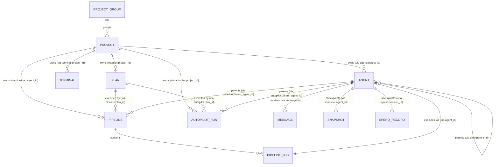

# Warden Schema-2 Data Source Inventory & Persistence Architecture

**Date:** 2026-10-10  
**Status:** Spec freeze / Inventory contract — **design only** (Plan `01-warden-db-architecture-and-contract`, Task `inventory`)  
**Integration branch:** `autopilot/01-warden-db-architecture-and-contract`  
**Autopilot run:** `ap-e596f46ee920`  
**Plan:** `plan-b88768f6` (Task `inventory`)  
**Scope:** Provide a complete, authoritative, versioned inventory of every current persistent Warden data source, record schema, owner subsystem, retention class, and target collection in schema-2 `warden-db`; explicitly classify all configuration files, runtime blobs, and ephemeral files that remain outside `warden-db`.

---

## 1. Executive Summary & Architecture Context

### 1.1 The Schema-1 Fragmentation Problem

Warden currently operates across **19 distinct on-disk storage locations and subsystems** under `<dataDir>` (`~/.warden` by default). These include:
- **14 independent ScrivaDB databases** (each with its own `engine.Collection`, `LOCK`, index files, and segment logs in separate directories like `agents-db`, `terminals-db`, `context`, `inbox`, `projects`, `backends`, `plans/plans-db`, `plans/plan-exports-db`, `pipelines-db`, `schedules-db`, `snapshots-db`, `known-prompts-db`, `autopilots-db`, `autopilot/runs-db`);
- **3 JSONL append-only stores** (`usage-snapshots/usage-snapshots.jsonl`, `quota-impact/quota-impact-fences.jsonl`, `savings/ledger.jsonl`);
- **2 JSON flat map files** (`spend/spend.json`, `plan-sync-hub`);
- **Daily JSONL time-series files** (`metrics/YYYY-MM-DD.jsonl`);
- **A flat JSON calibration file** (`savings/calibration.json`);
- **Multiple legacy migration sentinels and import paths**.

This multi-store fragmentation introduces major operational and structural challenges:
1. **No Cross-Collection Invariant Protection:** Multi-entity operations (e.g. creating a pipeline and spawning its initial agent, or updating project membership alongside agent creation) cannot execute within a single ACID transaction across separate ScrivaDB instances.
2. **Denormalized Inverse Arrays & Contention:** Parent records (e.g., `Project`, `Agent`, `ProjectGroup`) store mutable child-ID arrays (`Project.Agents`, `Project.Pipelines`, `Agent.ChildAgents`), causing high lock contention, split-brain drift during partial crashes, and O(N) read-modify-write overhead.
3. **Complex Maintenance and Recovery:** Backup, repair (`warden repair all`), migration (`warden migrate`), and verification must discover and traverse multiple disparate storage formats and locations.

### 1.2 The Schema-2 Single `warden-db` Architecture

Schema-2 unifies all structured, relational, and indexable operational state into a single ScrivaDB instance: **`warden-db`** located at `<dataDir>/warden-db/`.

```
<dataDir>/
├── warden-db/                   # SINGLE ScrivaDB instance (Schema-2)
│   ├── agents/                  # Collection: Active and historical agent records
│   ├── terminals/               # Collection: Plain terminal pane processes
│   ├── projects/                # Collection: Project entities (Normalized query boundaries)
│   ├── project_groups/          # Collection: Organizational project groupings
│   ├── plans/                   # Collection: Canonical Plan records & task DAGs
│   ├── plan_exports/            # Collection: Plan replica export metadata
│   ├── pipelines/               # Collection: Multi-stage agent pipelines
│   ├── pipeline_jobs/           # Collection: Individual pipeline job execution records
│   ├── autopilot_runs/          # Collection: Autopilot run lifecycle & diagnostics
│   ├── context_entries/         # Collection: Shared KV blackboard & coordination state
│   ├── messages/                # Collection: Directed agent mailbox messages
│   ├── backends/                # Collection: Installed AI CLI backends & detection
│   ├── backend_models/          # Collection: Model catalog & tier assignments
│   ├── backend_roles/           # Collection: Role-to-tier mappings
│   ├── backend_settings/        # Collection: System policy & handover settings
│   ├── usage_snapshots/         # Collection: Provider usage & rate limit observations
│   ├── quota_impact_fences/     # Collection: Capacity recovery incident claims
│   ├── snapshots/               # Collection: Worktree checkpoint metadata
│   ├── savings_events/          # Collection: Token savings ledger
│   ├── savings_calibration/     # Collection: Measured token calibration factors
│   ├── spend_records/           # Collection: Cumulative session billed tokens
│   ├── schedules/               # Collection: Recurring & one-shot automation timers
│   ├── known_prompts/           # Collection: Fast-Brain recognized prompt templates
│   ├── plan_sync_envelopes/     # Collection: Hub synchronization envelopes
│   └── metrics_samples/         # Collection: Host & fleet operational telemetry
│
├── schema.json                  # Data format ledger (Remains outside DB)
├── owner.lock                   # Authoritative process lock (Remains outside DB)
├── audit.jsonl                  # Append-only security audit log (Remains outside DB)
├── snapshots/*.transcript       # Raw terminal transcript blobs (Remains outside DB)
├── prompts/, hints/, exits/     # Process launch staging files (Remains outside DB)
├── session-logs/, settings/     # Backend discovery & hook configs (Remains outside DB)
└── backups/, quarantine/        # Recovery & repair artifacts (Remains outside DB)
```

### 1.3 Normative Constraints & Design Invariants

This inventory enforces the architectural constraints defined in `plan-b88768f6`:
1. **Constraint 1 (No Production Path Alteration):** This inventory document and its downstream contracts specify schema-2; no production storage paths are mutated during this design phase.
2. **Constraint 2 (Normalized Query Boundary):** `Project` is strictly an aggregate query boundary. Authoritative child-ID arrays (`Agents[]`, `Pipelines[]`, `Terminals[]`, `Plans[]`, `Autopilots[]`) are **completely removed**. Relationship resolution relies solely on child-to-parent foreign keys (`agent.project_id`, `pipeline.project_id`, `terminal.project_id`, `plan.project_id`, `autopilot.project_id`).
3. **Constraint 3 (No Authoritative Inverse Lists on Agents):** `Agent.ChildAgents`, `Agent.ChildPipelines`, and `Agent.ChildAutopilots` are deprecated and replaced by indexed foreign keys (`parent_id`, `parent_agent_id`).
4. **Constraint 4 (Cross-Collection Transactions):** Cross-collection invariants (e.g. Agent + Mailbox cleanup, Pipeline + Job state transitions) leverage ScrivaDB single-instance transaction capabilities.

---

## 2. Inventory Taxonomy & Methodology

### 2.1 Entity & Data Classification

Each data source is classified according to its structural type:
- **Primary Entity:** Core domain object with an independent lifecycle and stable identifier (e.g. `Agent`, `Project`, `Plan`, `Pipeline`, `Terminal`).
- **Dependent / Child Entity:** Entity whose lifecycle is bounded by a parent entity (e.g. `PipelineJob`, `Message`, `PlanExport`).
- **Key-Value / Blackboard State:** Arbitrary dot-namespaced strings and values used for ad-hoc agent coordination (`context_entries`).
- **Event / Ledger Stream:** Immutable or append-only chronological log of occurrences (`savings_events`, `usage_snapshots`, `metrics_samples`).
- **System Configuration & Registry:** Persistent daemon settings and hardware/CLI detection facts (`backends`, `backend_settings`, `schedules`).
- **External Blob:** Large, unstructured, or binary payloads stored outside the database engine to prevent write amplification and metadata bloat (`.transcript`, Git commits).
- **Ephemeral Runtime Artifact:** Transient files used strictly for inter-process communication, hook injection, or process synchronization.

### 2.2 Retention Classes

| Retention Class | Definition | Lifecycle / Eviction Policy | Examples |
|---|---|---|---|
| **Audit-Grade (Permanent)** | Crucial operational and compliance history that must never be deleted automatically. | Explicit user purge/archive only. Survived across updates and resets. | `plans`, `audit.jsonl`, `schema.json` |
| **Lifecycle-Bound** | Persisted for the duration of the operational entity; transitions to archived state upon completion. | Retained while active; soft-deleted / archived when finished; pruned via retention policy (`worktree.keep_done`). | `agents`, `pipelines`, `terminals`, `autopilot_runs` |
| **Rolling Time-Series** | Periodic telemetry or observation metrics. | Monotonically pruned by age (e.g. 14 days, 30 days) on a sliding window. | `usage_snapshots` (30d), `metrics_samples` (14-30d) |
| **Incident / Session Bounded** | Temporary synchronization or deduplication fences. | Expires after incident resolution, generation advance, or cooldown window. | `quota_impact_fences` |
| **Capacity-Capped Cache** | Derived or acceleration data. | LRU / Count-capped / TTL eviction (e.g., max 500 entries, 30-day prune). | `known_prompts`, `inbox` (read messages > 24h) |
| **Configuration (Durable)** | Human- or operator-managed system policy. | Explicit user or API edits only; survive daemon restarts. | `~/.warden/config.yaml`, `backends`, `schedules` |
| **Ephemeral Runtime** | Process-bound files for subprocess staging or IPC. | Recreated on demand; deleted on process exit or daemon reboot. | `prompts/*.txt`, `hints/*.txt`, `exits/*.exit`, `owner.lock` |

---

## 3. Complete Master Inventory Matrix

| # | Data Source Name | Current Schema-1 Location & Format | Current Schema Struct / Key Type | Owner Subsystem | Current Retention Class | Target Schema-2 Collection in `warden-db` | Primary / Index Keys | Invariant & Relationship Notes |
|---|---|---|---|---|---|---|---|---|
| 1 | **Agents** | `<dataDir>/agents-db` (ScrivaDB) & legacy `sessions-db` | `agentstore.Agent` | Agent Lifecycle (`internal/agentstore`, `internal/lifecycle`) | Lifecycle-Bound (active in `agents`, soft-deleted in `archived`) | `agents` | `id` (PK: `agent-<8hex>` / `worker-<8hex>`), Index: `project_id`, `plan_id`, `pipeline_id`, `parent_id`, `status` | Normalized; `child_agents`, `child_pipelines`, `child_autopilots` arrays stripped in favor of foreign keys. |
| 2 | **Terminals** | `<dataDir>/terminals-db` (ScrivaDB) | `terminalstore.Terminal` | Terminal Manager (`internal/terminalstore`, `internal/tmuxproc`) | Lifecycle-Bound (running, exited, orphaned) | `terminals` | `id` (PK: `term-<8hex>`), Index: `project_id`, `status` | Plain shell panes; no AI agent fields; linked to parent project via `project_id`. |
| 3 | **Projects** | `<dataDir>/projects` (ScrivaDB) | `projectstore.Project` | Project Subsystem (`internal/projectstore`) | Configuration & Entity Aggregate | `projects` | `id` (PK: canonical absolute path or URL) | Authoritative child arrays (`agents[]`, `pipelines[]`, `terminals[]`, `plans[]`, `autopilots[]`) **removed**; becomes query boundary. |
| 4 | **Project Groups** | `<dataDir>/projects` (ScrivaDB, collection `project_groups`) | `projectstore.ProjectGroup` | Project Subsystem (`internal/projectstore`) | Configuration (Durable) | `project_groups` | `id` (PK: `group-<id>`), Index: `name` | M:N or 1:N mapping of projects to groups; membership stored via normalized group mapping or array. |
| 5 | **Plans** | `<dataDir>/plans/plans-db` (ScrivaDB) | `planstore.Plan` | Plan Service (`internal/planstore`) | Audit-Grade (Permanent: pending, in_progress, completed, archived) | `plans` | `id` (PK: `plan-<8hex>`), Index: `project_id`, `status`, `revision` | Sole canonical authority for plan definitions and task DAGs; repository YAML is inert replica export. |
| 6 | **Plan Exports** | `<dataDir>/plans/plan-exports-db` (ScrivaDB) | `planexport.Export` | Plan Export Subsystem (`internal/planexport`) | Cache-Bounded / Export State | `plan_exports` | `id` (PK: `plan_id`), Index: `export_path` | Tracks Git branch and PR status for exported replica files. |
| 7 | **Pipelines** | `<dataDir>/pipelines-db` (ScrivaDB) & legacy `pipelines/*.json` | `pipeline.Pipeline` | Pipeline Executor (`internal/pipeline`, `internal/daemon`) | Lifecycle-Bound (pending, running, done, stalled, canceled) | `pipelines` | `id` (PK: pipeline name), Index: `project_id`, `plan_id`, `parent_agent_id`, `status` | Contains user/system DAG jobs; back-refs parent project, plan, and triggering schedule. |
| 8 | **Pipeline Jobs** | Embedded in `pipeline.Pipeline.Jobs[]` | `pipeline.Job` | Pipeline Executor (`internal/pipeline`) | Lifecycle-Bound (dependent on Pipeline) | `pipeline_jobs` *(or embedded in `pipelines`)* | `pipeline_id:job_id` (PK), Index: `agent_id`, `status` | Individual execution unit in a pipeline; links to executing agent via `agent_id`. |
| 9 | **Autopilot Runs** | `<dataDir>/autopilots-db` & `<dataDir>/autopilot/runs-db` (ScrivaDB) | `autopilotstore.Autopilot` & `autopilot.RunRecord` | Autopilot Controller (`internal/autopilotstore`, `internal/autopilot`) | Lifecycle-Bound (active, starting, healing, degraded, paused) | `autopilot_runs` | `id` (PK: `ap-<12hex>`), Index: `project_id`, `plan_id`, `manager_agent_id` | Live executor entity bound to a Plan; unified from legacy `autopilots` and `runs-db`. |
| 10 | **Shared Context** | `<dataDir>/context` (ScrivaDB) | `ctxstore.Entry` (Key, Value, UpdatedBy, UpdatedAt) | Coordination Subsystem (`internal/ctxstore`) | Working / Run-Scoped KV | `context_entries` | `key` (PK: dot-namespaced string), Index: `prefix` | Shared blackboard KV for agent coordination; supports CAS operations. |
| 11 | **Mailbox Messages** | `<dataDir>/inbox` (ScrivaDB) | `mailbox.Message` | Messaging Subsystem (`internal/mailbox`) | Bounded Retained Log (max 500/inbox, 24h read retention) | `messages` | `to:id` (PK), Secondary Index: `to` (recipient) | Directed asynchronous messages between agents with monotonic high-water mark IDs. |
| 12 | **Backend Registry** | `<dataDir>/backends` (ScrivaDB) | `backendstore.Backend` | Backend Registry (`internal/backendstore`) | Configuration & Hardware Detection | `backends` | `id` (PK: "claude", "local", "codex", etc.) | Persists CLI detection status, user-assigned tiers, default flags, and rate limit cooldowns. |
| 13 | **Backend Models** | Embedded in `backends` collection | `backendstore.ModelEntry` | Backend Registry (`internal/backendstore`) | Configuration (Durable) | `backend_models` | `backend_id:model_id` (PK), Index: `tier`, `quota_scope` | Catalog of available models, assigned tiers (tier-1/2/3), and auto-assign preferences. |
| 14 | **Backend Roles** | Embedded in `backends` collection | `backendstore.RoleTierMapping` | Role Routing (`internal/backendstore`) | Configuration (Durable) | `backend_roles` | `role_name` (PK: "planner", "worker", "brain", etc.) | Maps agent roles to default model tier targets. |
| 15 | **Backend Settings** | `<dataDir>/backends` singleton records (`__settings__`, `__handover_settings__`) | `backendstore.Settings`, `backendstore.HandoverSettings` | Backend Subsystem (`internal/backendstore`) | Configuration (Durable) | `backend_settings` | `key` (PK: "policy", "handover") | Global execution policies (internal thinking mode, handover thresholds). |
| 16 | **Usage Snapshots** | `<dataDir>/usage-snapshots/usage-snapshots.jsonl` (JSONL) | `backendusage.UsageSnapshot` | Rate Limit Recovery (`internal/backendusage`) | Rolling Time-Series (30-day window) | `usage_snapshots` | `domain_key:revision` (PK), Index: `recorded_at`, `domain_key` | Provider API token usage readings, quota buckets, and authoritative reset windows. |
| 17 | **Quota Impact Fences** | `<dataDir>/quota-impact/quota-impact-fences.jsonl` (JSONL) | `capacity.FenceRecord` | Capacity Subsystem (`internal/capacity`) | Incident-Scoped / Recovery-Bounded | `quota_impact_fences` | `snapshot_revision:agent_id` (PK), Index: `domain_key`, `bucket_key`, `agent_id` | Deduplication fences ensuring a rate limit incident doesn't double-select an agent. |
| 18 | **Snapshot Metadata** | `<dataDir>/snapshots-db` (ScrivaDB) & legacy `snapshots/*.json` | `snapshot.Metadata` | Workspace Checkpoint (`internal/snapshot`) | Lifecycle-Bound / Checkpoint Metadata | `snapshots` | `id` (PK: `snap-<8hex>`), Index: `agent_id`, `created_at` | Checkpoint metadata linking to Git stash SHA and flat transcript file. Blobs stay outside. |
| 19 | **Token Savings Ledger** | `<dataDir>/savings/ledger.jsonl` (JSONL) | `savings.Event` | Savings Subsystem (`internal/savings`) | Durable Event Log | `savings_events` | `id` (PK: monotonic event ID), Index: `ts`, `agent_id`, `feature` | Audit of token reduction via Fast-Brain, compaction, classification, and truncation. |
| 20 | **Savings Calibration** | `<dataDir>/savings/calibration.json` (JSON) | `savings.Calibration` | Savings Subsystem (`internal/savings`) | Configuration & Measurement State | `savings_calibration` | `key` (PK: "current") | Measured bytes-per-token ratio for accurate token cost derivation. |
| 21 | **Session Spend Tracker** | `<dataDir>/spend/spend.json` (JSON map) | `spend.Entry` keyed by session ID | Spend & Budget Subsystem (`internal/spend`) | Cumulative Session Gauges | `spend_records` | `session_id` (PK), Index: `repo`, `day`, `backend` | Cumulative billed input/output tokens per agent session. |
| 22 | **Schedules** | `<dataDir>/schedules-db` (ScrivaDB) & legacy `schedules.json` | `schedule.Schedule` | Scheduler Subsystem (`internal/schedule`) | Configuration (Durable) | `schedules` | `id` (PK: schedule name), Index: `enabled`, `mode` | Cron and one-shot timer definitions for automated agent or pipeline execution. |
| 23 | **Known Prompts** | `<dataDir>/known-prompts-db` (ScrivaDB) | `knownprompts.Entry` | Fast-Brain (`internal/knownprompts`) | Capacity-Capped Cache (LRU/Pruned) | `known_prompts` | `id` (PK: hash of normalized question + options), Index: `backend`, `last_seen_at` | Learned prompt templates allowing instant zero-model-call menu recognition. |
| 24 | **Plan Sync Hub Envelopes** | `<dataDir>/plan-sync-hub` (JSON map) | `plansync.Envelope` | PlanSync Server (`internal/plansync`) | Hub Synchronization State | `plan_sync_envelopes` | `scope:plan_id` (PK), Index: `synced_at` | Synchronization envelopes for local and remote Hub multi-machine coordination. |
| 25 | **Fleet Metrics** | `<dataDir>/metrics/YYYY-MM-DD.jsonl` (Daily JSONL) | `metrics.Sample` | Telemetry Subsystem (`internal/metrics`) | Rolling Time-Series (14-30 days) | `metrics_samples` | `taken_at:sample_id` (PK), Index: `taken_at` | Fleet-wide process memory, active agents, and system pressure samples. |

---

## 4. Deep-Dive Specification of Persistent Data Sources

### 4.1 `agents-db` (Agent Sessions)

- **Legacy / Current Paths:** `<dataDir>/agents-db/` (ScrivaDB collections: `agents`, `archived`), `<dataDir>/sessions-db/`, `<dataDir>/sessions/` (legacy JSON).
- **Owner Subsystem:** `internal/agentstore`, `internal/lifecycle`, `internal/daemon`.
- **Current Record Schema (`agentstore.Agent`):**
  ```go
  type Agent struct {
      ID                        string                 `json:"id"`
      Name                      string                 `json:"name,omitempty"`
      Type                      store.Type             `json:"type"`
      Ticket                    string                 `json:"ticket"`
      TmuxSession               string                 `json:"tmux_session"`
      AiCli                     string                 `json:"ai_cli,omitempty"`
      AICLISessionID            string                 `json:"ai_cli_session_id"`
      Repo                      string                 `json:"repo"`
      Worktree                  string                 `json:"worktree"`
      Branch                    string                 `json:"branch"`
      BaseBranch                string                 `json:"base_branch,omitempty"`
      WorktreeCreated           bool                   `json:"worktree_created,omitempty"`
      BranchCreated             bool                   `json:"branch_created,omitempty"`
      PR                        string                 `json:"pr"`
      Prompt                    string                 `json:"prompt"`
      Workdir                   string                 `json:"workdir"`
      Subject                   string                 `json:"subject"`
      Activity                  string                 `json:"activity,omitempty"`
      Tags                      []string               `json:"tags,omitempty"`
      Status                    store.Status           `json:"status"`
      PID                       int                    `json:"pid"`
      ExitCode                  *int                   `json:"exit_code,omitempty"`
      CreatedAt                 time.Time              `json:"created_at"`
      UpdatedAt                 time.Time              `json:"updated_at"`
      Events                    []store.Event          `json:"events"`
      LastPaneExcerpt           string                 `json:"last_pane_excerpt"`
      AutoRestart               bool                   `json:"auto_restart,omitempty"`
      RestartCount              int                    `json:"restart_count,omitempty"`
      LastRestartAt             *time.Time             `json:"last_restart_at,omitempty"`
      PermissionMode            string                 `json:"permission_mode,omitempty"`
      ExecutionProfile          store.ExecutionProfile `json:"execution_profile,omitempty"`
      Role                      string                 `json:"role,omitempty"`
      Task                      string                 `json:"task,omitempty"`
      AutoApprove               bool                   `json:"auto_approve,omitempty"`
      ForceCompact              *bool                  `json:"force_compact,omitempty"`
      PipelineID                string                 `json:"pipeline_id,omitempty"`
      JobID                     string                 `json:"job_id,omitempty"`
      PlanID                    string                 `json:"plan_id,omitempty"`
      ScheduleID                string                 `json:"schedule_id,omitempty"`
      ScheduleName              string                 `json:"schedule_name,omitempty"`
      ParentID                  string                 `json:"parent_id,omitempty"`
      ChildAgents               []string               `json:"child_agents,omitempty"`      // DEPRECATE IN SCHEMA-2
      ChildPipelines            []string               `json:"child_pipelines,omitempty"`   // DEPRECATE IN SCHEMA-2
      ChildAutopilots           []string               `json:"child_autopilots,omitempty"`  // DEPRECATE IN SCHEMA-2
      SeedStatus                string                 `json:"seed_status,omitempty"`
      SeedError                 string                 `json:"seed_error,omitempty"`
      AutopilotRunID            string                 `json:"autopilot_run_id,omitempty"`
      AutopilotSlot             string                 `json:"autopilot_slot,omitempty"`
      AutopilotTaskID           string                 `json:"autopilot_task_id,omitempty"`
      Model                     string                 `json:"model,omitempty"`
      QuotaBinding              *capacity.QuotaBinding `json:"quota_binding,omitempty"`
      ProjectID                 string                 `json:"project_id,omitempty"`
      Hibernated                bool                   `json:"hibernated,omitempty"`
      ContextTokens             int                    `json:"context_tokens,omitempty"`
      ContextState              string                 `json:"context_state,omitempty"`
      ContextCheckedAt          time.Time              `json:"context_checked_at,omitempty"`
      LastCompactAt             *time.Time             `json:"last_compact_at,omitempty"`
      RateLimitedAt             *time.Time             `json:"rate_limited_at,omitempty"`
      RateLimitRestoreAt        *time.Time             `json:"rate_limit_restore_at,omitempty"`
      RateLimitRetryCount       int                    `json:"rate_limit_retry_count,omitempty"`
      BackendRecoveryGeneration uint64                 `json:"backend_recovery_generation,omitempty"`
      BackendRecovery           *store.BackendRecovery `json:"backend_recovery,omitempty"`
  }
  ```
- **Target Schema-2 Collection:** `warden-db/agents`.
- **Normalization & Invariants:**
  - `ChildAgents`, `ChildPipelines`, and `ChildAutopilots` inverse arrays are stripped.
  - Queries for child entities use indexed child-to-parent references (`agent.parent_id`, `pipeline.parent_agent_id`, `autopilot.parent_agent_id`).
  - Active and archived agents are stored in `agents` (with an indexed `is_archived` / `status` field) or cleanly separated into `agents` and `archived_agents` within the single database instance.

### 4.2 `terminals-db` (Plain Shell Panes)

- **Legacy / Current Paths:** `<dataDir>/terminals-db/` (ScrivaDB collection: `terminals`).
- **Owner Subsystem:** `internal/terminalstore`, `internal/tmuxproc`, `internal/daemon`.
- **Current Record Schema (`terminalstore.Terminal`):**
  ```go
  type Terminal struct {
      ID          string    `json:"id"`
      ProjectID   string    `json:"project_id,omitempty"`
      Name        string    `json:"name,omitempty"`
      TmuxSession string    `json:"tmux_session"`
      Workdir     string    `json:"workdir,omitempty"`
      Shell       string    `json:"shell,omitempty"`
      PID         int       `json:"pid,omitempty"`
      Status      Status    `json:"status,omitempty"`
      ExitCode    *int      `json:"exit_code,omitempty"`
      CreatedAt   time.Time `json:"created_at"`
      UpdatedAt   time.Time `json:"updated_at"`
  }
  ```
- **Target Schema-2 Collection:** `warden-db/terminals`.
- **Normalization & Invariants:**
  - Terminals remain flat and strictly non-AI; leaf nodes belonging to a project via `project_id`.

### 4.3 `projects` & `project_groups`

- **Legacy / Current Paths:** `<dataDir>/projects/` (ScrivaDB collections: `projects`, `project_groups`).
- **Owner Subsystem:** `internal/projectstore`.
- **Current Record Schemas (`projectstore.Project`, `projectstore.ProjectGroup`):**
  ```go
  type Project struct {
      ID         string    `json:"id"` // Canonical absolute path or remote URL
      Name       string    `json:"name"`
      Path       string    `json:"path"`
      Status     Status    `json:"status"` // open | closed (hibernated)
      Agents     []string  `json:"agents,omitempty"`     // REMOVE IN SCHEMA-2
      Pipelines  []string  `json:"pipelines,omitempty"`  // REMOVE IN SCHEMA-2
      Terminals  []string  `json:"terminals,omitempty"`  // REMOVE IN SCHEMA-2
      Plans      []string  `json:"plans,omitempty"`      // REMOVE IN SCHEMA-2
      Autopilots []string  `json:"autopilots,omitempty"` // REMOVE IN SCHEMA-2
      CreatedAt  time.Time `json:"created_at"`
      UpdatedAt  time.Time `json:"updated_at"`
  }

  type ProjectGroup struct {
      ID         string    `json:"id"`
      Name       string    `json:"name"`
      ProjectIDs []string  `json:"project_ids"`
      CreatedAt  time.Time `json:"created_at"`
      UpdatedAt  time.Time `json:"updated_at"`
  }
  ```
- **Target Schema-2 Collection:** `warden-db/projects` and `warden-db/project_groups`.
- **Normalization & Invariants:**
  - `Project` authoritative child ID lists are **completely eliminated**. Project becomes an immutable identity and aggregate query boundary.
  - Membership is queried dynamically via indexed foreign keys on child records (`agents WHERE project_id = ?`, etc.).
  - Hibernation (`Status == StatusClosed`) cascades via query filters rather than mutating 5 child ID arrays.

### 4.4 `plans` & `plan_exports`

- **Legacy / Current Paths:** `<dataDir>/plans/plans-db/` (ScrivaDB collections: `plans`, `archived`), `<dataDir>/plans/plan-exports-db/`.
- **Owner Subsystem:** `internal/planstore`, `internal/planexport`, `internal/plansync`.
- **Current Record Schema (`planstore.Plan`):**
  ```go
  type Plan struct {
      ID             string            `json:"id"` // plan-<8hex>
      ProjectID      string            `json:"project_id"`
      Name           string            `json:"name"`
      FilePath       string            `json:"file_path,omitempty"`
      Goal           string            `json:"goal,omitempty"`
      Constraints    []string          `json:"constraints,omitempty"`
      DoneWhen       []string          `json:"done_when,omitempty"`
      Tasks          []PlanTask        `json:"tasks,omitempty"`
      Status         PlanStatus        `json:"status"` // pending | in_progress | completed | archived
      ExecutionMode  PlanExecutionMode `json:"execution_mode,omitempty"`
      AutopilotRunID string            `json:"autopilot_run_id,omitempty"`
      PipelineID     string            `json:"pipeline_id,omitempty"`
      OrchestratorID string            `json:"orchestrator_id,omitempty"`
      TaskProgress   map[string]string `json:"task_progress,omitempty"`
      Branches       []string          `json:"plan_branches,omitempty"`
      CreatedAt      time.Time         `json:"created_at"`
      UpdatedAt      time.Time         `json:"updated_at"`
      StartedAt      *time.Time        `json:"started_at,omitempty"`
      CompletedAt    *time.Time        `json:"completed_at,omitempty"`
      ArchivedAt     *time.Time        `json:"archived_at,omitempty"`
      ArchivedFrom   PlanStatus        `json:"archived_from,omitempty"`
      Revision       int64             `json:"revision,omitempty"`
      ContentHash    string            `json:"content_hash,omitempty"`
  }
  ```
- **Target Schema-2 Collection:** `warden-db/plans` and `warden-db/plan_exports`.
- **Normalization & Invariants:**
  - ScrivaDB `plans` record is the single canonical definition and lifecycle authority.
  - Linked to project via `project_id`.

### 4.5 `pipelines` & `pipeline_jobs`

- **Legacy / Current Paths:** `<dataDir>/pipelines-db/` (ScrivaDB collection: `pipelines`), `<dataDir>/pipelines/*.json` (legacy).
- **Owner Subsystem:** `internal/pipeline`, `internal/daemon`.
- **Current Record Schema (`pipeline.Pipeline`, `pipeline.Job`):**
  ```go
  type Pipeline struct {
      ID            string    `json:"id"`
      Name          string    `json:"name"`
      Repo          string    `json:"repo"`
      Status        Status    `json:"status"`
      Jobs          []Job     `json:"jobs"`
      Tags          []string  `json:"tags,omitempty"`
      ScheduleID    string    `json:"schedule_id,omitempty"`
      ScheduleName  string    `json:"schedule_name,omitempty"`
      PlanID        string    `json:"plan_id,omitempty"`
      ProjectID     string    `json:"project_id,omitempty"`
      ParentAgentID string    `json:"parent_agent_id,omitempty"`
  }

  type Job struct {
      ID             string         `json:"id"`
      Prompt         string         `json:"prompt"`
      DependsOn      []string       `json:"depends_on,omitempty"`
      Handoff        string         `json:"handoff,omitempty"`
      Worktree       string         `json:"worktree"`
      Supervised     bool           `json:"supervised,omitempty"`
      Type           string         `json:"type,omitempty"`
      RunIf          string         `json:"run_if,omitempty"`
      Role           string         `json:"role,omitempty"`
      Tier           string         `json:"tier,omitempty"`
      Backend        string         `json:"backend,omitempty"`
      Model          string         `json:"model,omitempty"`
      AutoRetryCount int            `json:"auto_retry_count,omitempty"`
      AgentID        string         `json:"agent_id,omitempty"`
      Status         JobStatus      `json:"status,omitempty"`
      Output         string         `json:"output,omitempty"`
      Branch         string         `json:"branch,omitempty"`
      RestartBranch  string         `json:"restart_branch,omitempty"`
      Workdir        string         `json:"workdir,omitempty"`
      System         bool           `json:"system,omitempty"`
      Digest         *digest.Digest `json:"digest,omitempty"`
  }
  ```
- **Target Schema-2 Collection:** `warden-db/pipelines` (and optionally normalized `warden-db/pipeline_jobs`).
- **Normalization & Invariants:**
  - Back-references `project_id`, `plan_id`, and `parent_agent_id`.
  - Links to executed agents via `job.agent_id`.

### 4.6 `autopilots` & `autopilot_runs`

- **Legacy / Current Paths:** `<dataDir>/autopilots-db/` (ScrivaDB collection: `autopilots`), `<dataDir>/autopilot/runs-db/` (ScrivaDB collection: `autopilot_runs`).
- **Owner Subsystem:** `internal/autopilotstore`, `internal/autopilot`.
- **Current Record Schema (`autopilotstore.Autopilot`, `autopilot.RunRecord`):**
  ```go
  type Autopilot struct {
      ID             string      `json:"id"` // ap-<12hex>
      ProjectID      string      `json:"project_id"`
      PlanID         string      `json:"plan_id"`
      Name           string      `json:"name"`
      ManagerAgentID string      `json:"manager_agent_id,omitempty"`
      BrainAgentID   string      `json:"brain_agent_id,omitempty"`
      ParentAgentID  string      `json:"parent_agent_id,omitempty"`
      Diagnostics    Diagnostics `json:"diagnostics"`
      CreatedAt      time.Time   `json:"created_at"`
      UpdatedAt      time.Time   `json:"updated_at"`
  }
  ```
- **Target Schema-2 Collection:** `warden-db/autopilot_runs`.
- **Normalization & Invariants:**
  - Unifies the two legacy autopilot collections into a single canonical run entity.
  - Linked to parent project (`project_id`) and plan (`plan_id`).

### 4.7 `context` (Shared Context / Blackboard)

- **Legacy / Current Paths:** `<dataDir>/context/` (ScrivaDB collection: `context`).
- **Owner Subsystem:** `internal/ctxstore`.
- **Current Record Schema (`ctxstore.Entry`):**
  - Key: Dot-namespaced string (e.g. `autopilot.<run_id>.tasks`, `pipeline.<id>.<job>.output`).
  - Fields: `value` (string), `by` (advisory sender), `at` (RFC3339 timestamp).
- **Target Schema-2 Collection:** `warden-db/context_entries`.
- **Normalization & Invariants:**
  - Atomic compare-and-set (CAS) and append operations supported natively within ScrivaDB.

### 4.8 `inbox` (Mailbox / Directed Messages)

- **Legacy / Current Paths:** `<dataDir>/inbox/` (ScrivaDB collection: `messages`, secondary index on `to`).
- **Owner Subsystem:** `internal/mailbox`.
- **Current Record Schema (`mailbox.Message`):**
  - Record Key: `<to>:<id>`
  - Fields: `id` (monotonic string), `from` (string), `to` (string), `body` (string), `ts` (time.Time), `read` (bool).
- **Target Schema-2 Collection:** `warden-db/messages`.
- **Normalization & Invariants:**
  - Indexed on recipient `to` for fast per-agent message drainage.
  - Compaction drops read messages older than 24h while preserving unread messages.

### 4.9 `backends` (Registry, Models, Roles, Settings)

- **Legacy / Current Paths:** `<dataDir>/backends/` (ScrivaDB collections: `backends`, `models`, `roles`).
- **Owner Subsystem:** `internal/backendstore`, `internal/agentbackend`.
- **Current Record Schemas:**
  - `Backend`: `id` (PK), `installed`, `binary_path`, `detected_at`, `tier`, `default`, `enabled`, `is_local`, `limited_until`.
  - `ModelEntry`: `backend_id`, `model_id`, `tier`, `display_name`, `enabled`, `auto_assign`, `is_custom`, `quota_scope`.
  - `RoleTierMapping`: `role_name`, `default_tier`.
  - `Settings` (`__settings__`), `HandoverSettings` (`__handover_settings__`).
- **Target Schema-2 Collections:** `warden-db/backends`, `warden-db/backend_models`, `warden-db/backend_roles`, `warden-db/backend_settings`.
- **Normalization & Invariants:**
  - Separate singletons (`__settings__`) into explicit configuration collection `backend_settings`.

### 4.10 `usage-snapshots` & `quota-impact`

- **Legacy / Current Paths:** `<dataDir>/usage-snapshots/usage-snapshots.jsonl`, `<dataDir>/quota-impact/quota-impact-fences.jsonl`.
- **Owner Subsystems:** `internal/backendusage`, `internal/capacity`.
- **Current Record Schemas:**
  - `UsageSnapshot`: `revision`, `recorded_at`, `domain`, `authoritative`, `buckets`, `stale_after`.
  - `FenceRecord`: `snapshot_revision`, `domain_key`, `bucket_key`, `agent_id`, `recovery_generation`, `source`.
- **Target Schema-2 Collections:** `warden-db/usage_snapshots`, `warden-db/quota_impact_fences`.
- **Normalization & Invariants:**
  - Converted from flat JSONL files to indexed ScrivaDB collections with rolling retention.

### 4.11 `snapshots` (Metadata)

- **Legacy / Current Paths:** `<dataDir>/snapshots-db/` (ScrivaDB collection: `snapshots`), `<dataDir>/snapshots/*.json` (legacy).
- **Owner Subsystem:** `internal/snapshot`.
- **Current Record Schema (`snapshot.Metadata`):**
  - Fields: `id`, `name`, `agent_id`, `message`, `created_at`, `head`, `branch`, `dirty_files`, `transcript_path`, `stash_sha`.
- **Target Schema-2 Collection:** `warden-db/snapshots`.
- **Normalization & Invariants:**
  - Metadata is stored in `snapshots`; raw `.transcript` blobs remain in `<dataDir>/snapshots/<id>.transcript` outside the database.

### 4.12 `savings` & `spend`

- **Legacy / Current Paths:** `<dataDir>/savings/ledger.jsonl`, `<dataDir>/savings/calibration.json`, `<dataDir>/spend/spend.json`.
- **Owner Subsystems:** `internal/savings`, `internal/spend`.
- **Current Record Schemas:**
  - `savings.Event`: `ts`, `feature`, `agent_id`, `raw_tokens`, `kept_tokens`, `net_tokens`, `raw_sample`, `kept_sample`, `cost_tokens`.
  - `savings.Calibration`: `bytes_per_token`, `sample_count`, `calibrated_at`.
  - `spend.Entry`: `input`, `output`, `backend`, `model`, `repo`, `day` (keyed by `session_id`).
- **Target Schema-2 Collections:** `warden-db/savings_events`, `warden-db/savings_calibration`, `warden-db/spend_records`.

### 4.13 `schedules`, `known_prompts`, `plan_sync_hub`, `metrics`

- **`schedules`:** `<dataDir>/schedules-db` -> `warden-db/schedules` (`Schedule` struct).
- **`known_prompts`:** `<dataDir>/known-prompts-db` -> `warden-db/known_prompts` (`Entry` struct with templated question/options).
- **`plan_sync_hub`:** `<dataDir>/plan-sync-hub` -> `warden-db/plan_sync_envelopes` (`Envelope` struct).
- **`metrics`:** `<dataDir>/metrics/*.jsonl` -> `warden-db/metrics_samples` (`Sample` struct).

---

## 5. Explicit Classification of Blobs, Config & Runtime Files Outside `warden-db`

Certain categories of files **MUST remain outside `warden-db`**. Storing them in the database would violate architectural boundaries, cause excessive write amplification, break OS-level tooling, or destroy filesystem portability.

```
┌─────────────────────────────────────────────────────────────────────────────────┐
│                           OUTSIDE WARDEN-DB BOUNDARY                            │
├──────────────────────────┬──────────────────────────┬───────────────────────────┤
│   CONFIG & REPO FILES    │    OS & PROCESS RUNTIME  │     LARGE BLOBS & VCS     │
├──────────────────────────┼──────────────────────────┼───────────────────────────┤
│ • ~/.warden/config.yaml  │ • <dataDir>/owner.lock   │ • snapshots/*.transcript  │
│ • ~/.warden/presets.yaml │ • <dataDir>/schema.json  │ • Git object store (.git) │
│ • ~/.warden/prompt-templ │ • prompts/<agent-id>.txt │ • .worktrees/<agent-id>   │
│ • .warden/check.yml      │ • hints/<agent-id>.txt   │ • plans/**/*.yaml exports │
│ • .warden/memory.md      │ • exits/<agent-id>.exit  │ • .warden/handoff-*.md    │
│                          │ • audit.jsonl            │ • backups/ & quarantine/  │
└──────────────────────────┴──────────────────────────┴───────────────────────────┘
```

### 5.1 Configuration Files (User-Authored & Version-Controlled)

1. **`~/.warden/config.yaml`:**
   - **Reason outside DB:** Human-editable text configuration file; supports hot-reloading via inotify/fsnotify; operator authority before database engine is initialized.
   - **Retention:** Permanent user configuration.
2. **`~/.warden/presets.yaml` & `~/.warden/prompt-templates.yaml`:**
   - **Reason outside DB:** Reusable CLI flags and template definitions intended for user editing via standard editors or version-control sharing across machines.
3. **`.warden/check.yml` (Repository Project Checks):**
   - **Reason outside DB:** Committed repo-scoped configuration declaring project verification commands (`test`, `lint`, `build`). Must travel with git commits.
4. **`.warden/memory.md` (Project Durable Memory):**
   - **Reason outside DB:** Committed repo-scoped markdown document holding curated durable project facts. Reviewed via git diffs and PR review gates.

### 5.2 Process & System Runtime Files (IPC & Process Boundary)

1. **`<dataDir>/owner.lock`:**
   - **Reason outside DB:** Authoritative OS-level file lock (carrying PID, version, command) acquired *before* any store is opened to prevent split-brain execution between concurrent daemons/CLIs.
2. **`<dataDir>/schema.json` (Data Format Ledger):**
   - **Reason outside DB:** Pre-boot guard ledger specifying the data schema version. Read and verified *before* the database engine is loaded.
3. **`<dataDir>/prompts/<agent-id>.txt` & `<dataDir>/hints/<agent-id>.txt`:**
   - **Reason outside DB:** Filesystem payloads passed directly to child AI CLI processes via `--append-system-prompt "$(cat ...)"` or prompt file flags to avoid exceeding OS TTY command line limits (e.g. 1024B on macOS).
4. **`<dataDir>/exits/<agent-id>.exit`:**
   - **Reason outside DB:** Exit code sentinel file written by shell wrappers when an agent tmux pane terminates.
5. **`<dataDir>/settings/<agent-id>.json`:**
   - **Reason outside DB:** Backend-specific JSON settings files generated for external CLIs (e.g. Claude Code PreToolUse hook configurations).
6. **`<dataDir>/session-logs/<agent-id>/`:**
   - **Reason outside DB:** Mapping links enabling backend discovery of directory-scoped external AI CLI transcripts (e.g. Antigravity conversation transcripts).
7. **`<dataDir>/ratelimit-captures/<agent-id>-<ts>.txt`:**
   - **Reason outside DB:** Raw diagnostic terminal dump files saved on rate limit incidents for parser test fixture generation.

### 5.3 Security & Operator Audit Log

1. **`<dataDir>/audit.jsonl`:**
   - **Reason outside DB:** Append-only, write-streamed JSONL file recording high-privilege operator actions, security events, and rate-limit recoveries. Kept as an independent stream so security auditing survives database corruption or rebuilds.

### 5.4 Large Blobs & External Object Stores

1. **`<dataDir>/snapshots/<id>.transcript`:**
   - **Reason outside DB:** Multi-megabyte raw tmux pane terminal scrollback captures. Storing massive text blobs inside structured database segments would cause severe read-amplification during metadata queries.
2. **Git Object Store (`.git/objects/`):**
   - **Reason outside DB:** Git commit objects, tree snapshots, and stash objects created by `snapshot_create` remain in Git's native content-addressed object database.

### 5.5 VCS & Workspace Structures

1. **Git Worktrees (`.worktrees/<agent-id>/`):** Native filesystem checkouts for isolated worker execution.
2. **Git Branches (`autopilot/*`, `plan-*`):** VCS branch refs in git repository.
3. **Replica Plan Exports (`plans/{pending,in_progress,completed,archived}/*.yaml`):** Inert markdown/YAML exports for human review and git tracking.
4. **Agent Handoff Documents (`.warden/handoff-*.md`):** Hot-swap handoff briefs for mid-session model transitions.

### 5.6 Cryptographic & Relay Identity

1. **`<dataDir>/relay/key.pem`, `cert.pem`, `ca.pem`, `meta.json`:**
   - **Reason outside DB:** TLS certificates and private keys required for relay server identity. Must be stored as discrete filesystem files with `0600` permissions for standard TLS libraries.

### 5.7 Backup & Maintenance Artifacts

1. **`<dataDir>/backups/`:** Full offline pre-repair and pre-migration backup tarballs.
2. **`<dataDir>/quarantine/`:** Quarantined corrupt segments and dropped records created during `warden repair all`.
3. **`<dataDir>/tmp/`:** Scratch files used for atomic temp-file rename sequences.

---

## 6. Entity Relationship & Invariant Normalization Contract

### 6.1 Normalization Schema Diagram



### 6.2 Strict Referential Rules (Normative)

1. **Child-to-Parent References Only:**
   - All parent-child relationships are declared **strictly via foreign keys on the child entity** (`project_id`, `plan_id`, `pipeline_id`, `parent_id`, `parent_agent_id`).
   - Inverse arrays (`project.agents[]`, `project.pipelines[]`, `agent.child_agents[]`, `agent.child_pipelines[]`) are **strictly forbidden** in schema-2 database records.
2. **Project Query Boundary:**
   - A project's members are derived dynamically by index lookups:
     `SELECT * FROM agents WHERE project_id = ? AND is_archived = false`
     `SELECT * FROM pipelines WHERE project_id = ?`
     `SELECT * FROM terminals WHERE project_id = ?`
3. **Cross-Collection Transaction Guarantees:**
   - Entity creation that spans collections (e.g. creating an Autopilot run and its manager Agent record, or updating a Pipeline job and archiving its Agent) must execute in a single ScrivaDB multi-collection transaction.

---

## 7. Migration Matrix & Legacy Sentinels

### 7.1 Legacy Sentinels Inventory

The following sentinels are recognized by `internal/schema` and `internal/migrate`:

| Sentinel Path | Owning Legacy Subsystem | Migration Action | Schema-2 Destination |
|---|---|---|---|
| `.sessions-filedb-imported` | `internal/store` | Migrated legacy JSON sessions to ScrivaDB `sessions-db` | `warden-db/agents` |
| `.provenance-migrated` | `internal/store` | Added provenance records to legacy sessions | `warden-db/agents` |
| `.agents-from-sessions-imported` | `internal/agentstore` | Migrated active sessions from `sessions-db` to `agents-db` | `warden-db/agents` |
| `.archived-agents-from-sessions-imported` | `internal/agentstore` | Migrated closed sessions to `agents-db/archived` | `warden-db/agents` |
| `.terminals-from-sessions-imported` | `internal/terminalstore` | Extracted terminal panes from `sessions-db` to `terminals-db` | `warden-db/terminals` |
| `.pipelines-filedb-imported` | `internal/pipeline` | Migrated `pipelines/*.json` to `pipelines-db` | `warden-db/pipelines` |
| `.schedules-filedb-imported` | `internal/schedule` | Migrated flat `schedules.json` to `schedules-db` | `warden-db/schedules` |
| `.snapshots-filedb-imported` | `internal/snapshot` | Migrated `snapshots/*.json` to `snapshots-db` | `warden-db/snapshots` |
| `.autopilots-from-runs-imported` | `internal/autopilotstore` | Migrated `autopilot/runs-db` to `autopilots-db` | `warden-db/autopilot_runs` |
| `backends/.autopilot-ladder-migrated` | `internal/backendstore` | Migrated config model ladder to registry DB | `warden-db/backends` |

### 7.2 Schema-1 to Schema-2 Data Migration Strategy

1. **Preflight & Verification:** Acquire data dir ownership lock (`owner.lock`); run whole-store preflight checks.
2. **Offline Backup:** Create a full timestamped snapshot in `<dataDir>/backups/pre-schema2-<timestamp>/`.
3. **Unified Import:** Open unified `warden-db` ScrivaDB instance. Iterate through all discovered legacy stores (`migrate.DiscoverStores`) and insert normalized records into target collections.
4. **Array Stripping & Normalization:** During import of `Project` and `Agent` records, strip inverse child arrays and verify child-to-parent foreign keys.
5. **Ledger Stamp:** Write updated `schema_version: 2` into `<dataDir>/schema.json`.

---

## 8. Downstream Implementation Dependencies (Tasks 2–5 Handoff)

This inventory document serves as the baseline contract for subsequent tasks in `plan-b88768f6`:

- **Task 2 (`contract`):** Author canonical collection schemas, primary keys, secondary indexes, referential constraints, and archive semantics using the collections mapped in §3 and §4.
- **Task 3 (`aggregate`):** Author `ProjectView` projection contracts, cache invalidation rules, revision semantics, and TUI/API response shapes using the query-boundary model defined in §6.
- **Task 4 (`operations`):** Specify the durable operation journal, saga reconciliation, and recovery contracts distinguishing `warden-db` transaction boundaries from external effects (tmux, Git, filesystem).
- **Task 5 (`acceptance`):** Define adversarial test fixtures, migration matrix validation, and rollback/recovery verification based on the schema mapping in §7.
